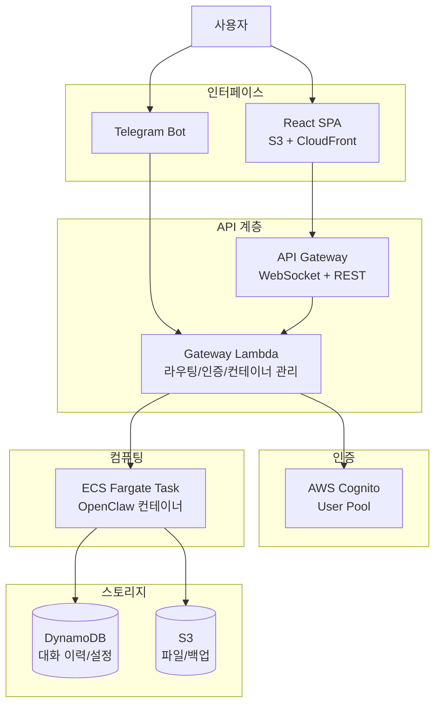

# Serverless OpenClaw

AWS 서버리스 인프라에서 [OpenClaw](https://github.com/openclaw/openclaw)를 on-demand로 구동하고, 웹 UI와 Telegram을 인터페이스로 제공하는 오픈소스 프로젝트입니다.

[Cloudflare MoltWorker](https://github.com/cloudflare/moltworker)의 아키텍처를 참고하되, AWS 생태계에 최적화된 독자적인 서버리스 솔루션을 제공합니다.

## 주요 특징

- **서버리스 On-demand 실행**: ECS Fargate Spot 기반으로 요청 시에만 컨테이너를 구동하여 비용 최소화 (~$1/월)
- **웹 채팅 UI**: React SPA 기반 실시간 채팅 인터페이스 (S3 + CloudFront 호스팅)
- **Telegram 봇 통합**: Telegram을 통한 어디서든 AI 에이전트와 대화
- **멀티 LLM 지원**: Claude, GPT, DeepSeek 등 사용자가 원하는 LLM 프로바이더 선택 가능
- **태스크 자동화**: OpenClaw skills를 통한 다양한 태스크 자동 수행
- **원커맨드 배포**: `cdk deploy` 한 번으로 전체 인프라 배포

## 프로젝트 목표

### 비용

- 개인 사용 기준 **월 $1-2 이하** 운영 (프리 티어 내 ~$0.23)
- ECS Fargate Spot으로 컴퓨팅 비용 70% 절감
- ALB 대신 API Gateway를 사용하여 월 $18-25 고정 비용 제거
- 비활성 시 컨테이너 자동 종료로 유휴 비용 제로

### 관리

- `cdk deploy` 원커맨드로 전체 인프라 배포/업데이트
- 서버 관리 불필요 — 모든 컴포넌트가 서버리스 또는 관리형 서비스
- OpenClaw 버전 업데이트는 Docker 이미지 태그 변경으로 처리
- CloudWatch 기반 로깅으로 별도 모니터링 인프라 불필요

### 확장성

- Fargate 태스크 사양을 CDK 설정으로 간단히 조정 (vCPU, 메모리)
- 멀티 채널 확장 가능한 Gateway 아키텍처 (Telegram → Discord, Slack 등)
- 커스텀 Skills를 통한 기능 확장
- DynamoDB on-demand 모드로 트래픽 변동에 자동 대응

### 보안

- AWS Cognito 기반 JWT 인증 — 모든 API 요청에 토큰 검증 적용
- HTTPS 필수 (CloudFront + API Gateway)
- 시크릿 관리는 AWS Secrets Manager / SSM Parameter Store 사용
- Fargate 컨테이너에 최소 권한 IAM 역할 적용
- Telegram webhook에 secret token 검증으로 스푸핑 방지
- 퍼블릭 서브넷 + 다층 방어 (Security Group + Bridge 토큰 인증 + TLS + localhost 바인딩)

## 아키텍처



## 기술 스택

| 계층 | 기술 |
|------|------|
| **IaC** | AWS CDK (TypeScript) |
| **API** | API Gateway (WebSocket + REST) |
| **게이트웨이** | Lambda (Node.js/TypeScript) |
| **런타임** | ECS Fargate |
| **프론트엔드** | React + Vite + TypeScript |
| **인증** | AWS Cognito |
| **DB** | DynamoDB |
| **파일 저장소** | S3 |
| **모니터링** | CloudWatch |
| **메신저** | Telegram Bot API |

## 로드맵

### Phase 1: MVP (현재)
- AWS에 OpenClaw 컨테이너 on-demand 배포
- 웹 채팅 UI + Telegram 봇 통합
- AI 대화/채팅 + 태스크 자동화
- Cognito 인증 + 데이터 영속성

### Phase 2: 확장
- 브라우저 자동화 (headless Chromium)
- 커스텀 Skills 개발 지원
- 설정 관리 UI

### Phase 3: 고급 기능
- CloudWatch 알림 + 비용 대시보드
- EventBridge 기반 정기 태스크 스케줄링
- 추가 메신저 (Discord, Slack) 지원

## 예상 비용

Fargate Spot + API Gateway 조합으로 극한의 비용 최적화를 적용합니다. (하루 2시간 사용 가정)

| 구분 | 월 비용 |
|------|--------|
| 프리 티어 내 (12개월) | **~$0.23/월** |
| 프리 티어 만료 후 | **~$1.07/월** |

핵심: Fargate Spot (On-Demand 대비 ~70% 할인) + API Gateway (ALB 대비 월 $18-25 절감)

상세 분석: [비용 최적화 문서](docs/cost-optimization.md)

## Claude Code Skills

개발 시 Claude Code에서 프로젝트 컨텍스트를 자동 로드하는 스킬을 제공합니다.

| 스킬 | 호출 | 설명 |
|------|------|------|
| **context** | 자동 로드 | 프로젝트 개요, 기술 스택, 핵심 결정 |
| **implement** | `/implement 1-3` | 특정 구현 단계 가이드 (목표, 산출물, 검증 기준) |
| **architecture** | `/architecture` | 네트워크, 데이터 모델, CDK 스택 참조 |
| **security** | `/security` | 보안 체크리스트 (Bridge 방어, IDOR, 시크릿) |
| **cost** | `/cost` | 비용 목표 검증 (금지 리소스, 체크리스트) |

## 프로젝트 구조

```
serverless-openclaw/
├── packages/
│   ├── shared/      # 공유 타입, 상수
│   ├── cdk/         # AWS CDK 인프라 정의
│   ├── gateway/     # Lambda 함수 (API Gateway 핸들러)
│   ├── container/   # Fargate 컨테이너 (Bridge 서버)
│   └── web/         # React SPA (Vite)
├── docs/            # 설계 문서
└── references/      # 참조 프로젝트 (MoltWorker 등)
```

npm workspaces 모노레포 + TypeScript project references로 구성되어 있습니다.

## 개발 시작

```bash
npm install          # 의존성 설치
npm run build        # TypeScript 빌드
npm run lint         # ESLint 검사
npm run format       # Prettier 포맷팅
npm run test         # Vitest 테스트
```

## 문서

- [PRD (Product Requirements Document)](docs/PRD.md)
- [아키텍처 설계](docs/architecture.md)
- [세부 설계 및 구현 계획](docs/implementation-plan.md)
- [비용 최적화 분석](docs/cost-optimization.md)
- [프로젝트 진행 계획](docs/progress.md)

## 라이선스

MIT License
