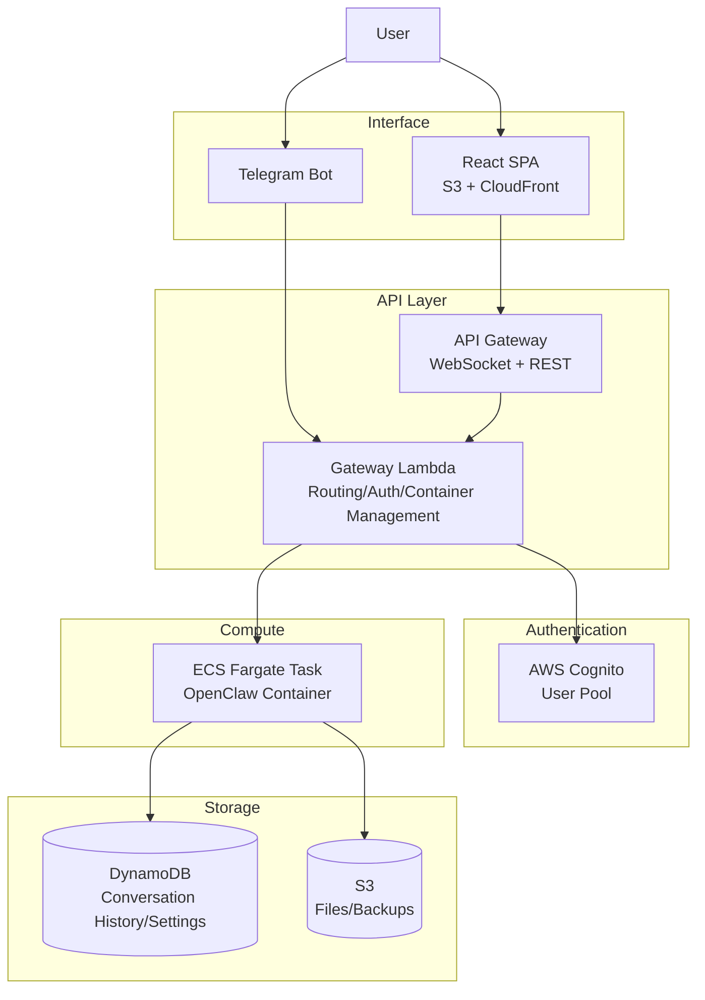

# Serverless OpenClaw

[](LICENSE)
[](https://www.typescriptlang.org/)
[](https://aws.amazon.com/cdk/)
[](https://nodejs.org/)
[](#contributing)
[](#)

> **⚠️ Alpha — Development in Progress**
>
> This project is in an early alpha stage and has **not been fully tested** in production environments.
> It involves LLM API calls, which can incur **unexpected costs** and may expose **security risks** if misconfigured.
> **Use for development and testing purposes only.** The authors are not responsible for any costs or damages arising from its use.

An open-source project that runs [OpenClaw](https://github.com/openclaw/openclaw) on-demand on AWS serverless infrastructure, providing a web UI and Telegram as interfaces.

Inspired by the architecture of [Cloudflare MoltWorker](https://github.com/cloudflare/moltworker), this project delivers an independent serverless solution optimized for the AWS ecosystem.

## Key Features

- **Serverless On-demand Execution**: Minimizes cost (~$1/month) by running containers only when requested, powered by ECS Fargate Spot
- **Web Chat UI**: Real-time chat interface built with React SPA (hosted on S3 + CloudFront)
- **Telegram Bot Integration**: Chat with the AI agent from anywhere via Telegram, with Web-Telegram identity linking for container sharing
- **Multi-LLM Support**: Choose your preferred LLM provider — Claude, GPT, DeepSeek, and more
- **Task Automation**: Automate various tasks through OpenClaw skills
- **One-command Deployment**: Deploy the entire infrastructure with a single `cdk deploy`

## Project Goals

### Cost

- Operate at **under $1-2/month** for personal use (~$0.23 within Free Tier)
- 70% compute cost reduction with ECS Fargate Spot
- Eliminate $18-25/month fixed costs by using API Gateway instead of ALB
- Zero idle costs with automatic container termination during inactivity

### Management

- Deploy/update the entire infrastructure with a single `cdk deploy` command
- No server management required — all components are serverless or managed services
- OpenClaw version updates handled by changing the Docker image tag
- No separate monitoring infrastructure needed thanks to CloudWatch-based logging

### Scalability

- Easily adjust Fargate task specifications (vCPU, memory) via CDK configuration
- Multi-channel extensible Gateway architecture (Telegram, Discord, Slack, etc.)
- Feature extensibility through custom Skills
- Automatic traffic scaling with DynamoDB on-demand mode

### Security

- AWS Cognito-based JWT authentication — token verification applied to all API requests
- HTTPS enforced (CloudFront + API Gateway)
- Secrets managed via SSM Parameter Store SecureString
- Least-privilege IAM roles applied to Fargate containers
- Telegram webhook protected with secret token verification to prevent spoofing
- Public subnet + multi-layer defense (Security Group + Bridge token authentication + TLS + localhost binding)

## Architecture



## Tech Stack

| Layer | Technology |
|-------|------------|
| **IaC** | AWS CDK (TypeScript) |
| **API** | API Gateway (WebSocket + REST) |
| **Gateway** | Lambda (Node.js/TypeScript) |
| **Runtime** | ECS Fargate |
| **Frontend** | React + Vite + TypeScript |
| **Auth** | AWS Cognito |
| **DB** | DynamoDB |
| **File Storage** | S3 |
| **Monitoring** | CloudWatch |
| **Messenger** | Telegram Bot API |

## Roadmap

### Phase 1: MVP (Current)
- On-demand deployment of OpenClaw containers on AWS
- Web chat UI + Telegram bot integration
- AI conversation/chat + task automation
- Cognito authentication + data persistence

### Phase 2: Expansion
- Browser automation (headless Chromium)
- Custom Skills development support
- Settings management UI

### Phase 3: Advanced Features
- CloudWatch alerts + cost dashboard
- EventBridge-based scheduled task execution
- Additional messenger support (Discord, Slack)

## Estimated Cost

Extreme cost optimization applied with the Fargate Spot + API Gateway combination. (Assuming 2 hours of daily usage)

| Category | Monthly Cost |
|----------|-------------|
| Within Free Tier (12 months) | **~$0.27/month** |
| After Free Tier expires | **~$1.11/month** |

Key: Fargate Spot (~70% discount vs On-Demand) + API Gateway ($18-25/month savings vs ALB)

Detailed analysis: [Cost Optimization Document](docs/cost-optimization.md)

## Claude Code Skills

Skills are provided that automatically load project context in Claude Code during development.

| Skill | Invocation | Description |
|-------|------------|-------------|
| **context** | Auto-loaded | Project overview, tech stack, key decisions |
| **implement** | `/implement 1-3` | Guide for specific implementation steps (goals, deliverables, verification criteria) |
| **architecture** | `/architecture` | Network, data model, CDK stack reference |
| **security** | `/security` | Security checklist (Bridge defense, IDOR, secrets) |
| **cost** | `/cost` | Cost target verification (prohibited resources, checklist) |

## Project Structure

```
serverless-openclaw/
├── packages/
│   ├── shared/      # Shared types, constants
│   ├── cdk/         # AWS CDK infrastructure definitions
│   ├── gateway/     # Lambda functions (API Gateway handlers)
│   ├── container/   # Fargate container (Bridge server)
│   └── web/         # React SPA (Vite)
├── docs/            # Design documents
└── references/      # Reference projects (MoltWorker, etc.)
```

Organized as an npm workspaces monorepo with TypeScript project references.

## Getting Started

```bash
npm install          # Install dependencies
cp .env.example .env # Configure AWS profile (edit .env)
npm run build        # TypeScript build
npm run lint         # ESLint check
npm run format       # Prettier formatting
npm run test         # Unit tests (164 tests)
npm run test:e2e     # E2E tests (CDK synth, 26 tests)
```

AWS deployment: [Deployment Guide](docs/deployment.md) | Local development details: [Development Guide](docs/development.md)

## Documentation

- [PRD (Product Requirements Document)](docs/PRD.md)
- [Architecture Design](docs/architecture.md)
- [Detailed Design & Implementation Plan](docs/implementation-plan.md)
- [Cost Optimization Analysis](docs/cost-optimization.md)
- [Deployment Guide](docs/deployment.md)
- [Development Guide](docs/development.md)
- [Project Progress Plan](docs/progress.md)
- [User Guide (Quick Start)](docs/user-guide.md)

## Contributing

Contributions are welcome! Please read the guidelines below before submitting.

### How to Contribute

1. **Bug fixes and small improvements** — Submit a Pull Request directly
2. **Major features or architecture changes** — Open a GitHub Issue first to discuss the approach
3. **Questions** — Open a GitHub Discussion

### Before Submitting a PR

- Fork the repository and create a feature branch from `main`
- Run the full build and test suite locally:
  ```bash
  npm run build && npm run lint && npm run test && npm run test:e2e
  ```
- Keep each PR focused on a **single change**
- Provide a clear description of what changed and why
- Ensure all CI checks pass

### Development Setup

```bash
git clone https://github.com/<your-fork>/serverless-openclaw.git
cd serverless-openclaw
npm install
cp .env.example .env   # Configure AWS profile
npm run build
npm run test            # Unit tests (99 tests)
npm run test:e2e        # E2E tests (24 tests)
```

For detailed local development instructions, see the [Development Guide](docs/development.md).

### Code Style

- TypeScript strict mode with ES2022 target
- `.js` extension required in all import paths
- ESLint + Prettier enforced via Git hooks (pre-commit)
- TDD required — write tests before implementation (except `packages/web`)

### AI-Assisted Contributions

AI-generated code is welcome. When submitting AI-assisted PRs:

- Indicate in the PR title or description that AI tools were used
- Document the testing level (untested / lightly tested / fully tested)
- Confirm that you understand what the code does

### Security Reporting

If you discover a security vulnerability, please **do not** open a public issue. Instead, report it via GitHub's private vulnerability reporting feature or contact the maintainers directly.

A complete report should include: severity level, affected components, reproduction steps, and suggested fixes.

## License

MIT License
