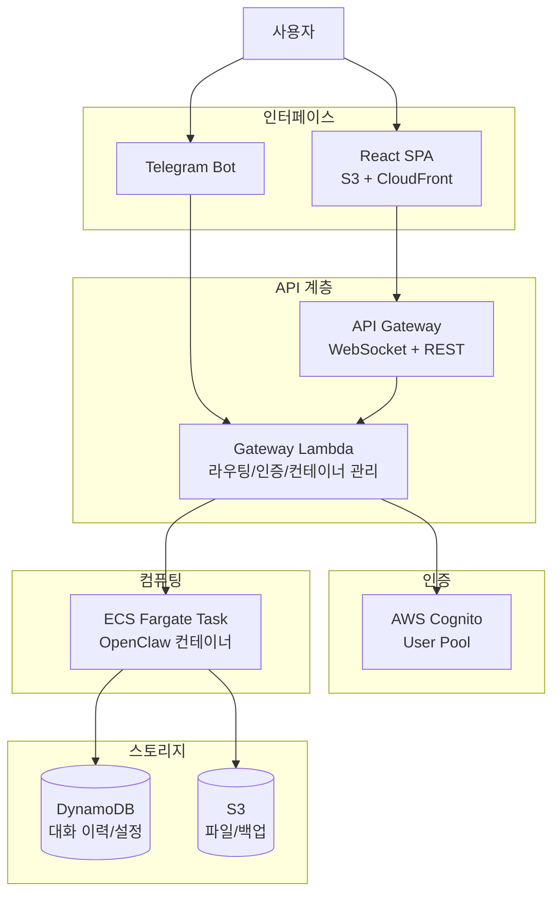

# Serverless OpenClaw

AWS 서버리스 인프라에서 [OpenClaw](https://github.com/openclaw/openclaw)를 on-demand로 구동하고, 웹 UI와 Telegram을 인터페이스로 제공하는 오픈소스 프로젝트입니다.

[Cloudflare MoltWorker](https://github.com/cloudflare/moltworker)의 아키텍처를 참고하되, AWS 생태계에 최적화된 독자적인 서버리스 솔루션을 제공합니다.

## 주요 특징

- **서버리스 On-demand 실행**: ECS Fargate 기반으로 요청 시에만 컨테이너를 구동하여 비용 최소화 (~$5-10/월)
- **웹 채팅 UI**: React SPA 기반 실시간 채팅 인터페이스 (S3 + CloudFront 호스팅)
- **Telegram 봇 통합**: Telegram을 통한 어디서든 AI 에이전트와 대화
- **멀티 LLM 지원**: Claude, GPT, DeepSeek 등 사용자가 원하는 LLM 프로바이더 선택 가능
- **태스크 자동화**: OpenClaw skills를 통한 다양한 태스크 자동 수행
- **원커맨드 배포**: `cdk deploy` 한 번으로 전체 인프라 배포

## 아키텍처

## 기술 스택

| 계층 | 기술 |
|------|------|
| **IaC** | AWS CDK (TypeScript) |
| **API** | API Gateway (WebSocket + REST) |
| **게이트웨이** | Lambda (Node.js/TypeScript) |
| **런타임** | ECS Fargate |
| **프론트엔드** | React + Vite + TypeScript |
| **인증** | AWS Cognito |
| **DB** | DynamoDB |
| **파일 저장소** | S3 |
| **모니터링** | CloudWatch |
| **메신저** | Telegram Bot API |

## 로드맵

### Phase 1: MVP (현재)
- AWS에 OpenClaw 컨테이너 on-demand 배포
- 웹 채팅 UI + Telegram 봇 통합
- AI 대화/채팅 + 태스크 자동화
- Cognito 인증 + 데이터 영속성

### Phase 2: 확장
- 브라우저 자동화 (headless Chromium)
- 커스텀 Skills 개발 지원
- 설정 관리 UI

### Phase 3: 고급 기능
- CloudWatch 알림 + 비용 대시보드
- EventBridge 기반 정기 태스크 스케줄링
- 추가 메신저 (Discord, Slack) 지원

## 예상 비용

개인 사용 기준 월 **~$5-10** (하루 2시간 사용 가정)

| 서비스 | 예상 비용 |
|--------|----------|
| ECS Fargate | ~$3-5 |
| API Gateway | ~$1-2 |
| CloudWatch | ~$0-1 |
| 기타 (Lambda, DynamoDB, S3, CloudFront, Cognito) | ~$0 (프리 티어) |

## 문서

- [PRD (Product Requirements Document)](docs/PRD.md)

## 라이선스

MIT License
