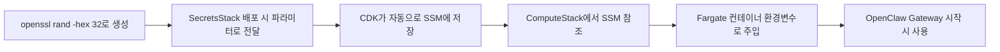

# OpenClaw Gateway Token 생성 가이드

## 개요

`OpenclawGatewayToken`은 **OpenClaw Gateway 서비스의 인증 토큰**입니다. 이 프로젝트에서는 Fargate 컨테이너 내부에서 실행되는 OpenClaw Gateway와 통신하기 위해 필요합니다.

## 중요: 이 프로젝트에서의 사용 방식

**이 프로젝트는 OpenClaw를 별도로 설치하지 않습니다.** 대신:

1. OpenClaw는 **Fargate 컨테이너 내부에 자동으로 설치**됩니다 (Dockerfile 참조)
2. Gateway Token은 **컨테이너 시작 시 자동으로 생성**되거나 **환경변수로 주입**됩니다
3. SecretsStack 배포 시 제공하는 `OpenclawGatewayToken`은 **임의의 보안 토큰**입니다

## OpenclawGatewayToken 생성 방법

### 방법 1: 랜덤 토큰 생성 (권장)

SecretsStack 배포 시 사용할 토큰을 생성합니다:

```bash
# 32바이트 랜덤 hex 문자열 생성
openssl rand -hex 32

# 출력 예시:
# a9f3c8d1e4b7f2a5c6d8e9f0a1b2c3d4e5f6a7b8c9d0e1f2a3b4c5d6e7f8a9b0
```

이 토큰을 SecretsStack 배포 시 `OpenclawGatewayToken` 파라미터로 사용합니다.

### 방법 2: 기존 OpenClaw 설치에서 가져오기 (선택사항)

만약 로컬에 OpenClaw가 이미 설치되어 있다면:

```bash
# OpenClaw 설치 (필요한 경우)
npm install -g openclaw@latest

# Gateway 토큰 생성
openclaw doctor --generate-gateway-token

# 출력:
# ✓ Created credentials directory
# ✓ Generated gateway token
# Gateway token: ocw_............
```

생성된 토큰을 복사하여 SecretsStack 배포 시 사용합니다.

### 방법 3: 기존 설정에서 확인

이미 OpenClaw가 설치되어 있고 토큰이 설정되어 있다면:

```bash
# 현재 설정된 토큰 확인
openclaw config get gateway.auth.token

# 또는 설정 파일 직접 확인
cat ~/.openclaw/config.yml | grep -A 2 "auth:"
```

## 이 프로젝트에서의 토큰 사용 흐름



### 1. SecretsStack 배포 시 (토큰 자동 저장)

```bash
cd packages/cdk

# 토큰을 생성하면서 동시에 배포 (권장)
npx cdk deploy SecretsStack \
  --parameters "BridgeAuthToken=$(openssl rand -hex 32)" \
  --parameters "OpenclawGatewayToken=$(openssl rand -hex 32)" \
  --parameters "AnthropicApiKey=<YOUR_API_KEY>" \
  --parameters "TelegramBotToken=unused" \
  --parameters "TelegramWebhookSecret=unused" \
  --profile $AWS_PROFILE
```

**중요**: 
- ✅ **토큰은 자동으로 SSM Parameter Store에 저장됩니다**
- ✅ **별도로 보관할 필요 없습니다** - AWS가 안전하게 관리
- ✅ **다음 배포 시 자동으로 재사용됩니다** - CloudFormation이 `UsePreviousValue` 사용

### 2. 토큰 저장 위치 (자동 생성)

SecretsStack 배포 시 CDK가 자동으로 생성:

- **SSM Parameter Store**: `/serverless-openclaw/secrets/openclaw-gateway-token`
- **타입**: SecureString (KMS로 암호화됨)
- **접근 권한**: Fargate Task Role만 읽기 가능

### 3. 토큰 확인 방법 (필요한 경우)

배포 후 저장된 토큰을 확인하려면:

```bash
# SSM에서 토큰 확인
aws ssm get-parameter \
  --name /serverless-openclaw/secrets/openclaw-gateway-token \
  --with-decryption \
  --profile $AWS_PROFILE \
  --query 'Parameter.Value' \
  --output text
```

### 4. 컨테이너에서 사용

Fargate 컨테이너는 환경변수 `OPENCLAW_GATEWAY_TOKEN`으로 이 토큰을 받아 OpenClaw Gateway 인증에 사용합니다.

## 토큰 관리 FAQ

### Q: 토큰을 어딘가에 따로 저장해야 하나요?

**A: 아니요, 필요 없습니다.**

- SecretsStack 배포 시 `--parameters`로 전달한 값이 **자동으로 SSM에 저장**됩니다
- AWS SSM Parameter Store가 안전하게 관리합니다
- 로컬에 저장할 필요 없습니다 (오히려 보안 위험)

### Q: 다음에 다시 배포할 때 토큰을 다시 입력해야 하나요?

**A: 아니요, 자동으로 재사용됩니다.**

```bash
# 두 번째 배포부터는 파라미터 생략 가능
npx cdk deploy --all --profile $AWS_PROFILE

# CloudFormation이 자동으로 이전 값 사용 (UsePreviousValue)
```

### Q: 토큰을 잊어버렸는데 어떻게 확인하나요?

**A: SSM에서 확인할 수 있습니다.**

```bash
aws ssm get-parameter \
  --name /serverless-openclaw/secrets/openclaw-gateway-token \
  --with-decryption \
  --profile $AWS_PROFILE \
  --query 'Parameter.Value' \
  --output text
```

### Q: 토큰을 변경하고 싶으면?

**A: SecretsStack을 다시 배포하면 됩니다.**

```bash
# 새 토큰으로 업데이트
npx cdk deploy SecretsStack \
  --parameters "OpenclawGatewayToken=$(openssl rand -hex 32)" \
  --profile $AWS_PROFILE

# 실행 중인 컨테이너 재시작 (새 토큰 적용)
aws ecs stop-task --cluster serverless-openclaw --task <TASK_ARN> --profile $AWS_PROFILE
```

## 보안 고려사항

### 토큰 요구사항

- **최소 길이**: 32자 이상 권장
- **형식**: hex 문자열 (0-9, a-f)
- **예시**: `a9f3c8d1e4b7f2a5c6d8e9f0a1b2c3d4e5f6a7b8c9d0e1f2a3b4c5d6e7f8a9b0`

### 주의사항

1. **절대 하드코딩하지 말 것**: 코드나 설정 파일에 직접 작성 금지
2. **Git에 커밋하지 말 것**: `.env` 파일은 `.gitignore`에 포함됨
3. **정기적으로 교체**: 보안을 위해 주기적으로 토큰 재생성 권장
4. **SSM에만 저장**: AWS SSM Parameter Store의 SecureString 사용

### 토큰 교체 방법

```bash
# 1. 새 토큰 생성
NEW_TOKEN=$(openssl rand -hex 32)

# 2. SSM Parameter 업데이트
aws ssm put-parameter \
  --name /serverless-openclaw/secrets/openclaw-gateway-token \
  --value "$NEW_TOKEN" \
  --type SecureString \
  --overwrite \
  --profile $AWS_PROFILE

# 3. 실행 중인 Fargate 태스크 종료 (새 토큰으로 재시작됨)
aws ecs list-tasks --cluster serverless-openclaw --profile $AWS_PROFILE
aws ecs stop-task --cluster serverless-openclaw --task <TASK_ARN> --profile $AWS_PROFILE
```

## 문제 해결

### 토큰 관련 에러

#### "Gateway token missing" 에러

**증상**:
```
Error: Gateway token missing or invalid
```

**원인**: 
- SecretsStack이 배포되지 않음
- SSM Parameter가 생성되지 않음

**해결**:
```bash
# SecretsStack 배포 확인
aws cloudformation describe-stacks \
  --stack-name SecretsStack \
  --profile $AWS_PROFILE

# SSM Parameter 확인
aws ssm get-parameter \
  --name /serverless-openclaw/secrets/openclaw-gateway-token \
  --with-decryption \
  --profile $AWS_PROFILE
```

#### "Unauthorized" 에러

**증상**:
```
Error: Unauthorized (401)
```

**원인**: 
- 토큰이 일치하지 않음
- 환경변수가 제대로 주입되지 않음

**해결**:
```bash
# Fargate 태스크 환경변수 확인
aws ecs describe-task-definition \
  --task-definition serverless-openclaw \
  --profile $AWS_PROFILE \
  --query 'taskDefinition.containerDefinitions[0].secrets'

# 태스크 재시작
aws ecs stop-task --cluster serverless-openclaw --task <TASK_ARN> --profile $AWS_PROFILE
```

## 참고 자료

- [OpenClaw 공식 문서](https://github.com/openclaw/openclaw)
- [OpenClaw Gateway 인증 가이드](https://www.ucartz.com/blog/fix-openclaw-disconnected-from-gateway-1008-unauthorized/)
- [OpenClaw Quick Start](https://macaron.im/en/blog/openclaw-quick-start)

## 요약

1. **로컬에 OpenClaw를 설치할 필요 없음** - Fargate 컨테이너에 자동 설치됨
2. **토큰은 랜덤 생성** - `openssl rand -hex 32` 사용
3. **SecretsStack 배포 시 제공** - CloudFormation 파라미터로 전달
4. **SSM에 안전하게 저장** - SecureString으로 암호화
5. **컨테이너가 자동으로 사용** - 환경변수로 주입됨

---

**날짜**: 2025-02-17
