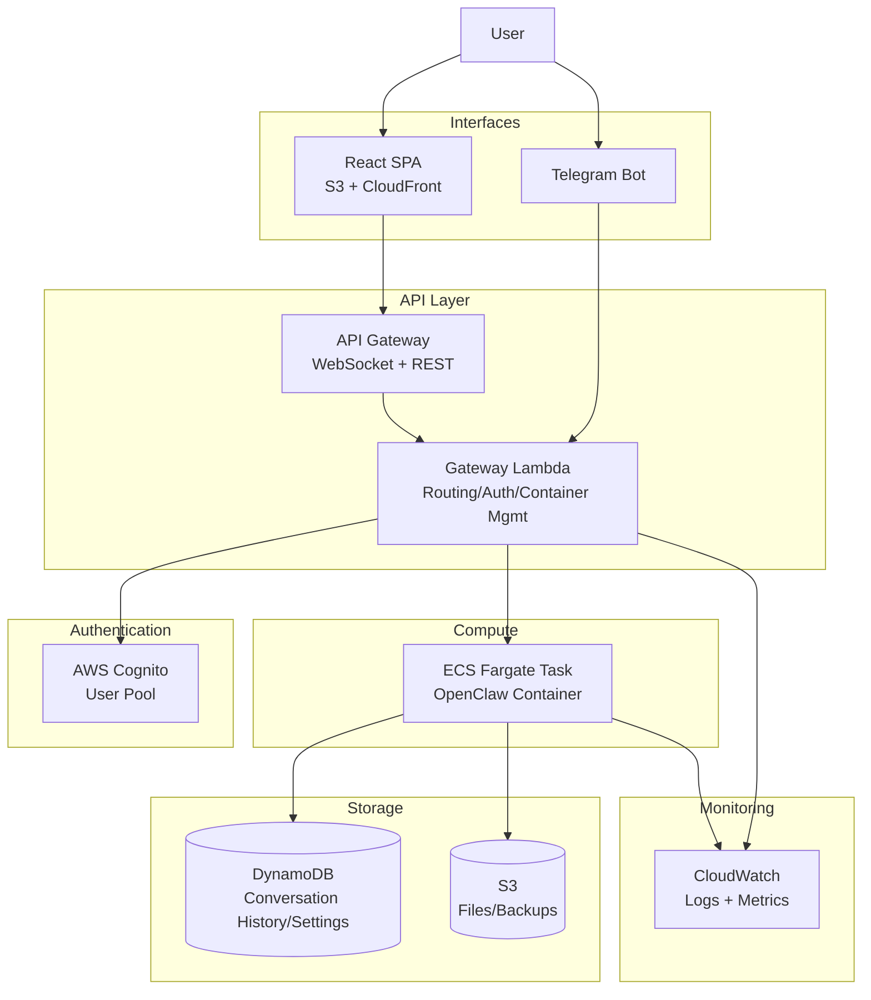
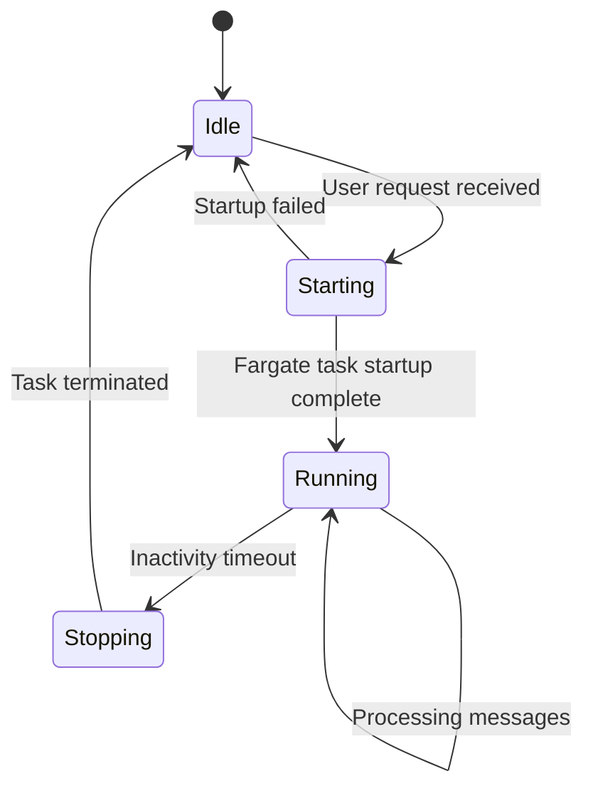
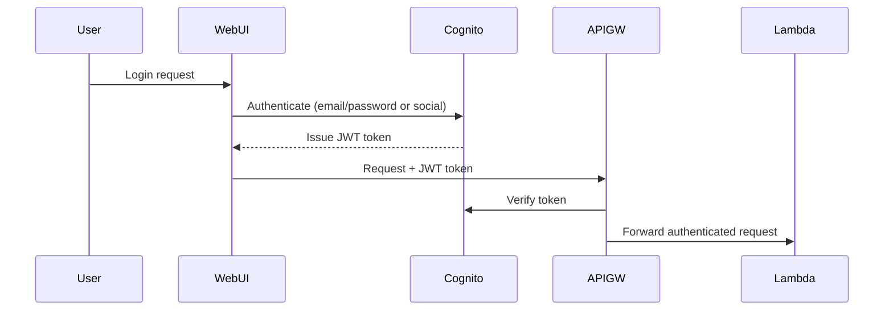

# Serverless OpenClaw - PRD (Product Requirements Document)

## Context

OpenClaw is an open-source AI agent with over 145K stars that runs in local environments to automate various tasks. However, local execution has limitations: it requires an always-on machine and is difficult to access externally.

Cloudflare's MoltWorker demonstrated an approach to running OpenClaw serverlessly on Cloudflare Workers + Sandbox, but there is no alternative for users who prefer the AWS ecosystem.

**serverless-openclaw** is an open-source project that runs OpenClaw on-demand on AWS serverless infrastructure, providing web UI and Telegram as interfaces. The goal is to enable anyone to easily deploy it to their own AWS account.

---

## 1. Project Overview

| Item | Description |
|------|-------------|
| **Project Name** | serverless-openclaw |
| **Goal** | Run OpenClaw on-demand on AWS serverless + provide web/Telegram interfaces |
| **Target Users** | Individual users (developers who want to host their own AI agent serverlessly) |
| **Reference Project** | [cloudflare/moltworker](https://github.com/cloudflare/moltworker) (architecture reference only) |
| **License** | Open source (published on GitHub) |
| **Development Language** | TypeScript unified (CDK + backend + frontend) |

---

## 2. Core Features

### Phase 1 (MVP)
- **OpenClaw Serverless Runtime**: On-demand OpenClaw Docker container execution on AWS ECS Fargate
- **Web Chat UI**: Chat interface based on React SPA (hosted on S3 + CloudFront)
- **Telegram Bot Integration**: OpenClaw conversations and commands via Telegram
- **AI Conversation/Chat**: Support for user-selected LLM providers (Claude, GPT, DeepSeek, etc.)
- **Task Automation**: Task execution through OpenClaw's built-in skills
- **Authentication**: User authentication based on AWS Cognito
- **Data Persistence**: S3 (files/backups) + DynamoDB (conversation history/settings/metadata)

### Phase 2
- **Browser Automation**: Web browsing/automation with a container that includes headless Chromium
- **Custom Skills Development**: Support for adding user-defined skills
- **Settings UI**: Management interface for LLM provider selection, skill management, etc.

### Phase 3
- **Advanced Monitoring**: CloudWatch alerts, cost dashboard
- **Scheduling**: Periodic task execution (EventBridge integration)
- **Multi-Channel Expansion**: Additional messenger support for Discord, Slack, etc.

---

## 3. Architecture

### 3.1 Overall Diagram



### 3.2 Component Details

#### API Gateway + Gateway Lambda
- **Role**: Entry point for all requests. Authentication verification, container lifecycle management, message routing
- **WebSocket**: Real-time bidirectional communication with the web UI (chat streaming)
- **REST**: Telegram webhook reception, management API
- **Container Management**: Fargate task start/stop/status check

#### ECS Fargate (OpenClaw Runtime)
- **On-demand Execution**: Task starts on request, automatically terminates when inactive
- **Docker Image**: OpenClaw + Node.js + headless Chromium (Phase 2)
- **Lifecycle**:
  1. User request received
  2. Gateway Lambda checks for a running task
  3. If none exists, starts a new Fargate task (cold start ~30s-1min)
  4. Delivers message to the task
  5. Task terminates after inactivity timeout

#### React SPA (Web UI)
- **Tech Stack**: React + Vite + TypeScript
- **Hosting**: S3 static hosting + CloudFront CDN
- **Features**: Chat interface, loading state display, conversation history browsing
- **Communication**: Real-time message send/receive via WebSocket

#### Telegram Bot
- **Communication Method**: Webhook (Telegram webhook registered with API Gateway)
- **Features**: Text conversations, command processing, status notifications
- **Authentication**: Telegram user ID based + Cognito integration

#### Data Model (DynamoDB)

| Table | PK | SK | Purpose |
|-------|-----|-----|---------|
| Conversations | userId | conversationId#timestamp | Conversation history |
| Settings | userId | settingKey | User settings (LLM provider, skill configuration, etc.) |
| TaskState | userId | - | Fargate task state tracking |
| Connections | connectionId | - | WebSocket connection management |
| PendingMessages | userId | timestamp#uuid | Message queuing during cold start |

#### S3 Buckets
- **openclaw-data**: OpenClaw configuration files, skill files, backup data
- **openclaw-web**: React SPA static file hosting

---

## 4. On-demand Container Lifecycle



- **Cold Start Handling**: Gateway Lambda sends a "Waking up the agent..." status message via WebSocket/Telegram
- **Inactivity Timeout**: Task terminates after a configurable period (default 15 minutes) since the last message
- **State Tracking**: Current task state managed in the DynamoDB TaskState table

---

## 5. Authentication Flow



- **Web UI**: Cognito Hosted UI or custom login form
- **Telegram**: Register Telegram user ID via web UI during initial pairing. Auto-authenticate via Telegram user ID afterward

---

## 6. Tech Stack

| Layer | Technology | Rationale |
|-------|------------|-----------|
| **IaC** | AWS CDK (TypeScript) | Unified TypeScript, concise definitions with L2 constructs |
| **API** | API Gateway (WebSocket + REST) | Serverless, native WebSocket support |
| **Gateway** | Lambda (Node.js/TypeScript) | Event-driven, fast response, cost-efficient |
| **Runtime** | ECS Fargate | Serverless containers, long-running capable, on-demand scaling |
| **Frontend** | React + Vite + TypeScript | SPA chat UI, S3/CloudFront hosting |
| **Auth** | AWS Cognito | Managed authentication, JWT, social login support |
| **DB** | DynamoDB | Serverless NoSQL, usage-based billing, zero management |
| **File Storage** | S3 | OpenClaw configuration/backups, web hosting |
| **Monitoring** | CloudWatch | AWS native, minimal additional cost |
| **Messenger** | Telegram Bot API | Webhook-based, free, suitable for personal use |

---

## 7. Estimated Cost (Monthly, Personal Use)

Aggressive cost optimization is applied using the Fargate Spot + API Gateway combination. See [Cost Optimization Analysis](cost-optimization.md) for detailed analysis.

### Within Free Tier (First 12 Months After Signup)

| Service | Usage Pattern | Estimated Cost |
|---------|--------------|----------------|
| ECS Fargate Spot | 2 hours/day (0.25 vCPU, 0.5GB) | ~$0.23 |
| API Gateway | WebSocket + REST (10K requests/month) | $0 (Free Tier) |
| Lambda | Container management | $0 (Free Tier) |
| DynamoDB | 100K reads/writes per month | $0 (Free Tier) |
| S3 | Under 1GB | $0 (Free Tier) |
| CloudFront | 1GB transfer | $0 (Free Tier) |
| Cognito | Under 50,000 MAU | $0 (Always free) |
| CloudWatch | Basic logging | $0 (Free Tier) |
| **Total** | | **~$0.23/month** |

### After Free Tier Expiration

| Service | Usage Pattern | Estimated Cost |
|---------|--------------|----------------|
| ECS Fargate Spot | 2 hours/day (0.25 vCPU, 0.5GB) | ~$0.23 |
| API Gateway | WebSocket + REST (10K requests/month) | ~$0.05 |
| Lambda | Container management | ~$0 |
| DynamoDB | 100K reads/writes per month | ~$0.16 |
| S3 | Under 1GB | ~$0.03 |
| CloudFront | 1GB transfer | ~$0.09 |
| Cognito | Under 50,000 MAU | $0 (Always free) |
| CloudWatch | Basic logging | ~$0.50 |
| **Total** | | **~$1.07/month** |

> **Key Optimization Points**: Fargate Spot offers ~70% discount compared to On-Demand. API Gateway saves ~$18-25/month compared to ALB. For personal low-traffic use, eliminating the ELB is the single largest cost reduction factor.

---

## 8. Project Structure

```
serverless-openclaw/
├── README.md
├── package.json                    # Monorepo root
├── tsconfig.json
├── .gitignore
│
├── packages/
│   ├── cdk/                        # AWS CDK infrastructure definitions
│   │   ├── bin/
│   │   │   └── app.ts              # CDK app entry point
│   │   ├── lib/
│   │   │   ├── stacks/
│   │   │   │   ├── network-stack.ts
│   │   │   │   ├── auth-stack.ts
│   │   │   │   ├── api-stack.ts
│   │   │   │   ├── compute-stack.ts
│   │   │   │   ├── storage-stack.ts
│   │   │   │   └── web-stack.ts
│   │   │   └── constructs/         # Reusable CDK constructs
│   │   └── package.json
│   │
│   ├── gateway/                    # Lambda handlers (Gateway)
│   │   ├── src/
│   │   │   ├── handlers/
│   │   │   │   ├── websocket.ts    # WebSocket connection/message handling
│   │   │   │   ├── telegram.ts     # Telegram webhook handling
│   │   │   │   └── api.ts          # REST API handler
│   │   │   ├── services/
│   │   │   │   ├── container.ts    # Fargate task management
│   │   │   │   ├── message.ts      # Message routing
│   │   │   │   └── auth.ts         # Authentication helpers
│   │   │   └── index.ts
│   │   └── package.json
│   │
│   ├── container/                  # OpenClaw Docker container
│   │   ├── Dockerfile
│   │   ├── src/
│   │   │   ├── bridge.ts           # Gateway <-> OpenClaw bridge
│   │   │   ├── lifecycle.ts        # Container lifecycle management
│   │   │   └── config.ts           # OpenClaw configuration loader
│   │   └── package.json
│   │
│   ├── web/                        # React SPA (Chat UI)
│   │   ├── src/
│   │   │   ├── components/
│   │   │   │   ├── Chat/
│   │   │   │   ├── Auth/
│   │   │   │   └── Status/
│   │   │   ├── hooks/
│   │   │   ├── services/
│   │   │   │   └── websocket.ts
│   │   │   ├── App.tsx
│   │   │   └── main.tsx
│   │   ├── vite.config.ts
│   │   └── package.json
│   │
│   └── shared/                     # Shared types/utilities
│       ├── src/
│       │   ├── types.ts
│       │   └── constants.ts
│       └── package.json
│
├── docker/                         # Docker-related files
│   └── openclaw/
│       └── Dockerfile              # OpenClaw + Chromium image
│
└── docs/                           # Documentation
    ├── PRD.md
    ├── architecture.md
    ├── deployment.md
    └── development.md
```

---

## 9. Implementation Roadmap

### Phase 1: MVP (Core + Telegram)

| Step | Task | Description |
|------|------|-------------|
| 1-1 | Project initialization | Monorepo setup, CDK project bootstrap, common configuration |
| 1-2 | Infrastructure foundation | VPC, ECS cluster, DynamoDB tables, S3 bucket CDK definitions |
| 1-3 | OpenClaw container | Docker image build, ECR push, Fargate task definition |
| 1-4 | Gateway Lambda | Container lifecycle management, message routing, authentication |
| 1-5 | API Gateway | WebSocket + REST endpoint configuration |
| 1-6 | Cognito authentication | User Pool setup, JWT verification, Telegram user integration |
| 1-7 | Web chat UI | React SPA development, WebSocket communication, S3/CloudFront deployment |
| 1-8 | Telegram bot | Webhook setup, message handling, user pairing |
| 1-9 | Data persistence | Conversation history storage/retrieval, user settings management |
| 1-10 | Deployment/documentation | One-click deployment guide, README, configuration guide |

### Phase 2: Browser Automation + Custom Skills

| Step | Task |
|------|------|
| 2-1 | Build Docker image with Chromium included |
| 2-2 | Browser automation skill integration |
| 2-3 | Custom skill upload/management API |
| 2-4 | Settings management UI (LLM provider selection, skill management) |

### Phase 3: Advanced Features

| Step | Task |
|------|------|
| 3-1 | CloudWatch alerts + cost dashboard |
| 3-2 | EventBridge-based periodic task scheduling |
| 3-3 | Additional messenger support (Discord, Slack) |

---

## 10. Non-Functional Requirements

| Item | Requirement |
|------|-------------|
| **Availability** | 99.9% (based on AWS serverless SLA) |
| **Cold Start** | Within 30 seconds to 1 minute. Loading state displayed in UI |
| **Security** | Cognito JWT authentication, HTTPS required, secrets via Secrets Manager/SSM Parameter Store |
| **Cost** | Under $10/month (personal use, on-demand basis) |
| **Deployment** | Single-command deployment via `cdk deploy`. Initial setup guide provided |
| **Open Source** | MIT or Apache 2.0 license. Contribution guidelines included |

---

## 11. Risks and Mitigations

| Risk | Impact | Mitigation |
|------|--------|------------|
| Fargate cold start degrades user experience | Medium | Display loading state + provide warm pool option in the future |
| OpenClaw version update compatibility | High | Pin version via Docker image tags, provide update guide |
| Fargate tasks not terminating leading to cost increase | Medium | Lambda-based watchdog to force-terminate zombie tasks |
| Telegram webhook security vulnerabilities | High | Telegram secret token verification, respond only to registered users |
| OpenClaw internal security (skill execution permissions) | High | Least privilege principle for container IAM roles, network policy restrictions |

---

## 12. Success Criteria

- [ ] Full infrastructure deployable with a single `cdk deploy`
- [ ] Real-time chat with OpenClaw possible via web UI
- [ ] Conversation with OpenClaw possible via Telegram
- [ ] Containers start/stop on-demand with no cost incurred during inactivity
- [ ] Conversation history persistently stored in DynamoDB
- [ ] Users can select LLM provider in settings
- [ ] Deployment guide documentation enables other users to deploy to their own AWS accounts
