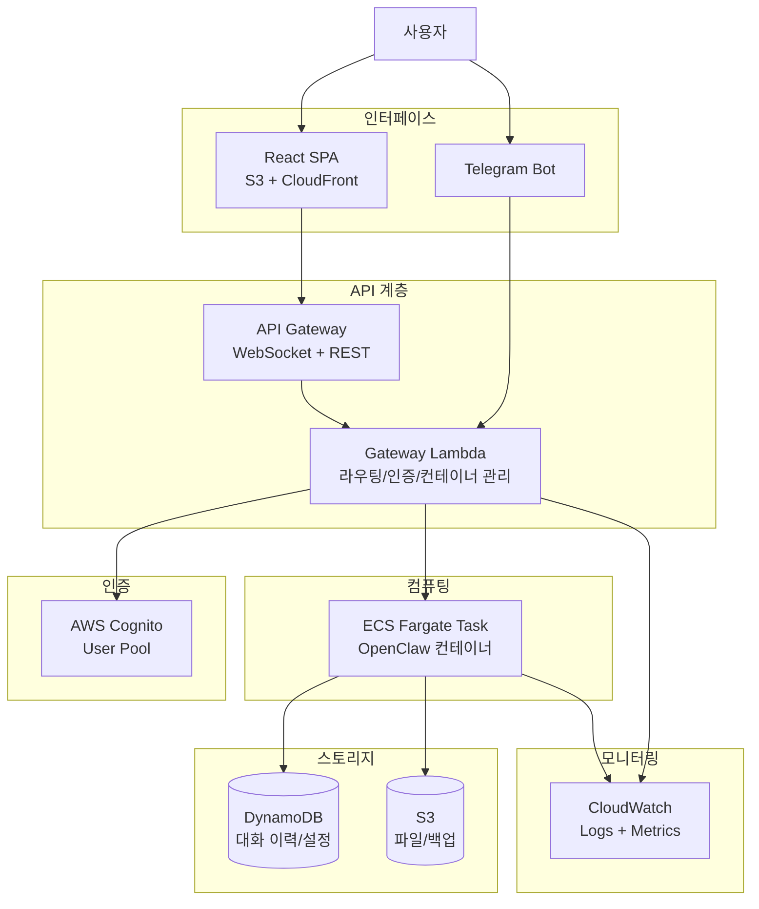
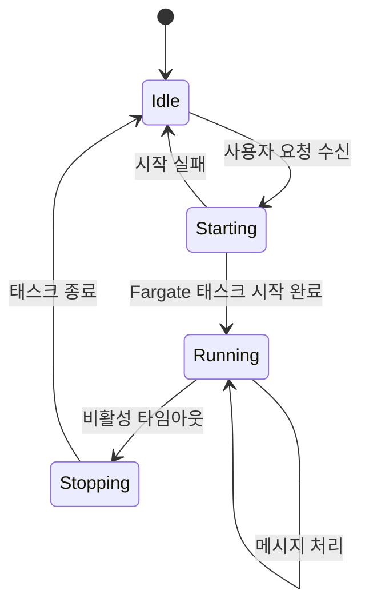
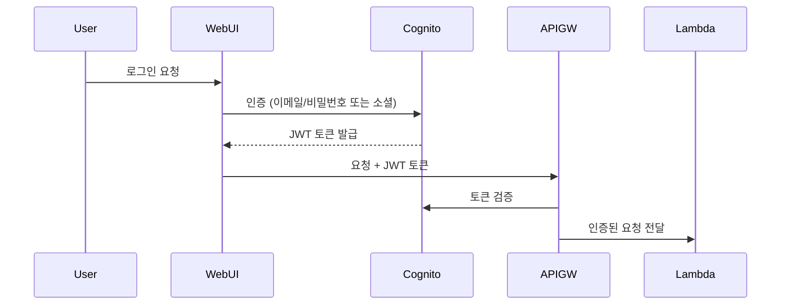

# Serverless OpenClaw - PRD (Product Requirements Document)

## Context

OpenClaw는 145K+ 스타를 보유한 오픈소스 AI 에이전트로, 로컬 환경에서 실행되어 다양한 태스크를 자동화한다. 그러나 로컬 실행은 항상 켜진 머신이 필요하고, 외부 접근이 어렵다는 한계가 있다.

Cloudflare의 MoltWorker가 Cloudflare Workers + Sandbox에서 OpenClaw를 서버리스로 구동하는 방식을 제시했지만, AWS 생태계를 선호하는 사용자에게는 대안이 없다.

**serverless-openclaw** 는 AWS 서버리스 인프라에서 OpenClaw를 on-demand로 구동하고, 웹 UI와 Telegram을 인터페이스로 제공하는 오픈소스 프로젝트다. 누구나 자신의 AWS 계정에 간단히 배포할 수 있는 것을 목표로 한다.

---

## 1. 프로젝트 개요

| 항목 | 내용 |
|------|------|
| **프로젝트명** | serverless-openclaw |
| **목표** | AWS 서버리스에서 OpenClaw를 on-demand로 구동 + 웹/Telegram 인터페이스 제공 |
| **타겟 사용자** | 개인 사용자 (자신만의 AI 에이전트를 서버리스로 호스팅하려는 개발자) |
| **참고 프로젝트** | [cloudflare/moltworker](https://github.com/cloudflare/moltworker) (아키텍처 참고만) |
| **라이선스** | 오픈소스 (GitHub 공개) |
| **개발 언어** | TypeScript 통일 (CDK + 백엔드 + 프론트엔드) |

---

## 2. 핵심 기능

### Phase 1 (MVP)
- **OpenClaw 서버리스 런타임**: AWS ECS Fargate에서 OpenClaw Docker 컨테이너 on-demand 구동
- **웹 채팅 UI**: React SPA 기반 채팅 인터페이스 (S3 + CloudFront 호스팅)
- **Telegram 봇 통합**: Telegram을 통한 OpenClaw 대화 및 명령
- **AI 대화/채팅**: 사용자가 선택한 LLM 프로바이더(Claude, GPT, DeepSeek 등) 지원
- **태스크 자동화**: OpenClaw의 기본 skills를 통한 태스크 수행
- **인증**: AWS Cognito 기반 사용자 인증
- **데이터 영속성**: S3(파일/백업) + DynamoDB(대화 이력/설정/메타데이터)

### Phase 2
- **브라우저 자동화**: headless Chromium 포함 컨테이너로 웹 브라우징/자동화
- **커스텀 Skills 개발**: 사용자 정의 skill 추가 지원
- **설정 UI**: LLM 프로바이더 선택, skill 관리 등 관리 인터페이스

### Phase 3
- **고급 모니터링**: CloudWatch 알림, 비용 대시보드
- **스케줄링**: 정기 태스크 실행 (EventBridge 연동)
- **멀티 채널 확장**: Discord, Slack 등 추가 메신저 지원

---

## 3. 아키텍처

### 3.1 전체 구성도



### 3.2 컴포넌트 상세

#### API Gateway + Gateway Lambda
- **역할**: 모든 요청의 진입점. 인증 검증, 컨테이너 생명주기 관리, 메시지 라우팅
- **WebSocket**: 웹 UI와의 실시간 양방향 통신 (채팅 스트리밍)
- **REST**: Telegram webhook 수신, 관리 API
- **컨테이너 관리**: Fargate 태스크 시작/중지/상태 확인

#### ECS Fargate (OpenClaw 런타임)
- **On-demand 실행**: 요청 시 태스크 시작, 비활성 시 자동 종료
- **Docker 이미지**: OpenClaw + Node.js + headless Chromium (Phase 2)
- **생명주기**:
  1. 사용자 요청 수신
  2. Gateway Lambda가 실행 중인 태스크 확인
  3. 없으면 새 Fargate 태스크 시작 (cold start ~30초-1분)
  4. 태스크에 메시지 전달
  5. 비활성 타임아웃 후 태스크 종료

#### React SPA (웹 UI)
- **기술 스택**: React + Vite + TypeScript
- **호스팅**: S3 정적 호스팅 + CloudFront CDN
- **기능**: 채팅 인터페이스, 로딩 상태 표시, 대화 이력 조회
- **통신**: WebSocket으로 실시간 메시지 송수신

#### Telegram 봇
- **통신 방식**: Webhook (API Gateway에 Telegram webhook 등록)
- **기능**: 텍스트 대화, 명령어 처리, 상태 알림
- **인증**: Telegram 사용자 ID 기반 + Cognito 연동

#### 데이터 모델 (DynamoDB)

| 테이블 | PK | SK | 용도 |
|--------|-----|-----|------|
| Conversations | userId | conversationId#timestamp | 대화 이력 |
| Settings | userId | settingKey | 사용자 설정 (LLM 프로바이더, skill 설정 등) |
| TaskState | taskId | - | Fargate 태스크 상태 추적 |

#### S3 버킷
- **openclaw-data**: OpenClaw 설정 파일, skill 파일, 백업 데이터
- **openclaw-web**: React SPA 정적 파일 호스팅

---

## 4. On-demand 컨테이너 생명주기



- **Cold Start 처리**: Gateway Lambda가 "에이전트를 깨우는 중..." 상태 메시지를 WebSocket/Telegram으로 전송
- **비활성 타임아웃**: 마지막 메시지 이후 설정 가능한 시간(기본 15분) 경과 시 태스크 종료
- **상태 추적**: DynamoDB TaskState 테이블에서 현재 태스크 상태 관리

---

## 5. 인증 흐름



- **웹 UI**: Cognito Hosted UI 또는 커스텀 로그인 폼
- **Telegram**: 초기 페어링 시 웹 UI에서 Telegram 사용자 ID 등록. 이후 Telegram user ID로 자동 인증

---

## 6. 기술 스택

| 계층 | 기술 | 이유 |
|------|------|------|
| **IaC** | AWS CDK (TypeScript) | TypeScript 통일, L2 construct로 간결한 정의 |
| **API** | API Gateway (WebSocket + REST) | 서버리스, WebSocket 네이티브 지원 |
| **게이트웨이** | Lambda (Node.js/TypeScript) | 이벤트 기반, 빠른 응답, 비용 효율 |
| **런타임** | ECS Fargate | 서버리스 컨테이너, 장기 실행 가능, on-demand 스케일링 |
| **프론트엔드** | React + Vite + TypeScript | SPA 채팅 UI, S3/CloudFront 호스팅 |
| **인증** | AWS Cognito | 관리형 인증, JWT, 소셜 로그인 지원 |
| **DB** | DynamoDB | 서버리스 NoSQL, 사용량 기반 과금, 관리 불필요 |
| **파일 저장소** | S3 | OpenClaw 설정/백업, 웹 호스팅 |
| **모니터링** | CloudWatch | AWS 네이티브, 추가 비용 최소 |
| **메신저** | Telegram Bot API | Webhook 방식, 무료, 개인 사용에 적합 |

---

## 7. 예상 비용 (월간, 개인 사용 기준)

Fargate Spot + API Gateway 조합으로 극한의 비용 최적화를 적용한다. 상세 분석은 [비용 최적화 분석](cost-optimization.md) 참조.

### 프리 티어 내 (가입 후 12개월)

| 서비스 | 사용 패턴 | 예상 비용 |
|--------|----------|----------|
| ECS Fargate Spot | 하루 2시간 (0.25 vCPU, 0.5GB) | ~$0.23 |
| API Gateway | WebSocket + REST (월 10K 요청) | $0 (프리 티어) |
| Lambda | 컨테이너 관리 | $0 (프리 티어) |
| DynamoDB | 월 100K 읽기/쓰기 | $0 (프리 티어) |
| S3 | 1GB 이하 | $0 (프리 티어) |
| CloudFront | 1GB 전송 | $0 (프리 티어) |
| Cognito | 50,000 MAU 이하 | $0 (무기한 무료) |
| CloudWatch | 기본 로깅 | $0 (프리 티어) |
| **합계** | | **~$0.23/월** |

### 프리 티어 만료 후

| 서비스 | 사용 패턴 | 예상 비용 |
|--------|----------|----------|
| ECS Fargate Spot | 하루 2시간 (0.25 vCPU, 0.5GB) | ~$0.23 |
| API Gateway | WebSocket + REST (월 10K 요청) | ~$0.05 |
| Lambda | 컨테이너 관리 | ~$0 |
| DynamoDB | 월 100K 읽기/쓰기 | ~$0.16 |
| S3 | 1GB 이하 | ~$0.03 |
| CloudFront | 1GB 전송 | ~$0.09 |
| Cognito | 50,000 MAU 이하 | $0 (무기한 무료) |
| CloudWatch | 기본 로깅 | ~$0.50 |
| **합계** | | **~$1.07/월** |

> **핵심 최적화 포인트**: Fargate Spot은 On-Demand 대비 ~70% 할인. API Gateway는 ALB 대비 월 $18-25 절감. 개인 저트래픽 사용에서 ELB 제거가 가장 큰 비용 절감 요소.

---

## 8. 프로젝트 구조

```
serverless-openclaw/
├── README.md
├── package.json                    # 모노레포 루트
├── tsconfig.json
├── .gitignore
│
├── packages/
│   ├── cdk/                        # AWS CDK 인프라 정의
│   │   ├── bin/
│   │   │   └── app.ts              # CDK 앱 진입점
│   │   ├── lib/
│   │   │   ├── stacks/
│   │   │   │   ├── network-stack.ts
│   │   │   │   ├── auth-stack.ts
│   │   │   │   ├── api-stack.ts
│   │   │   │   ├── compute-stack.ts
│   │   │   │   ├── storage-stack.ts
│   │   │   │   └── web-stack.ts
│   │   │   └── constructs/         # 재사용 가능한 CDK construct
│   │   └── package.json
│   │
│   ├── gateway/                    # Lambda 핸들러 (Gateway)
│   │   ├── src/
│   │   │   ├── handlers/
│   │   │   │   ├── websocket.ts    # WebSocket 연결/메시지 처리
│   │   │   │   ├── telegram.ts     # Telegram webhook 처리
│   │   │   │   └── api.ts          # REST API 핸들러
│   │   │   ├── services/
│   │   │   │   ├── container.ts    # Fargate 태스크 관리
│   │   │   │   ├── message.ts      # 메시지 라우팅
│   │   │   │   └── auth.ts         # 인증 헬퍼
│   │   │   └── index.ts
│   │   └── package.json
│   │
│   ├── container/                  # OpenClaw Docker 컨테이너
│   │   ├── Dockerfile
│   │   ├── src/
│   │   │   ├── bridge.ts           # Gateway ↔ OpenClaw 브릿지
│   │   │   ├── lifecycle.ts        # 컨테이너 생명주기 관리
│   │   │   └── config.ts           # OpenClaw 설정 로더
│   │   └── package.json
│   │
│   ├── web/                        # React SPA (채팅 UI)
│   │   ├── src/
│   │   │   ├── components/
│   │   │   │   ├── Chat/
│   │   │   │   ├── Auth/
│   │   │   │   └── Status/
│   │   │   ├── hooks/
│   │   │   ├── services/
│   │   │   │   └── websocket.ts
│   │   │   ├── App.tsx
│   │   │   └── main.tsx
│   │   ├── vite.config.ts
│   │   └── package.json
│   │
│   └── shared/                     # 공유 타입/유틸리티
│       ├── src/
│       │   ├── types.ts
│       │   └── constants.ts
│       └── package.json
│
├── docker/                         # Docker 관련 파일
│   └── openclaw/
│       └── Dockerfile              # OpenClaw + Chromium 이미지
│
└── docs/                           # 문서
    ├── PRD.md
    ├── architecture.md
    ├── deployment.md
    └── development.md
```

---

## 9. 구현 로드맵

### Phase 1: MVP (코어 + Telegram)

| 단계 | 작업 | 설명 |
|------|------|------|
| 1-1 | 프로젝트 초기화 | 모노레포 설정, CDK 프로젝트 부트스트랩, 공통 설정 |
| 1-2 | 인프라 기반 | VPC, ECS 클러스터, DynamoDB 테이블, S3 버킷 CDK 정의 |
| 1-3 | OpenClaw 컨테이너 | Docker 이미지 빌드, ECR 푸시, Fargate 태스크 정의 |
| 1-4 | Gateway Lambda | 컨테이너 생명주기 관리, 메시지 라우팅, 인증 |
| 1-5 | API Gateway | WebSocket + REST 엔드포인트 설정 |
| 1-6 | Cognito 인증 | User Pool 설정, JWT 검증, Telegram 사용자 연동 |
| 1-7 | 웹 채팅 UI | React SPA 개발, WebSocket 통신, S3/CloudFront 배포 |
| 1-8 | Telegram 봇 | Webhook 설정, 메시지 핸들링, 사용자 페어링 |
| 1-9 | 데이터 영속성 | 대화 이력 저장/조회, 사용자 설정 관리 |
| 1-10 | 배포/문서화 | 원클릭 배포 가이드, README, 설정 가이드 |

### Phase 2: 브라우저 자동화 + 커스텀 Skills

| 단계 | 작업 |
|------|------|
| 2-1 | Chromium 포함 Docker 이미지 빌드 |
| 2-2 | 브라우저 자동화 skill 연동 |
| 2-3 | 커스텀 skill 업로드/관리 API |
| 2-4 | 설정 관리 UI (LLM 프로바이더 선택, skill 관리) |

### Phase 3: 고급 기능

| 단계 | 작업 |
|------|------|
| 3-1 | CloudWatch 알림 + 비용 대시보드 |
| 3-2 | EventBridge 기반 정기 태스크 스케줄링 |
| 3-3 | 추가 메신저 (Discord, Slack) 지원 |

---

## 10. 비기능 요구사항

| 항목 | 요구사항 |
|------|---------|
| **가용성** | 99.9% (AWS 서버리스 SLA 기반) |
| **Cold Start** | 30초~1분 이내. UI에 로딩 상태 표시 |
| **보안** | Cognito JWT 인증, HTTPS 필수, 시크릿은 Secrets Manager/SSM Parameter Store |
| **비용** | 월 $10 이하 (개인 사용, on-demand 기준) |
| **배포** | `cdk deploy` 원커맨드 배포. 초기 설정 가이드 제공 |
| **오픈소스** | MIT 또는 Apache 2.0 라이선스. 기여 가이드라인 포함 |

---

## 11. 리스크 및 대응

| 리스크 | 영향 | 대응 방안 |
|--------|------|----------|
| Fargate cold start가 사용자 경험 저하 | 중간 | 로딩 상태 표시 + 향후 warm pool 옵션 제공 |
| OpenClaw 버전 업데이트 호환성 | 높음 | Docker 이미지 태그로 버전 고정, 업데이트 가이드 제공 |
| Fargate 태스크가 종료되지 않아 비용 증가 | 중간 | Lambda 기반 watchdog으로 좀비 태스크 강제 종료 |
| Telegram webhook 보안 취약점 | 높음 | Telegram secret token 검증, 등록된 사용자만 응답 |
| OpenClaw 내부 보안 (skill 실행 권한) | 높음 | 컨테이너 IAM 역할 최소 권한 원칙, 네트워크 정책 제한 |

---

## 12. 성공 기준

- [ ] `cdk deploy` 한 번으로 전체 인프라 배포 가능
- [ ] 웹 UI에서 OpenClaw와 실시간 채팅 가능
- [ ] Telegram에서 OpenClaw와 대화 가능
- [ ] 컨테이너가 on-demand로 시작/종료되어 비활성 시 비용 미발생
- [ ] 대화 이력이 DynamoDB에 영속적으로 저장
- [ ] LLM 프로바이더를 사용자가 설정에서 선택 가능
- [ ] 배포 가이드 문서로 다른 사용자도 자신의 AWS 계정에 배포 가능
