# Architecture Design Document

Detailed technical architecture based on the PRD. Defines the design, data flow, API contracts, and security model for each component.

---

## 1. Overall System Architecture

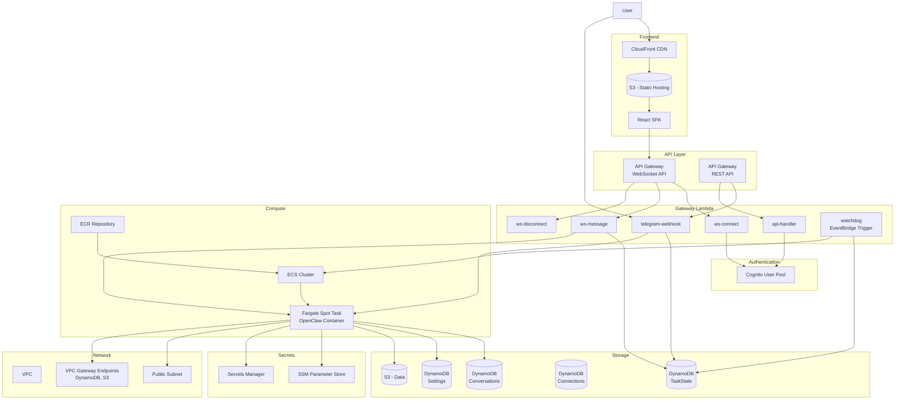

---

## 2. Network Design

### Design Principle: Eliminating NAT Gateway

A NAT Gateway costs at least ~$33/month ($4.5 fixed + data processing costs) even in a single-AZ minimal configuration. This exceeds the overall cost target ($1/month) by more than 30x, so we assign Public IPs to Fargate tasks and completely eliminate the NAT Gateway.

### VPC Configuration

```
VPC: 10.0.0.0/16

Public Subnets (Fargate tasks, Public IP assigned):
  - 10.0.1.0/24 (AZ-a)
  - 10.0.2.0/24 (AZ-b)

Private Subnets: None (NAT Gateway not needed)
```

### Network Flow

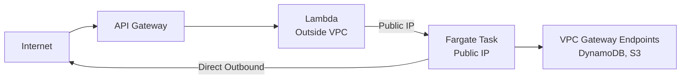

- **Fargate Tasks**: Placed in public subnets with Public IP assigned. Directly access external services such as LLM APIs (no NAT required)
- **Lambda**: Runs outside the VPC. Manages tasks via ECS API, communicates with the Bridge server via HTTP using the Fargate Public IP
- **VPC Gateway Endpoints**: Keeps DynamoDB and S3 traffic within the AWS internal network (free, optimized performance)

### Security Groups

| Security Group | Inbound | Outbound |
|----------|---------|----------|
| **sg-fargate** | 8080 (Bridge) - 0.0.0.0/0 (protected by auth token) | All allowed (443 HTTPS - LLM API, AWS services) |

> **Bridge Security**: Lambda runs outside the VPC and has no fixed IP, so source IP restriction via Security Group is not possible. The Bridge server's shared secret token authentication blocks unauthorized access.

### VPC Gateway Endpoints

Although Fargate can directly access the internet via Public IP, AWS service traffic is routed through VPC Gateway Endpoints over the AWS internal network to reduce latency and save data transfer costs.

| Service | Endpoint Type | Cost | Reason |
|--------|-------------|------|------|
| DynamoDB | Gateway | Free | Frequent conversation history reads/writes |
| S3 | Gateway | Free | File backup/configuration access |

> **Note**: ECR, CloudWatch Logs, Secrets Manager, etc. are accessed via Fargate's Public IP through public endpoints. Interface Endpoints (~$7/month each) do not align with the cost target and are therefore not used.

---

## 3. Gateway Lambda Detailed Design

Gateway Lambda is split into 6 independent functions following the single responsibility principle.

### 3.1 Function List

| Function | Trigger | Role | Timeout |
|------|--------|------|---------|
| `ws-connect` | WebSocket $connect | Connection establishment, authentication, connectionId storage | 10s |
| `ws-message` | WebSocket $default | Message reception, container routing | 30s |
| `ws-disconnect` | WebSocket $disconnect | Connection cleanup | 10s |
| `telegram-webhook` | REST POST /telegram | Telegram message reception, routing | 30s |
| `api-handler` | REST GET/POST /api/* | Settings query/update, conversation history | 10s |
| `watchdog` | EventBridge (5-min interval) | Zombie task detection and termination | 60s |

### 3.2 WebSocket Message Processing Flow

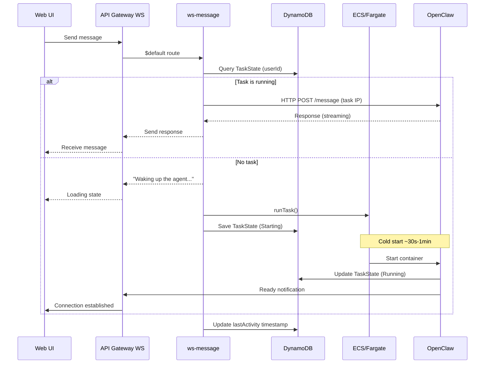

### 3.3 Telegram Message Processing Flow

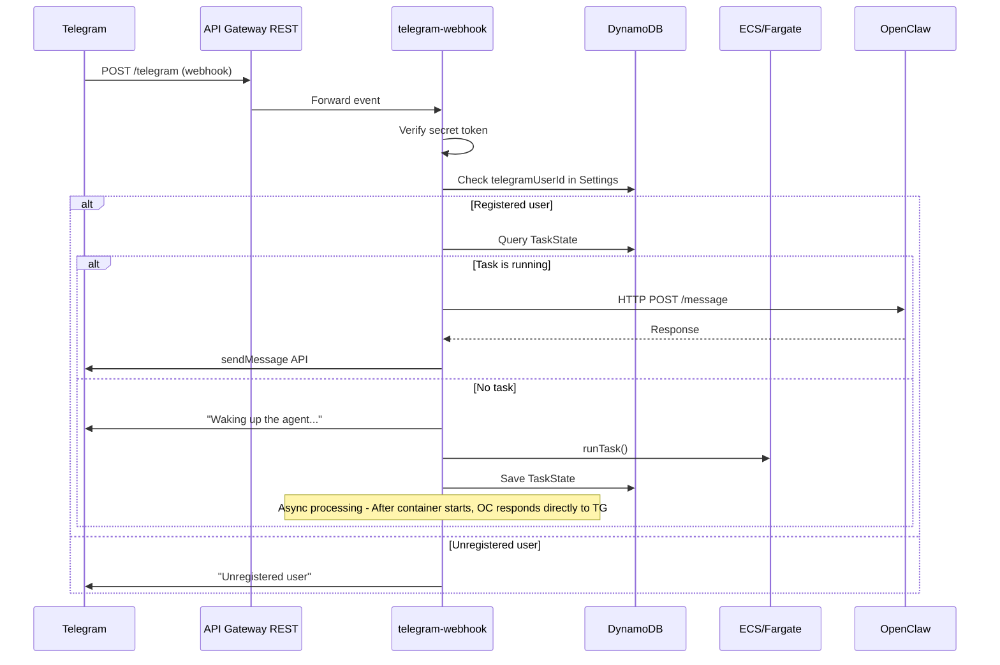

### 3.4 Watchdog (Zombie Task Detection)

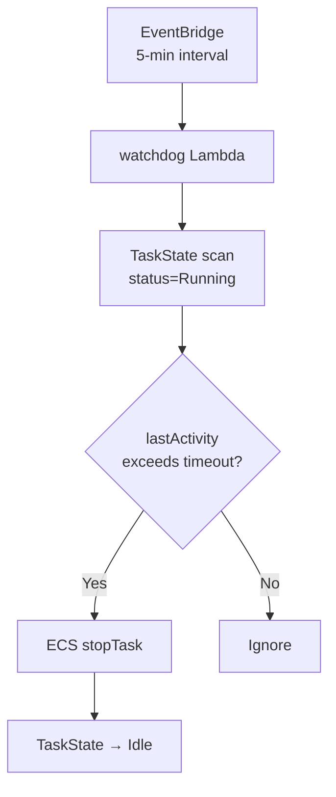

- **Default timeout**: 15 minutes (user-configurable)
- **Scan interval**: 5 minutes (EventBridge rule)
- **Safety guard**: Tasks within 5 minutes of startup are not terminated (cold start protection)

---

## 4. OpenClaw Container Design

### 4.1 Docker Image Configuration

```dockerfile
# Phase 1: Lightweight image
FROM node:20-slim

# Install OpenClaw
RUN npm install -g openclaw@latest

# Copy Bridge server
COPY src/ /app/
WORKDIR /app

# Bridge server port
EXPOSE 8080

# Health check
HEALTHCHECK --interval=30s --timeout=5s \
  CMD curl -f http://localhost:8080/health || exit 1

CMD ["node", "bridge.js"]
```

```dockerfile
# Phase 2: With Chromium
FROM node:20-slim

RUN apt-get update && apt-get install -y \
    chromium \
    --no-install-recommends \
    && rm -rf /var/lib/apt/lists/*

ENV PUPPETEER_EXECUTABLE_PATH=/usr/bin/chromium

# Same as above
```

### 4.2 Bridge Server Architecture

The Bridge server is an intermediary layer between Gateway Lambda and OpenClaw.

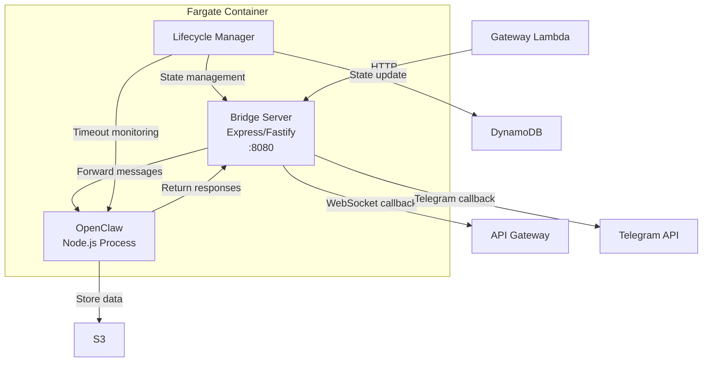

### 4.3 Bridge API Endpoints

| Method | Path | Description |
|--------|------|------|
| POST | `/message` | Forward message. body: `{ userId, message, channel, callbackUrl }` |
| GET | `/health` | Health check. `{ status: "ok", uptime, activeConversations }` |
| POST | `/shutdown` | Graceful shutdown request (for Spot interruption handling) |
| GET | `/status` | Container status information |

### 4.4 Container → Client Response Mechanism

Since OpenClaw responses are asynchronous, the Bridge delivers them to clients via a callback mechanism:

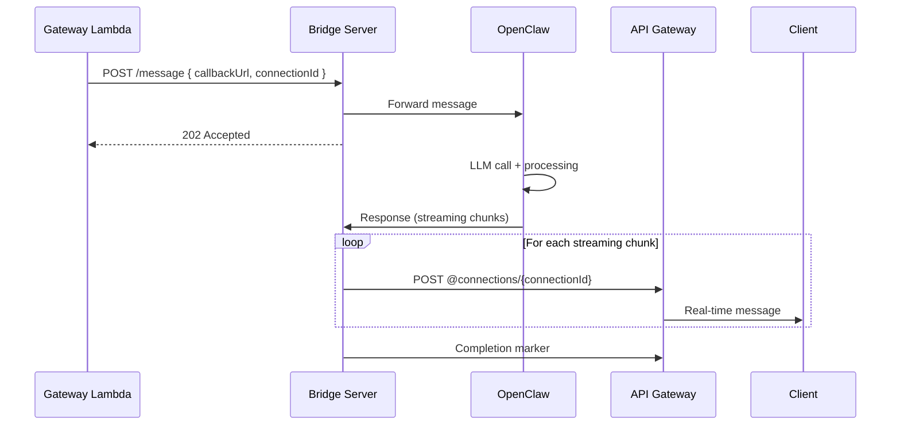

### 4.5 Fargate Task Definition

| Item | Value | Notes |
|------|-----|------|
| CPU | 0.25 vCPU (256 units) | Fargate minimum spec |
| Memory | 0.5 GB (512 MB) | Minimum spec, 1GB+ required in Phase 2 |
| Platform | LINUX/ARM64 | Graviton (higher Spot availability + 20% cheaper) |
| Capacity Provider | FARGATE_SPOT | 70% discount |
| Task Role | openclaw-task-role | DynamoDB, S3, SSM access |
| Execution Role | openclaw-exec-role | ECR pull, CloudWatch logs |
| Log Driver | awslogs | Send to CloudWatch Logs group |
| Assign Public IP | true | Public subnet, direct internet access (no NAT needed) |

### 4.6 Spot Interruption Handling

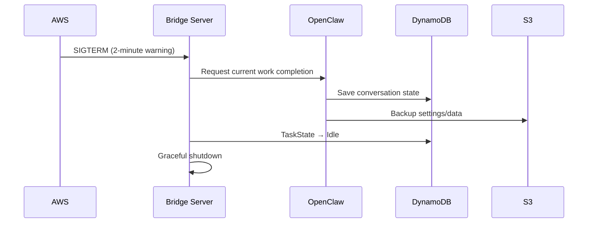

---

## 5. DynamoDB Table Detailed Design

### 5.1 Conversations Table

Stores conversation history. Uses single-table design for efficient per-user conversation queries.

| Attribute | Type | Description |
|------|------|------|
| **PK** | S | `USER#{userId}` |
| **SK** | S | `CONV#{conversationId}#MSG#{timestamp}` |
| role | S | `user` / `assistant` / `system` |
| content | S | Message content |
| channel | S | `web` / `telegram` |
| metadata | M | Token count, LLM model name, etc. |
| ttl | N | TTL timestamp (conversation retention period) |

**Access Patterns:**

| Pattern | Query |
|------|------|
| User's conversation list | PK = `USER#{userId}`, SK begins_with `CONV#` |
| Messages for a specific conversation | PK = `USER#{userId}`, SK begins_with `CONV#{convId}#MSG#` |
| Most recent N messages | Above query + ScanIndexForward=false, Limit=N |

### 5.2 Settings Table

User settings and system configuration.

| Attribute | Type | Description |
|------|------|------|
| **PK** | S | `USER#{userId}` |
| **SK** | S | `SETTING#{key}` |
| value | S / M | Setting value |
| updatedAt | S | ISO 8601 timestamp |

**Key Setting Keys:**

| SK | Example Value | Description |
|----|--------|------|
| `SETTING#llm_provider` | `{ provider: "anthropic", model: "claude-sonnet-4-5-20250929" }` | LLM provider |
| `SETTING#timeout` | `{ minutes: 15 }` | Inactivity timeout |
| `SETTING#skills` | `{ enabled: ["browser", "calendar"] }` | Enabled skills |

**Identity Linking Keys (OTP + 양방향 링크):**

| PK | SK | Value | TTL | Description |
|----|----|----|-----|------|
| `USER#{cognitoId}` | `SETTING#telegram-otp` | `{ code: "123456" }` | 5분 | OTP 코드 (Web에서 생성) |
| `USER#otp:123456` | `SETTING#otp-owner` | `{ cognitoUserId: "abc" }` | 5분 | OTP 역조회 (Telegram `/link` 시 사용) |
| `USER#{cognitoId}` | `SETTING#linked-telegram` | `{ telegramUserId: "67890" }` | — | 정방향 링크 (Cognito → Telegram) |
| `USER#telegram:67890` | `SETTING#linked-cognito` | `{ cognitoUserId: "abc" }` | — | 역방향 링크 (Telegram → Cognito) |

### 5.3 TaskState Table

Tracks Fargate task state.

| Attribute | Type | Description |
|------|------|------|
| **PK** | S | `USER#{userId}` |
| taskArn | S | ECS task ARN |
| status | S | `Idle` / `Starting` / `Running` / `Stopping` |
| publicIp | S | Task public IP (when Running) |
| startedAt | S | Start time |
| lastActivity | S | Last activity time |
| ttl | N | TTL for automatic deletion |

### 5.4 Connections Table

WebSocket connection management.

| Attribute | Type | Description |
|------|------|------|
| **PK** | S | `CONN#{connectionId}` |
| userId | S | Connected user ID |
| connectedAt | S | Connection time |
| ttl | N | Automatic deletion after 24 hours |

**GSI (userId-index):**

| GSI PK | GSI SK |
|--------|--------|
| userId | connectedAt |

> Used to query a user's active WebSocket connections for broadcasting messages.

### 5.5 PendingMessages Table

Message queue to prevent loss during cold start. Temporarily stores messages that arrive before the container starts, and the Bridge consumes them after startup.

| Attribute | Type | Description |
|------|------|------|
| **PK** | S | `USER#{userId}` |
| **SK** | S | `MSG#{timestamp}#{uuid}` |
| message | S | User message content |
| channel | S | `web` / `telegram` |
| connectionId | S | WebSocket connectionId for sending responses |
| createdAt | S | ISO 8601 timestamp |
| ttl | N | Automatic deletion after 5 minutes (cleanup of unprocessed messages) |

**Processing Flow:**
1. Lambda: When the container is not running → Save message to PendingMessages + RunTask
2. Bridge startup: Query PendingMessages for the userId from DynamoDB (SK begins_with `MSG#`)
3. Bridge: Forward each pending message to OpenClaw Gateway in order
4. Bridge: Delete processed messages (`DeleteItem`)

> **TTL Safety Guard**: The 5-minute TTL ensures that pending messages do not accumulate indefinitely even if the Bridge terminates abnormally.

---

## 6. API Gateway Design

### 6.1 WebSocket API

| Route | Lambda | Auth | Description |
|-------|--------|------|------|
| `$connect` | ws-connect | Cognito JWT (query string) | Connection establishment |
| `$default` | ws-message | Identified by connectionId | Message processing |
| `$disconnect` | ws-disconnect | Identified by connectionId | Connection termination |

**Authentication on Connection:**

```
wss://xxx.execute-api.region.amazonaws.com/prod?token={jwt_token}
```

The ws-connect Lambda validates the JWT and stores the connectionId and userId in the Connections table.

**Message Protocol:**

```typescript
// Client → Server
interface ClientMessage {
  action: "sendMessage" | "getHistory" | "getStatus";
  conversationId?: string;
  message?: string;
}

// Server → Client
interface ServerMessage {
  type: "message" | "status" | "error" | "stream_chunk" | "stream_end";
  conversationId?: string;
  content?: string;
  status?: "starting" | "running" | "stopping" | "idle";
  error?: string;
}
```

### 6.2 REST API

| Method | Path | Lambda | Auth | Description |
|--------|------|--------|------|------|
| POST | `/telegram` | telegram-webhook | Telegram secret | Telegram webhook |
| GET | `/conversations` | api-handler | Cognito JWT | Conversation list |
| GET | `/status` | api-handler | Cognito JWT | Container status |
| POST | `/link/generate-otp` | api-handler | Cognito JWT | Telegram 연동용 6자리 OTP 생성 |
| GET | `/link/status` | api-handler | Cognito JWT | 현재 연동 상태 조회 |
| POST | `/link/unlink` | api-handler | Cognito JWT | Telegram 연동 해제 |

**CORS 설정:** HTTP API에 `corsPreflight` 적용 (`allowOrigins: ["*"]`, `allowHeaders: [Authorization, Content-Type]`). Web(CloudFront) → API Gateway 크로스 오리진 호출 허용.

### 6.3 Cognito Authorizer

A Cognito User Pool Authorizer is attached to the REST API for automatic JWT validation:

```typescript
// CDK definition example
const authorizer = new apigateway.CognitoUserPoolsAuthorizer(this, "Authorizer", {
  cognitoUserPools: [userPool],
});

api.addMethod("GET", integration, {
  authorizer,
  authorizationType: apigateway.AuthorizationType.COGNITO,
});
```

---

## 7. Authentication and Security Design

### 7.1 Cognito User Pool Configuration

| Item | Setting |
|------|------|
| Sign-in attribute | Email |
| MFA | Optional (TOTP) |
| Password policy | Minimum 8 characters, upper/lower/numbers/special characters |
| Self-service sign-up | Enabled (email verification required) |
| Token expiration | Access: 1 hour, Refresh: 30 days |

### 7.2 Telegram Authentication Flow

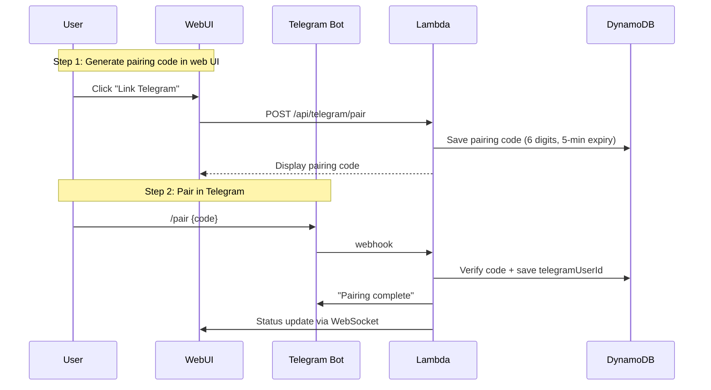

### 7.3 Secrets Management

| Secret | Storage | Accessed By |
|--------|-------|----------|
| Telegram Bot Token | Secrets Manager | Lambda (telegram-webhook) |
| LLM API Keys (Claude, GPT, etc.) | Secrets Manager | Fargate (OpenClaw) |
| Cognito Client Secret | SSM Parameter Store | Lambda (api-handler) |
| WebSocket Callback URL | SSM Parameter Store | Fargate (Bridge) |
| Database settings | Environment variables (CDK-injected) | Lambda, Fargate |

### 7.4 IAM Roles

**Lambda execution role (`gateway-lambda-role`):**

```json
{
  "Statement": [
    {
      "Effect": "Allow",
      "Action": ["dynamodb:GetItem", "dynamodb:PutItem", "dynamodb:Query", "dynamodb:DeleteItem"],
      "Resource": "arn:aws:dynamodb:*:*:table/serverless-openclaw-*"
    },
    {
      "Effect": "Allow",
      "Action": ["ecs:RunTask", "ecs:StopTask", "ecs:DescribeTasks"],
      "Resource": "*",
      "Condition": { "StringEquals": { "ecs:cluster": "{cluster-arn}" } }
    },
    {
      "Effect": "Allow",
      "Action": ["iam:PassRole"],
      "Resource": ["arn:aws:iam::*:role/openclaw-task-role", "arn:aws:iam::*:role/openclaw-exec-role"]
    },
    {
      "Effect": "Allow",
      "Action": ["execute-api:ManageConnections"],
      "Resource": "arn:aws:execute-api:*:*:*/prod/POST/@connections/*"
    },
    {
      "Effect": "Allow",
      "Action": ["secretsmanager:GetSecretValue"],
      "Resource": "arn:aws:secretsmanager:*:*:secret:serverless-openclaw/*"
    }
  ]
}
```

**Fargate task role (`openclaw-task-role`):**

```json
{
  "Statement": [
    {
      "Effect": "Allow",
      "Action": ["dynamodb:GetItem", "dynamodb:PutItem", "dynamodb:Query", "dynamodb:UpdateItem"],
      "Resource": "arn:aws:dynamodb:*:*:table/serverless-openclaw-*"
    },
    {
      "Effect": "Allow",
      "Action": ["s3:GetObject", "s3:PutObject", "s3:ListBucket"],
      "Resource": ["arn:aws:s3:::serverless-openclaw-data", "arn:aws:s3:::serverless-openclaw-data/*"]
    },
    {
      "Effect": "Allow",
      "Action": ["secretsmanager:GetSecretValue"],
      "Resource": "arn:aws:secretsmanager:*:*:secret:serverless-openclaw/llm-*"
    },
    {
      "Effect": "Allow",
      "Action": ["ssm:GetParameter"],
      "Resource": "arn:aws:ssm:*:*:parameter/serverless-openclaw/*"
    },
    {
      "Effect": "Allow",
      "Action": ["execute-api:ManageConnections"],
      "Resource": "arn:aws:execute-api:*:*:*/prod/POST/@connections/*"
    }
  ]
}
```

### 7.5 Public IP Multi-Layer Defense Strategy

Since Public IPs are assigned to Fargate to eliminate the NAT Gateway, the Bridge server (`:8080`) is exposed to the internet. Security is ensured through the following layered defenses.

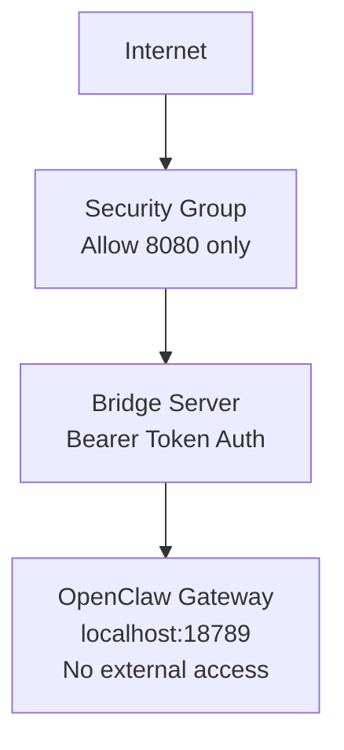

| Layer | Measure | Defends Against | Cost |
|------|------|----------|------|
| Security Group | Allow inbound 8080 only, block all others | Port scanning, unnecessary service exposure | $0 |
| Bridge Auth | `Authorization: Bearer <token>` validation. Required for all endpoints except `/health` | Unauthorized API calls | $0 |
| Gateway localhost binding | `--bind localhost` — port 18789 only accessible within the container | Direct Gateway access blocked | $0 |
| Token management | Stored in Secrets Manager, injected via environment variables. Never written to disk | Token leakage | ~$0.40/month |
| Non-root container | `USER openclaw` — runs as unprivileged user | Privilege escalation on container escape | $0 |
| TLS | Self-signed certificate on Bridge (Node.js `https.createServer`) | Token sniffing (plaintext HTTP segment) | $0 |

> **Cost Impact**: The entire multi-layer defense adds no cost beyond a single Secrets Manager secret ($0.40/month).

### 7.6 Bridge Authentication Details

```
Lambda → Bridge request:
  POST https://{publicIp}:8080/message
  Headers:
    Authorization: Bearer {BRIDGE_AUTH_TOKEN}
    Content-Type: application/json
  Body: { userId, message, channel, connectionId, callbackUrl }

Bridge validation:
  1. Extract Bearer token from Authorization header
  2. Verify match against BRIDGE_AUTH_TOKEN environment variable
  3. Return 401 Unauthorized immediately on mismatch
  4. Only /health endpoint is exempt from auth (for ECS health checks)
```

**Token Lifecycle:**
- Automatically generated in Secrets Manager during CDK deployment (32-byte random)
- Same token injected into both Lambda environment variables and Fargate container environment variables
- Token rotation: Secrets Manager automatic rotation + container restart to apply

### 7.7 Container Security Hardening

| Item | Setting | Reason |
|------|------|------|
| Execution user | `openclaw` (non-root) | OpenClaw skills can execute arbitrary code, so root privileges are restricted |
| Read-only root filesystem | `readonlyRootFilesystem: true` (Phase 2) | Prevent container tampering |
| Gateway binding | `--bind localhost` | Block external exposure of port 18789 |
| EXPOSE | 8080 only | 18789 is localhost-only, no exposure needed |
| Secret delivery | Environment variables (Secrets Manager → ECS) | No API keys written to disk. Tokens not included in `openclaw.json` |
| Home directory | `/home/openclaw/` | Uses non-root user home instead of `/root/` |

### 7.8 IDOR (Insecure Direct Object Reference) Prevention

All API paths enforce that authenticated users can only access their own resources.

| Layer | Validation Logic |
|------|----------|
| **ws-message Lambda** | connectionId → Look up userId from Connections table → Verify match with request userId |
| **Bridge /message** | Only uses the userId passed by Lambda. Client-provided userId is ignored |
| **REST API (conversation history)** | DynamoDB queries use only the userId extracted from JWT (PK = `USER#{jwt.sub}`) |
| **Telegram webhook** | Look up paired telegramUserId → userId mapping table. Reject unpaired users |

> **Principle**: userId is always determined server-side (via JWT or connectionId reverse lookup). Never trust userId sent by the client.

### 7.9 Telegram-Web Identity Linking

같은 사용자가 Web(Cognito UUID)과 Telegram(`telegram:{fromId}`)을 사용할 때, 하나의 컨테이너를 공유하기 위한 OTP 기반 계정 연동.

**연동 흐름:**

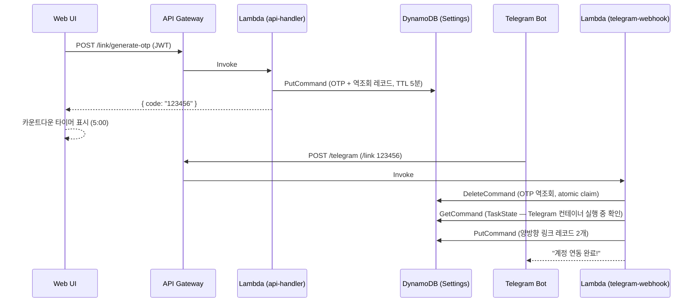

**메시지 라우팅 (연동 후):**

1. Telegram 메시지 도착 → `telegram-webhook` Lambda
2. `resolveUserId(dynamoSend, "telegram:67890")` → Settings 테이블에서 `linked-cognito` 조회
3. 링크 존재 → Cognito UUID 반환 → 이 userId로 `routeMessage()` 호출
4. TaskState(`USER#{cognitoId}`)의 컨테이너로 라우팅 → Web과 동일한 컨테이너 공유

**보안:**

| 위협 | 방어 |
|------|------|
| OTP 무차별 대입 | 6자리 × 5분 TTL × API Gateway 스로틀링 |
| 무인가 OTP 생성 | Cognito JWT 인증 필수 |
| Telegram 사칭 | Telegram API가 `from.id` 검증 (webhook secret token) |
| IDOR (타인 연동 해제) | 연동 해제는 Web(Cognito JWT)에서만 가능, Telegram `/unlink` 불가 |
| 연동 시 컨테이너 충돌 | Telegram 컨테이너 실행 중이면 링크 거부 |

### 7.10 Secrets Never Written to Disk Principle

Ensures that API keys, tokens, and other secrets are never written to the container filesystem.

| Secret | Delivery Method | Written to Disk |
|--------|----------|----------------|
| ANTHROPIC_API_KEY | Secrets Manager → ECS environment variable | **Never** — not included in `openclaw.json` |
| BRIDGE_AUTH_TOKEN | Secrets Manager → ECS environment variable | **Never** |
| OPENCLAW_GATEWAY_TOKEN | Secrets Manager → ECS environment variable | **Never** — uses environment variable instead of CLI `--token` argument |
| TELEGRAM_BOT_TOKEN | SSM Parameter Store → Lambda environment variable | **Never** — not passed to container (webhook-only approach) |

**Caution When Patching Config:**

```typescript
// patch-config.ts — Do not write secrets to config files
// API keys are delivered only via environment variables; config contains only provider/model settings
config.auth = { method: "env" }; // Reference environment variable instead of "apiKey"
delete config.auth?.apiKey;       // Remove if it exists
```

> **Difference from MoltWorker**: MoltWorker writes API keys directly to `openclaw.json` and backs them up to R2. We deliver them only via environment variables through Secrets Manager, ensuring secrets are not included in S3 backups.

---

## 8. CDK Stack Design

Each stack is independently deployable, with dependency relationships managed by CDK.

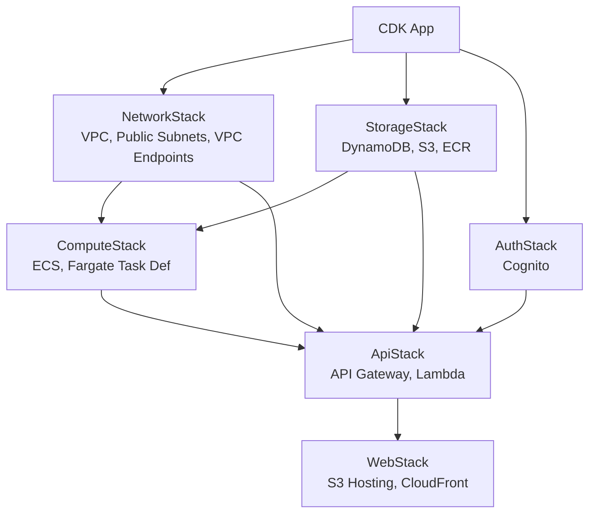

### Resources per Stack

| Stack | Resources | Dependencies |
|------|--------|--------|
| **NetworkStack** | VPC, Public Subnets, VPC Gateway Endpoints (DynamoDB, S3) | None |
| **StorageStack** | 5 DynamoDB tables, 2 S3 buckets, ECR repository | None |
| **AuthStack** | Cognito User Pool, App Client | None |
| **ComputeStack** | ECS Cluster, Fargate task definition, IAM roles | Network, Storage |
| **ApiStack** | API Gateway (WS+REST), 6 Lambda functions, IAM roles | Network, Storage, Auth, Compute |
| **WebStack** | S3 bucket (web), CloudFront distribution | Api (WebSocket URL injection) |

### Environment Variables and Configuration Injection

Settings injected from CDK into Lambda/Fargate:

```typescript
// Lambda environment variables
{
  DYNAMODB_TABLE_PREFIX: "serverless-openclaw",
  ECS_CLUSTER_ARN: cluster.clusterArn,
  TASK_DEFINITION_ARN: taskDef.taskDefinitionArn,
  SUBNET_IDS: privateSubnets.join(","),
  SECURITY_GROUP_ID: fargateSecurityGroup.securityGroupId,
  WEBSOCKET_API_ENDPOINT: wsApi.apiEndpoint,
  TELEGRAM_SECRET_ARN: telegramSecret.secretArn,
}

// Fargate environment variables
{
  DYNAMODB_TABLE_PREFIX: "serverless-openclaw",
  S3_DATA_BUCKET: dataBucket.bucketName,
  WEBSOCKET_CALLBACK_URL: wsApi.apiEndpoint,
  LLM_SECRET_ARN: llmSecret.secretArn,
  INACTIVITY_TIMEOUT_MINUTES: "15",
}
```

---

## 9. Frontend Design

### 9.1 React SPA Structure

```
packages/web/src/
├── components/
│   ├── Chat/
│   │   ├── ChatContainer.tsx    # Main chat container
│   │   ├── MessageList.tsx      # Message list (virtual scrolling)
│   │   ├── MessageBubble.tsx    # Individual message bubble
│   │   ├── MessageInput.tsx     # Input form
│   │   └── StreamingMessage.tsx # LLM streaming response display
│   ├── Auth/
│   │   ├── LoginForm.tsx        # Login form
│   │   └── AuthProvider.tsx     # Cognito auth context
│   ├── Status/
│   │   ├── AgentStatus.tsx      # Agent status display
│   │   └── ColdStartBanner.tsx  # "Waking up..." banner
│   └── Settings/
│       ├── SettingsPanel.tsx     # Settings panel
│       ├── LLMSelector.tsx      # LLM provider selector
│       └── TelegramPair.tsx     # Telegram pairing UI
├── hooks/
│   ├── useWebSocket.ts          # WebSocket connection management
│   ├── useAuth.ts               # Cognito auth hook
│   └── useAgentStatus.ts        # Agent status hook
├── services/
│   ├── websocket.ts             # WebSocket client
│   ├── api.ts                   # REST API client
│   └── auth.ts                  # Cognito Auth wrapper
├── types/
│   └── index.ts                 # Shared types
├── App.tsx
└── main.tsx
```

### 9.2 WebSocket Connection Management

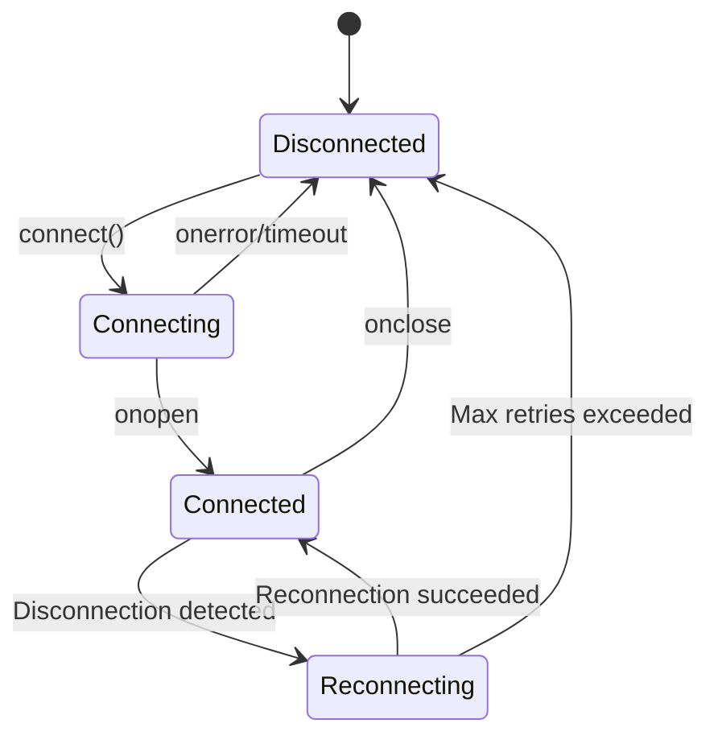

- **Auto-reconnect**: Exponential backoff (1s, 2s, 4s... max 30s)
- **Heartbeat**: Ping every 30 seconds to maintain connection
- **Token refresh**: Automatically refresh with Refresh Token on Access Token expiry, then reconnect

### 9.3 Deployment Settings

| Item | Value |
|------|-----|
| S3 bucket | `serverless-openclaw-web-{accountId}` |
| CloudFront | OAI for S3 access, HTTPS only |
| Cache policy | index.html: no-cache, assets: 1-year cache (hash-based) |
| SPA routing | CloudFront 404 → index.html redirect |
| Environment variables | Injected at build time: `VITE_WS_URL`, `VITE_API_URL`, `VITE_COGNITO_*` |

---

## 10. Deployment Pipeline

### 10.1 Initial Deployment (User)

```bash
# 1. Prerequisites
npm install -g aws-cdk
aws configure  # Set up AWS credentials

# 2. Clone repository and install dependencies
git clone https://github.com/serithemage/serverless-openclaw.git
cd serverless-openclaw
npm install

# 3. Environment setup
cp .env.example .env
# Edit .env: Enter Telegram Bot Token, LLM API Key, etc.

# 4. CDK bootstrap (one-time only)
cdk bootstrap

# 5. Build Docker image + deploy everything
cdk deploy --all

# 6. Check deployment outputs
# - Web UI URL (CloudFront)
# - WebSocket URL
# - REST API URL
```

### 10.2 Updates

```bash
git pull
npm install
cdk deploy --all
```

---

## 11. Monitoring

### CloudWatch Metrics

| Metric | Source | Purpose |
|--------|------|------|
| Lambda execution time/errors | Lambda automatic | Gateway performance |
| Fargate CPU/memory | ECS automatic | Container resources |
| DynamoDB reads/writes | DynamoDB automatic | Data access patterns |
| WebSocket connection count | Custom metric | Concurrent connections |
| Container start/stop count | Custom metric | Usage pattern analysis |
| Cold start duration | Custom metric | UX metric |

### Log Groups

| Log Group | Retention | Source |
|----------|----------|------|
| `/serverless-openclaw/lambda/ws-connect` | 7 days | Lambda |
| `/serverless-openclaw/lambda/ws-message` | 7 days | Lambda |
| `/serverless-openclaw/lambda/telegram` | 7 days | Lambda |
| `/serverless-openclaw/lambda/api` | 7 days | Lambda |
| `/serverless-openclaw/lambda/watchdog` | 7 days | Lambda |
| `/serverless-openclaw/fargate/openclaw` | 14 days | Fargate |
