# 아키텍처 설계서

PRD를 기반으로 한 상세 기술 아키텍처. 각 컴포넌트의 설계, 데이터 흐름, API 계약, 보안 모델을 정의한다.

---

## 1. 시스템 전체 구성


---

## 2. 네트워크 설계

### 설계 원칙: NAT Gateway 제거

NAT Gateway는 단일 AZ 최소 구성에서도 월 ~$33(고정 $4.5 + 데이터 처리 비용)이 발생한다. 이는 전체 비용 목표($1/월)를 30배 이상 초과하므로, Fargate에 Public IP를 할당하여 NAT Gateway를 완전히 제거한다.

### VPC 구성

```
VPC: 10.0.0.0/16

퍼블릭 서브넷 (Fargate 태스크, Public IP 할당):
  - 10.0.1.0/24 (AZ-a)
  - 10.0.2.0/24 (AZ-b)

프라이빗 서브넷: 없음 (NAT Gateway 불필요)
```

### 네트워크 흐름

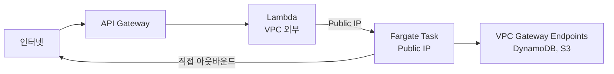

- **Fargate 태스크**: 퍼블릭 서브넷에 배치, Public IP 할당. LLM API 등 외부 서비스에 직접 접근 (NAT 불필요)
- **Lambda**: VPC 외부에서 실행. ECS API로 태스크 관리, Fargate Public IP로 Bridge 서버에 HTTP 통신
- **VPC Gateway Endpoints**: DynamoDB, S3 트래픽을 AWS 내부 네트워크로 유지 (무료, 성능 최적화)

### 보안 그룹

| 보안 그룹 | 인바운드 | 아웃바운드 |
|----------|---------|----------|
| **sg-fargate** | 8080 (Bridge) - 0.0.0.0/0 (인증 토큰으로 보호) | 전체 허용 (443 HTTPS - LLM API, AWS 서비스) |

> **Bridge 보안**: Lambda는 VPC 외부에서 실행되어 고정 IP가 없으므로, Security Group으로 소스 IP를 제한할 수 없다. Bridge 서버의 공유 시크릿 토큰 인증으로 무단 접근을 차단한다.

### VPC Gateway Endpoints

Fargate가 Public IP로 인터넷에 직접 접근 가능하지만, AWS 서비스 트래픽은 VPC Gateway Endpoint를 통해 AWS 내부 네트워크로 라우팅하여 지연 시간을 줄이고 데이터 전송 비용을 절감한다.

| 서비스 | Endpoint 유형 | 비용 | 이유 |
|--------|-------------|------|------|
| DynamoDB | Gateway | 무료 | 대화 이력 읽기/쓰기 빈번 |
| S3 | Gateway | 무료 | 파일 백업/설정 접근 |

> **참고**: ECR, CloudWatch Logs, Secrets Manager 등은 Fargate의 Public IP를 통해 공개 endpoint로 접근. Interface Endpoint(월 ~$7/개)는 비용 목표에 부합하지 않으므로 사용하지 않는다.

---

## 3. Gateway Lambda 상세 설계

Gateway Lambda는 6개의 독립 함수로 분리하여 단일 책임 원칙을 따른다.

### 3.1 함수 목록

| 함수 | 트리거 | 역할 | 타임아웃 |
|------|--------|------|---------|
| `ws-connect` | WebSocket $connect | 연결 수립, 인증, connectionId 저장 | 10초 |
| `ws-message` | WebSocket $default | 메시지 수신, 컨테이너 라우팅 | 30초 |
| `ws-disconnect` | WebSocket $disconnect | 연결 정리 | 10초 |
| `telegram-webhook` | REST POST /telegram | Telegram 메시지 수신, 라우팅 | 30초 |
| `api-handler` | REST GET/POST /api/* | 설정 조회/변경, 대화 이력 | 10초 |
| `watchdog` | EventBridge (5분 간격) | 좀비 태스크 감지 및 종료 | 60초 |

### 3.2 WebSocket 메시지 처리 흐름

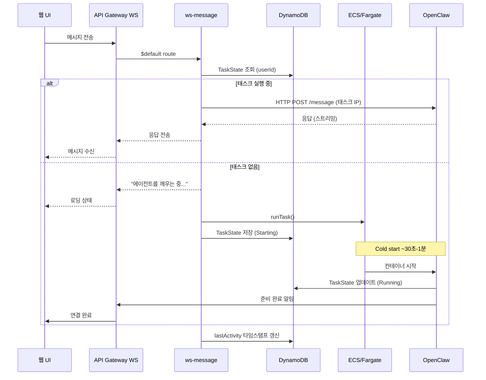

### 3.3 Telegram 메시지 처리 흐름

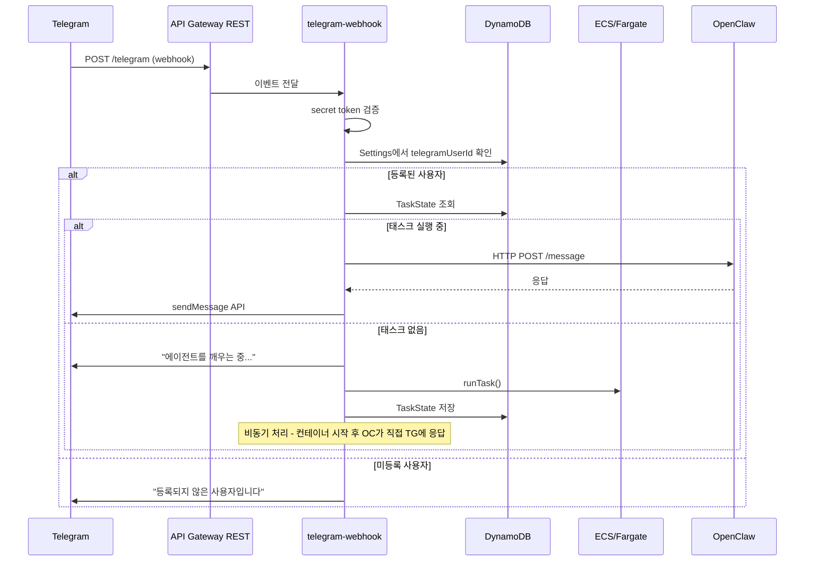

### 3.4 Watchdog (좀비 태스크 감지)

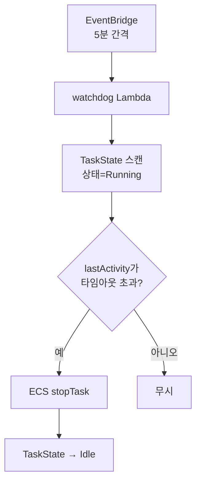

- **기본 타임아웃**: 15분 (사용자 설정 가능)
- **스캔 주기**: 5분 (EventBridge rule)
- **안전장치**: 시작 후 5분 이내 태스크는 종료하지 않음 (cold start 보호)

---

## 4. OpenClaw 컨테이너 설계

### 4.1 Docker 이미지 구성

```dockerfile
# Phase 1: 경량 이미지
FROM node:20-slim

# OpenClaw 설치
RUN npm install -g openclaw@latest

# Bridge 서버 복사
COPY src/ /app/
WORKDIR /app

# Bridge 서버 포트
EXPOSE 8080

# 헬스체크
HEALTHCHECK --interval=30s --timeout=5s \
  CMD curl -f http://localhost:8080/health || exit 1

CMD ["node", "bridge.js"]
```

```dockerfile
# Phase 2: Chromium 포함
FROM node:20-slim

RUN apt-get update && apt-get install -y \
    chromium \
    --no-install-recommends \
    && rm -rf /var/lib/apt/lists/*

ENV PUPPETEER_EXECUTABLE_PATH=/usr/bin/chromium

# 이하 동일
```

### 4.2 Bridge 서버 아키텍처

Bridge 서버는 Gateway Lambda와 OpenClaw 사이의 중간 레이어.

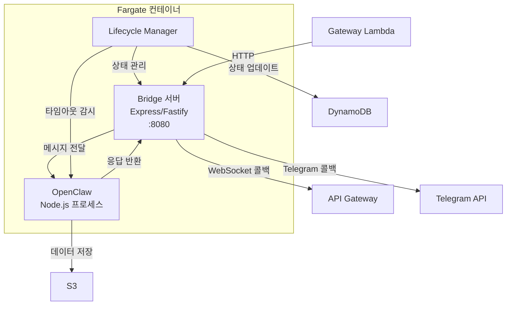

### 4.3 Bridge API 엔드포인트

| Method | Path | 설명 |
|--------|------|------|
| POST | `/message` | 메시지 전달. body: `{ userId, message, channel, callbackUrl }` |
| GET | `/health` | 헬스체크. `{ status: "ok", uptime, activeConversations }` |
| POST | `/shutdown` | Graceful shutdown 요청 (Spot 중단 대비) |
| GET | `/status` | 컨테이너 상태 정보 |

### 4.4 컨테이너 → 클라이언트 응답 메커니즘

OpenClaw의 응답은 비동기적이므로, Bridge가 콜백 방식으로 클라이언트에 전달:

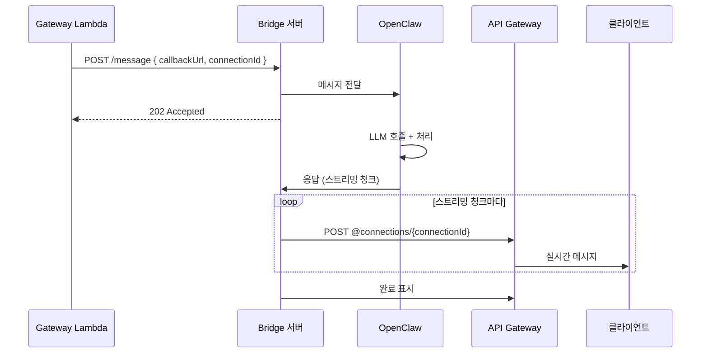

### 4.5 Fargate 태스크 정의

| 항목 | 값 | 비고 |
|------|-----|------|
| CPU | 0.25 vCPU (256 units) | Fargate 최소 사양 |
| Memory | 0.5 GB (512 MB) | 최소 사양, Phase 2에서 1GB 이상 필요 |
| Platform | LINUX/ARM64 | Graviton (Spot 가용성 높음 + 20% 저렴) |
| Capacity Provider | FARGATE_SPOT | 70% 할인 |
| Task Role | openclaw-task-role | DynamoDB, S3, SSM 접근 |
| Execution Role | openclaw-exec-role | ECR pull, CloudWatch logs |
| Log Driver | awslogs | CloudWatch Logs 그룹으로 전송 |
| Assign Public IP | true | 퍼블릭 서브넷, 직접 인터넷 접근 (NAT 불필요) |

### 4.6 Spot 중단 대응

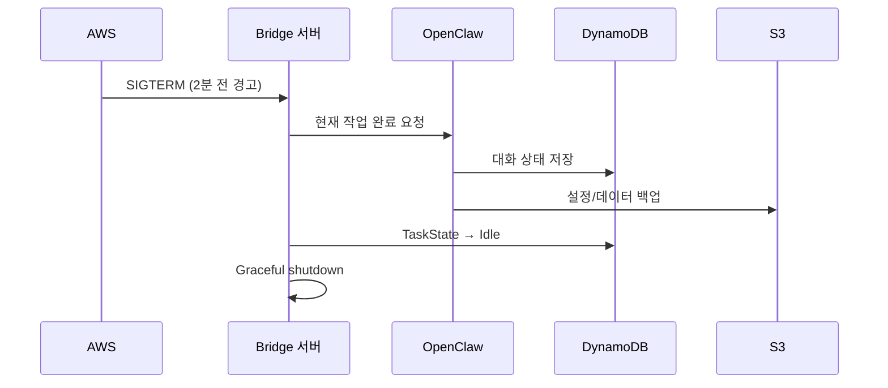

---

## 5. DynamoDB 테이블 상세 설계

### 5.1 Conversations 테이블

대화 이력을 저장. 단일 테이블 설계로 사용자별 대화를 효율적으로 조회.

| 속성 | 타입 | 설명 |
|------|------|------|
| **PK** | S | `USER#{userId}` |
| **SK** | S | `CONV#{conversationId}#MSG#{timestamp}` |
| role | S | `user` / `assistant` / `system` |
| content | S | 메시지 내용 |
| channel | S | `web` / `telegram` |
| metadata | M | 토큰 수, LLM 모델명 등 |
| ttl | N | TTL 타임스탬프 (대화 보존 기간) |

**접근 패턴:**

| 패턴 | 쿼리 |
|------|------|
| 사용자의 대화 목록 | PK = `USER#{userId}`, SK begins_with `CONV#` |
| 특정 대화의 메시지 | PK = `USER#{userId}`, SK begins_with `CONV#{convId}#MSG#` |
| 최근 N개 메시지 | 위 쿼리 + ScanIndexForward=false, Limit=N |

### 5.2 Settings 테이블

사용자 설정 및 시스템 구성.

| 속성 | 타입 | 설명 |
|------|------|------|
| **PK** | S | `USER#{userId}` |
| **SK** | S | `SETTING#{key}` |
| value | S / M | 설정 값 |
| updatedAt | S | ISO 8601 타임스탬프 |

**주요 설정 키:**

| SK | 값 예시 | 설명 |
|----|--------|------|
| `SETTING#llm_provider` | `{ provider: "anthropic", model: "claude-sonnet-4-5-20250929" }` | LLM 프로바이더 |
| `SETTING#telegram` | `{ telegramUserId: "123456", paired: true }` | Telegram 페어링 |
| `SETTING#timeout` | `{ minutes: 15 }` | 비활성 타임아웃 |
| `SETTING#skills` | `{ enabled: ["browser", "calendar"] }` | 활성 Skills |

### 5.3 TaskState 테이블

Fargate 태스크 상태 추적.

| 속성 | 타입 | 설명 |
|------|------|------|
| **PK** | S | `USER#{userId}` |
| taskArn | S | ECS 태스크 ARN |
| status | S | `Idle` / `Starting` / `Running` / `Stopping` |
| publicIp | S | 태스크 퍼블릭 IP (Running 시) |
| startedAt | S | 시작 시각 |
| lastActivity | S | 마지막 활동 시각 |
| ttl | N | 자동 삭제용 TTL |

### 5.4 Connections 테이블

WebSocket 연결 관리.

| 속성 | 타입 | 설명 |
|------|------|------|
| **PK** | S | `CONN#{connectionId}` |
| userId | S | 연결된 사용자 ID |
| connectedAt | S | 연결 시각 |
| ttl | N | 24시간 후 자동 삭제 |

**GSI (userId-index):**

| GSI PK | GSI SK |
|--------|--------|
| userId | connectedAt |

> 사용자의 활성 WebSocket 연결을 조회하여 메시지를 브로드캐스트할 때 사용.

### 5.5 PendingMessages 테이블

Cold start 중 유실 방지를 위한 메시지 큐. 컨테이너가 시작되기 전에 도착한 메시지를 임시 저장하고, Bridge가 시작 후 소비한다.

| 속성 | 타입 | 설명 |
|------|------|------|
| **PK** | S | `USER#{userId}` |
| **SK** | S | `MSG#{timestamp}#{uuid}` |
| message | S | 사용자 메시지 내용 |
| channel | S | `web` / `telegram` |
| connectionId | S | 응답을 보낼 WebSocket connectionId |
| createdAt | S | ISO 8601 타임스탬프 |
| ttl | N | 5분 후 자동 삭제 (미처리 메시지 정리) |

**처리 흐름:**
1. Lambda: 컨테이너 미실행 시 → PendingMessages에 메시지 저장 + RunTask
2. Bridge 시작: DynamoDB에서 userId의 PendingMessages 조회 (SK begins_with `MSG#`)
3. Bridge: 각 대기 메시지를 OpenClaw Gateway에 순서대로 전달
4. Bridge: 처리 완료된 메시지 삭제 (`DeleteItem`)

> **TTL 안전장치**: 5분 TTL로 Bridge가 비정상 종료되어도 대기 메시지가 무한히 쌓이지 않는다.

---

## 6. API Gateway 설계

### 6.1 WebSocket API

| Route | Lambda | 인증 | 설명 |
|-------|--------|------|------|
| `$connect` | ws-connect | Cognito JWT (query string) | 연결 수립 |
| `$default` | ws-message | connectionId로 식별 | 메시지 처리 |
| `$disconnect` | ws-disconnect | connectionId로 식별 | 연결 종료 |

**연결 시 인증:**

```
wss://xxx.execute-api.region.amazonaws.com/prod?token={jwt_token}
```

ws-connect Lambda에서 JWT를 검증하고, connectionId와 userId를 Connections 테이블에 저장.

**메시지 프로토콜:**

```typescript
// 클라이언트 → 서버
interface ClientMessage {
  action: "sendMessage" | "getHistory" | "getStatus";
  conversationId?: string;
  message?: string;
}

// 서버 → 클라이언트
interface ServerMessage {
  type: "message" | "status" | "error" | "stream_chunk" | "stream_end";
  conversationId?: string;
  content?: string;
  status?: "starting" | "running" | "stopping" | "idle";
  error?: string;
}
```

### 6.2 REST API

| Method | Path | Lambda | 인증 | 설명 |
|--------|------|--------|------|------|
| POST | `/telegram` | telegram-webhook | Telegram secret | Telegram webhook |
| GET | `/api/conversations` | api-handler | Cognito JWT | 대화 목록 |
| GET | `/api/conversations/{id}` | api-handler | Cognito JWT | 대화 상세 |
| GET | `/api/settings` | api-handler | Cognito JWT | 설정 조회 |
| PUT | `/api/settings` | api-handler | Cognito JWT | 설정 변경 |
| GET | `/api/status` | api-handler | Cognito JWT | 컨테이너 상태 |
| POST | `/api/container/start` | api-handler | Cognito JWT | 수동 시작 |
| POST | `/api/container/stop` | api-handler | Cognito JWT | 수동 종료 |

### 6.3 Cognito Authorizer

REST API에 Cognito User Pool Authorizer를 연결하여 JWT를 자동 검증:

```typescript
// CDK 정의 예시
const authorizer = new apigateway.CognitoUserPoolsAuthorizer(this, "Authorizer", {
  cognitoUserPools: [userPool],
});

api.addMethod("GET", integration, {
  authorizer,
  authorizationType: apigateway.AuthorizationType.COGNITO,
});
```

---

## 7. 인증 및 보안 설계

### 7.1 Cognito User Pool 구성

| 항목 | 설정 |
|------|------|
| 로그인 속성 | 이메일 |
| MFA | 선택적 (TOTP) |
| 비밀번호 정책 | 최소 8자, 대/소/숫자/특수문자 |
| 셀프 서비스 가입 | 활성화 (이메일 인증 필수) |
| 토큰 만료 | Access: 1시간, Refresh: 30일 |

### 7.2 Telegram 인증 흐름

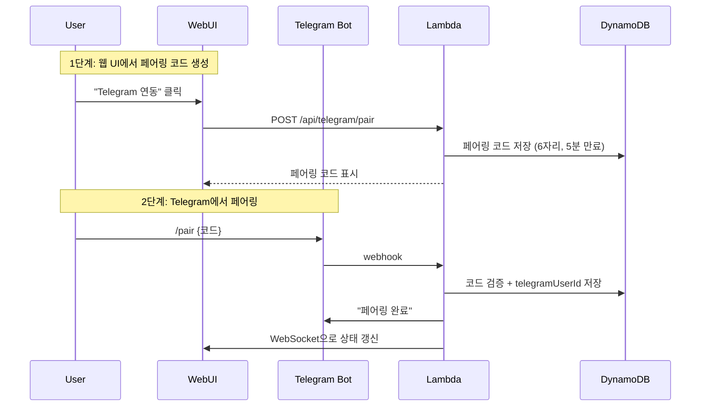

### 7.3 시크릿 관리

| 시크릿 | 저장소 | 접근 주체 |
|--------|-------|----------|
| Telegram Bot Token | Secrets Manager | Lambda (telegram-webhook) |
| LLM API Keys (Claude, GPT 등) | Secrets Manager | Fargate (OpenClaw) |
| Cognito Client Secret | SSM Parameter Store | Lambda (api-handler) |
| WebSocket Callback URL | SSM Parameter Store | Fargate (Bridge) |
| Database 설정 | 환경 변수 (CDK 주입) | Lambda, Fargate |

### 7.4 IAM 역할

**Lambda 실행 역할 (`gateway-lambda-role`):**

```json
{
  "Statement": [
    {
      "Effect": "Allow",
      "Action": ["dynamodb:GetItem", "dynamodb:PutItem", "dynamodb:Query", "dynamodb:DeleteItem"],
      "Resource": "arn:aws:dynamodb:*:*:table/serverless-openclaw-*"
    },
    {
      "Effect": "Allow",
      "Action": ["ecs:RunTask", "ecs:StopTask", "ecs:DescribeTasks"],
      "Resource": "*",
      "Condition": { "StringEquals": { "ecs:cluster": "{cluster-arn}" } }
    },
    {
      "Effect": "Allow",
      "Action": ["iam:PassRole"],
      "Resource": ["arn:aws:iam::*:role/openclaw-task-role", "arn:aws:iam::*:role/openclaw-exec-role"]
    },
    {
      "Effect": "Allow",
      "Action": ["execute-api:ManageConnections"],
      "Resource": "arn:aws:execute-api:*:*:*/prod/POST/@connections/*"
    },
    {
      "Effect": "Allow",
      "Action": ["secretsmanager:GetSecretValue"],
      "Resource": "arn:aws:secretsmanager:*:*:secret:serverless-openclaw/*"
    }
  ]
}
```

**Fargate 태스크 역할 (`openclaw-task-role`):**

```json
{
  "Statement": [
    {
      "Effect": "Allow",
      "Action": ["dynamodb:GetItem", "dynamodb:PutItem", "dynamodb:Query", "dynamodb:UpdateItem"],
      "Resource": "arn:aws:dynamodb:*:*:table/serverless-openclaw-*"
    },
    {
      "Effect": "Allow",
      "Action": ["s3:GetObject", "s3:PutObject", "s3:ListBucket"],
      "Resource": ["arn:aws:s3:::serverless-openclaw-data", "arn:aws:s3:::serverless-openclaw-data/*"]
    },
    {
      "Effect": "Allow",
      "Action": ["secretsmanager:GetSecretValue"],
      "Resource": "arn:aws:secretsmanager:*:*:secret:serverless-openclaw/llm-*"
    },
    {
      "Effect": "Allow",
      "Action": ["ssm:GetParameter"],
      "Resource": "arn:aws:ssm:*:*:parameter/serverless-openclaw/*"
    },
    {
      "Effect": "Allow",
      "Action": ["execute-api:ManageConnections"],
      "Resource": "arn:aws:execute-api:*:*:*/prod/POST/@connections/*"
    }
  ]
}
```

### 7.5 Public IP 다층 방어 전략

Fargate에 Public IP를 할당하여 NAT Gateway를 제거하므로, Bridge 서버(`:8080`)가 인터넷에 노출된다. 다음 계층별 방어로 보안을 확보한다.

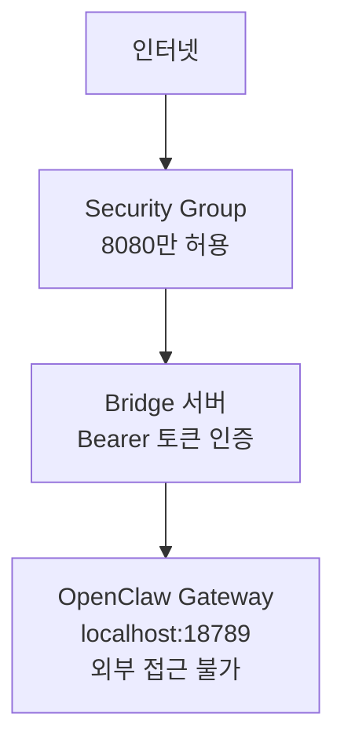

| 계층 | 대책 | 방어 대상 | 비용 |
|------|------|----------|------|
| Security Group | 인바운드 8080만 허용, 나머지 전체 차단 | 포트 스캐닝, 불필요한 서비스 노출 | $0 |
| Bridge 인증 | `Authorization: Bearer <token>` 검증. `/health` 외 모든 엔드포인트 필수 | 무단 API 호출 | $0 |
| Gateway localhost 바인딩 | `--bind localhost` — 18789 포트는 컨테이너 내부에서만 접근 | Gateway 직접 접근 차단 | $0 |
| 토큰 관리 | Secrets Manager 저장, 환경 변수로 주입. 디스크 미기록 | 토큰 유출 | ~$0.40/월 |
| 비root 컨테이너 | `USER openclaw` — 비특권 사용자로 실행 | 컨테이너 탈출 시 권한 상승 | $0 |
| TLS | Bridge에 자체 서명 인증서 적용 (Node.js `https.createServer`) | 토큰 스니핑 (평문 HTTP 구간) | $0 |

> **비용 영향**: 다층 방어 전체가 Secrets Manager 1개 시크릿($0.40/월) 외에는 추가 비용 없음.

### 7.6 Bridge 인증 상세

```
Lambda → Bridge 요청:
  POST https://{publicIp}:8080/message
  Headers:
    Authorization: Bearer {BRIDGE_AUTH_TOKEN}
    Content-Type: application/json
  Body: { userId, message, channel, connectionId, callbackUrl }

Bridge 검증:
  1. Authorization 헤더에서 Bearer 토큰 추출
  2. 환경 변수 BRIDGE_AUTH_TOKEN과 일치 여부 확인
  3. 불일치 시 401 Unauthorized 즉시 반환
  4. /health 엔드포인트만 인증 면제 (ECS 헬스체크용)
```

**토큰 생명주기:**
- CDK 배포 시 Secrets Manager에 자동 생성 (32바이트 랜덤)
- Lambda 환경 변수와 Fargate 컨테이너 환경 변수에 동일 토큰 주입
- 토큰 로테이션: Secrets Manager 자동 로테이션 + 컨테이너 재시작으로 적용

### 7.7 컨테이너 보안 강화

| 항목 | 설정 | 이유 |
|------|------|------|
| 실행 사용자 | `openclaw` (비root) | OpenClaw skills가 임의 코드를 실행할 수 있으므로 root 권한 제한 |
| 읽기 전용 루트 파일시스템 | `readonlyRootFilesystem: true` (Phase 2) | 컨테이너 변조 방지 |
| Gateway 바인딩 | `--bind localhost` | 18789 포트 외부 노출 차단 |
| EXPOSE | 8080만 | 18789는 localhost 전용이므로 노출 불필요 |
| 시크릿 전달 | 환경 변수 (Secrets Manager → ECS) | 디스크에 API 키 미기록. `openclaw.json`에 토큰 미포함 |
| 홈 디렉토리 | `/home/openclaw/` | `/root/` 대신 비root 사용자 홈 사용 |

### 7.8 IDOR (Insecure Direct Object Reference) 방지

모든 API 경로에서 인증된 사용자가 자신의 리소스만 접근 가능하도록 강제한다.

| 계층 | 검증 로직 |
|------|----------|
| **ws-message Lambda** | connectionId → Connections 테이블에서 userId 조회 → 요청의 userId와 일치 여부 확인 |
| **Bridge /message** | Lambda가 전달한 userId만 사용. 클라이언트 입력 userId 무시 |
| **REST API (대화 이력)** | JWT에서 추출한 userId로만 DynamoDB 쿼리 (PK = `USER#{jwt.sub}`) |
| **Telegram webhook** | 페어링된 telegramUserId → userId 매핑 테이블 조회. 미페어링 사용자 거부 |

> **원칙**: userId는 항상 서버 측에서 결정 (JWT 또는 connectionId 역조회). 클라이언트가 보낸 userId를 신뢰하지 않는다.

### 7.9 시크릿 디스크 미기록 원칙

컨테이너 파일시스템에 API 키, 토큰 등 시크릿이 기록되지 않도록 한다.

| 시크릿 | 전달 방식 | 디스크 기록 여부 |
|--------|----------|----------------|
| ANTHROPIC_API_KEY | Secrets Manager → ECS 환경 변수 | **미기록** — `openclaw.json`에 포함하지 않음 |
| BRIDGE_AUTH_TOKEN | Secrets Manager → ECS 환경 변수 | **미기록** |
| OPENCLAW_GATEWAY_TOKEN | Secrets Manager → ECS 환경 변수 | **미기록** — CLI `--token` 인자 대신 환경 변수 사용 |
| TELEGRAM_BOT_TOKEN | SSM Parameter Store → Lambda 환경 변수 | **미기록** — 컨테이너에 전달하지 않음 (webhook-only 방식) |

**Config 패치 시 주의:**

```typescript
// patch-config.ts — 시크릿을 config 파일에 기록하지 않음
// API 키는 환경 변수로만 전달, config에는 프로바이더/모델 설정만 기록
config.auth = { method: "env" }; // "apiKey" 대신 환경 변수 참조
delete config.auth?.apiKey;       // 혹시 존재하면 제거
```

> **MoltWorker와의 차이**: MoltWorker는 `openclaw.json`에 API 키를 직접 기록하고 R2에 백업한다. 우리는 Secrets Manager를 통해 환경 변수로만 전달하여 S3 백업에 시크릿이 포함되지 않도록 한다.

---

## 8. CDK 스택 설계

각 스택은 독립적으로 배포 가능하되, 의존 관계를 CDK에서 관리.

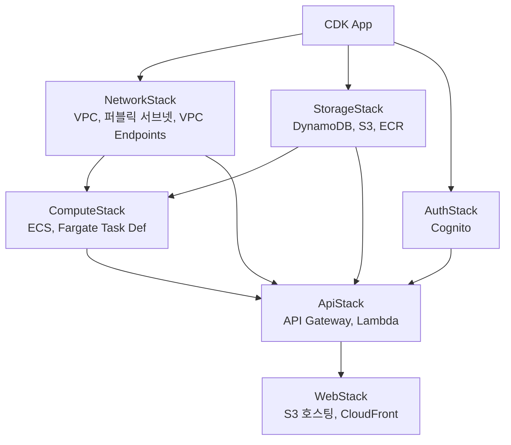

### 스택별 리소스

| 스택 | 리소스 | 의존성 |
|------|--------|--------|
| **NetworkStack** | VPC, 퍼블릭 서브넷, VPC Gateway Endpoints (DynamoDB, S3) | 없음 |
| **StorageStack** | DynamoDB 테이블 5개, S3 버킷 2개, ECR 리포지토리 | 없음 |
| **AuthStack** | Cognito User Pool, App Client | 없음 |
| **ComputeStack** | ECS 클러스터, Fargate 태스크 정의, IAM 역할 | Network, Storage |
| **ApiStack** | API Gateway (WS+REST), Lambda 함수 6개, IAM 역할 | Network, Storage, Auth, Compute |
| **WebStack** | S3 버킷(웹), CloudFront 배포 | Api (WebSocket URL 주입) |

### 환경 변수 및 설정 주입

CDK에서 Lambda/Fargate에 주입하는 설정:

```typescript
// Lambda 환경 변수
{
  DYNAMODB_TABLE_PREFIX: "serverless-openclaw",
  ECS_CLUSTER_ARN: cluster.clusterArn,
  TASK_DEFINITION_ARN: taskDef.taskDefinitionArn,
  SUBNET_IDS: privateSubnets.join(","),
  SECURITY_GROUP_ID: fargateSecurityGroup.securityGroupId,
  WEBSOCKET_API_ENDPOINT: wsApi.apiEndpoint,
  TELEGRAM_SECRET_ARN: telegramSecret.secretArn,
}

// Fargate 환경 변수
{
  DYNAMODB_TABLE_PREFIX: "serverless-openclaw",
  S3_DATA_BUCKET: dataBucket.bucketName,
  WEBSOCKET_CALLBACK_URL: wsApi.apiEndpoint,
  LLM_SECRET_ARN: llmSecret.secretArn,
  INACTIVITY_TIMEOUT_MINUTES: "15",
}
```

---

## 9. 프론트엔드 설계

### 9.1 React SPA 구성

```
packages/web/src/
├── components/
│   ├── Chat/
│   │   ├── ChatContainer.tsx    # 메인 채팅 컨테이너
│   │   ├── MessageList.tsx      # 메시지 목록 (가상 스크롤)
│   │   ├── MessageBubble.tsx    # 개별 메시지 버블
│   │   ├── MessageInput.tsx     # 입력 폼
│   │   └── StreamingMessage.tsx # LLM 스트리밍 응답 표시
│   ├── Auth/
│   │   ├── LoginForm.tsx        # 로그인 폼
│   │   └── AuthProvider.tsx     # Cognito 인증 컨텍스트
│   ├── Status/
│   │   ├── AgentStatus.tsx      # 에이전트 상태 표시
│   │   └── ColdStartBanner.tsx  # "깨우는 중..." 배너
│   └── Settings/
│       ├── SettingsPanel.tsx     # 설정 패널
│       ├── LLMSelector.tsx      # LLM 프로바이더 선택
│       └── TelegramPair.tsx     # Telegram 페어링 UI
├── hooks/
│   ├── useWebSocket.ts          # WebSocket 연결 관리
│   ├── useAuth.ts               # Cognito 인증 훅
│   └── useAgentStatus.ts        # 에이전트 상태 훅
├── services/
│   ├── websocket.ts             # WebSocket 클라이언트
│   ├── api.ts                   # REST API 클라이언트
│   └── auth.ts                  # Cognito Auth 래퍼
├── types/
│   └── index.ts                 # 공유 타입
├── App.tsx
└── main.tsx
```

### 9.2 WebSocket 연결 관리

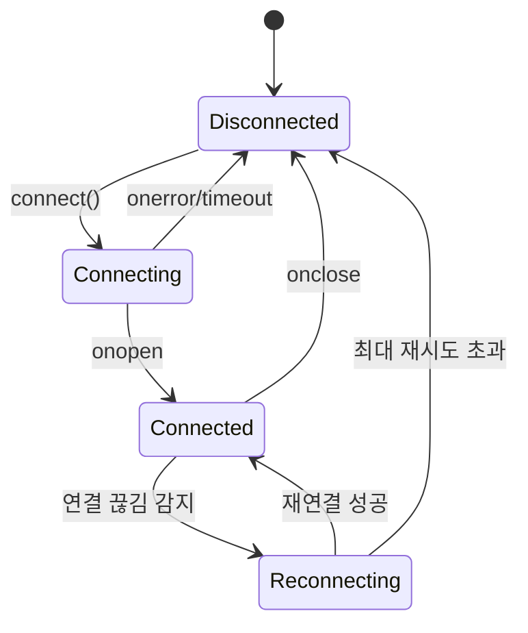

- **자동 재연결**: 지수 백오프 (1초, 2초, 4초... 최대 30초)
- **하트비트**: 30초 간격 ping으로 연결 유지
- **토큰 갱신**: Access Token 만료 시 Refresh Token으로 자동 갱신 후 재연결

### 9.3 배포 설정

| 항목 | 값 |
|------|-----|
| S3 버킷 | `serverless-openclaw-web-{accountId}` |
| CloudFront | OAI로 S3 접근, HTTPS 전용 |
| 캐시 정책 | index.html: no-cache, assets: 1년 캐시 (hash 기반) |
| SPA 라우팅 | CloudFront 404 → index.html 리다이렉트 |
| 환경 변수 | 빌드 시 `VITE_WS_URL`, `VITE_API_URL`, `VITE_COGNITO_*` 주입 |

---

## 10. 배포 파이프라인

### 10.1 초기 배포 (사용자)

```bash
# 1. 사전 요구사항
npm install -g aws-cdk
aws configure  # AWS 자격 증명 설정

# 2. 레포지토리 클론 및 의존성 설치
git clone https://github.com/serithemage/serverless-openclaw.git
cd serverless-openclaw
npm install

# 3. 환경 설정
cp .env.example .env
# .env 편집: Telegram Bot Token, LLM API Key 등 입력

# 4. CDK 부트스트랩 (최초 1회)
cdk bootstrap

# 5. Docker 이미지 빌드 + 전체 배포
cdk deploy --all

# 6. 배포 후 출력값 확인
# - 웹 UI URL (CloudFront)
# - WebSocket URL
# - REST API URL
```

### 10.2 업데이트

```bash
git pull
npm install
cdk deploy --all
```

---

## 11. 모니터링

### CloudWatch 메트릭

| 메트릭 | 소스 | 목적 |
|--------|------|------|
| Lambda 실행 시간/오류 | Lambda 자동 | Gateway 성능 |
| Fargate CPU/메모리 | ECS 자동 | 컨테이너 리소스 |
| DynamoDB 읽기/쓰기 | DynamoDB 자동 | 데이터 접근 패턴 |
| WebSocket 연결 수 | 커스텀 메트릭 | 동시 접속 |
| 컨테이너 시작/종료 횟수 | 커스텀 메트릭 | 사용 패턴 분석 |
| Cold start 소요 시간 | 커스텀 메트릭 | UX 지표 |

### 로그 그룹

| 로그 그룹 | 보존 기간 | 소스 |
|----------|----------|------|
| `/serverless-openclaw/lambda/ws-connect` | 7일 | Lambda |
| `/serverless-openclaw/lambda/ws-message` | 7일 | Lambda |
| `/serverless-openclaw/lambda/telegram` | 7일 | Lambda |
| `/serverless-openclaw/lambda/api` | 7일 | Lambda |
| `/serverless-openclaw/lambda/watchdog` | 7일 | Lambda |
| `/serverless-openclaw/fargate/openclaw` | 14일 | Fargate |
