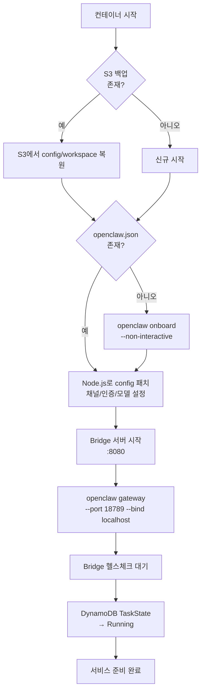
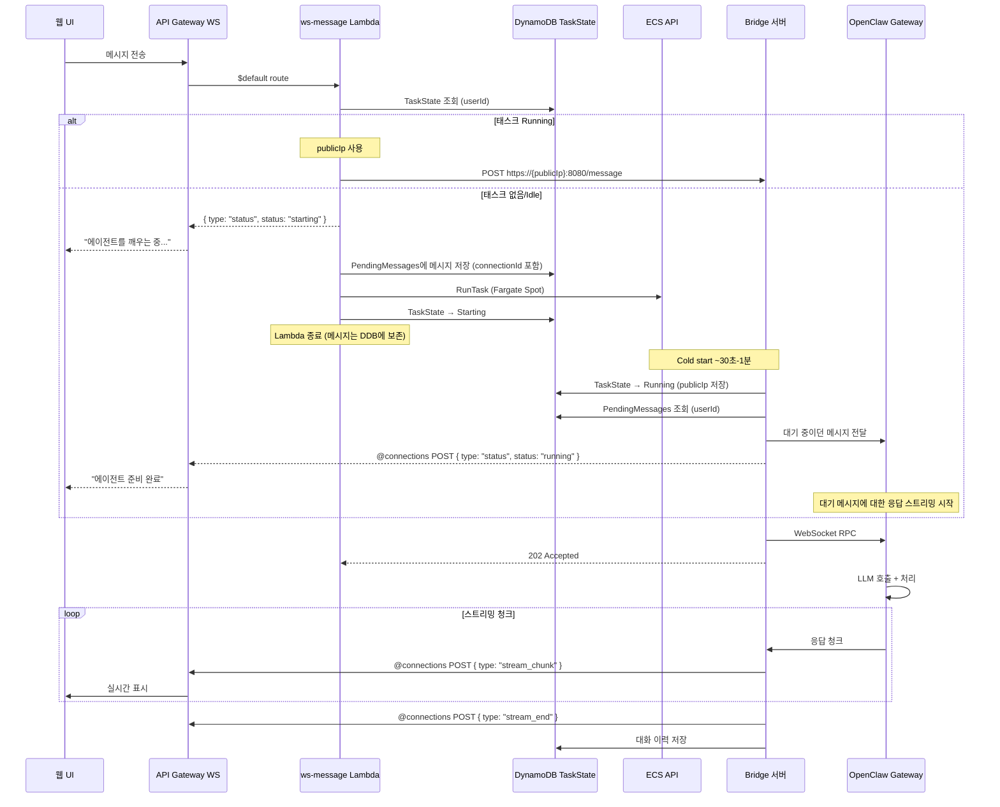
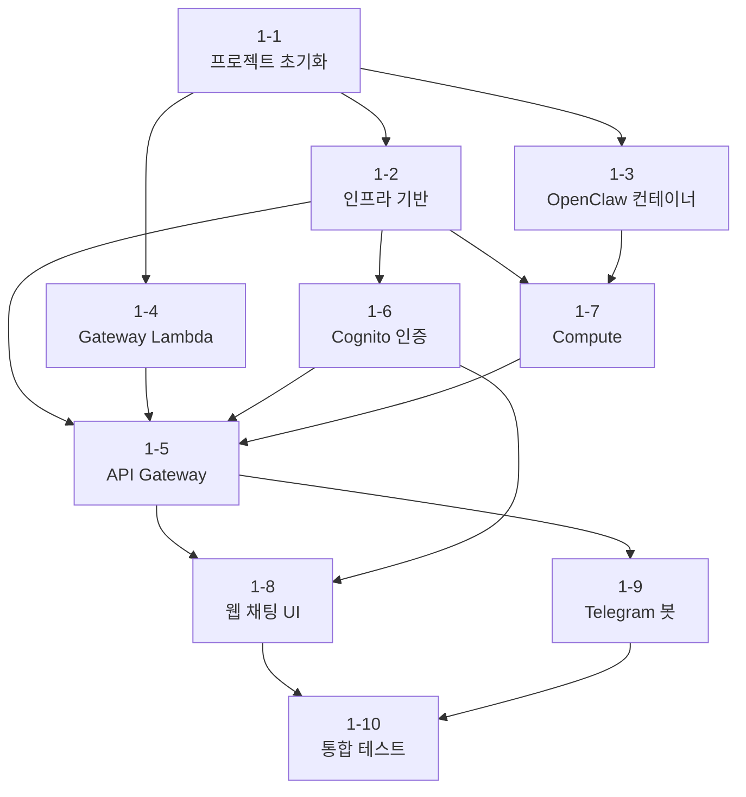

# 세부 설계 및 구현 계획

MoltWorker 참조 분석을 기반으로 한 구현 수준의 상세 설계와 단계별 구현 계획.

---

## Part 1: MoltWorker 참조 분석 및 설계 결정

### 1.1 MoltWorker 아키텍처 요약

MoltWorker는 Cloudflare Worker + Sandbox에서 OpenClaw를 구동하는 프로젝트로, 다음과 같은 구조를 가진다:

```
Browser → CF Worker (Hono) → CF Sandbox Container → OpenClaw Gateway (:18789)
```

| 컴포넌트 | 역할 |
|----------|------|
| CF Worker (`src/index.ts`) | 프록시, 인증, 컨테이너 생명주기 관리 |
| Sandbox Container | OpenClaw 런타임 (Docker) |
| `start-openclaw.sh` | 컨테이너 시작 스크립트: R2 복원 → onboard → config 패치 → gateway 시작 |
| Admin UI (`src/client/`) | React SPA로 디바이스 관리, 스토리지 상태, 게이트웨이 재시작 |
| R2 Storage | rsync 5분 주기 백업/복원으로 데이터 영속성 제공 |

### 1.2 MoltWorker에서 참조할 핵심 패턴

| 패턴 | MoltWorker 구현 | 우리 프로젝트 적용 |
|------|----------------|-------------------|
| **컨테이너 시작 스크립트** | `start-openclaw.sh`: 백업 복원 → onboard → config 패치 → gateway 시작 | S3 복원 → onboard → config 패치 → Bridge + Gateway 시작 |
| **OpenClaw Gateway 직접 사용** | Worker가 Gateway(:18789)로 HTTP/WS 프록시 | Bridge 서버가 Gateway에 로컬 WebSocket으로 연결 |
| **Config 패치** | Node.js inline 스크립트로 `openclaw.json` 동적 수정 | 동일 패턴 (채널, 인증, 모델 설정) |
| **Cold start UX** | 로딩 HTML 페이지 즉시 반환 + 백그라운드 시작 | WebSocket으로 "에이전트를 깨우는 중..." 상태 메시지 |
| **데이터 영속성** | R2 rsync 5분 주기 | S3 백업 + DynamoDB 실시간 저장 |
| **생명주기 관리** | `ensureMoltbotGateway()`: 프로세스 탐색 → 포트 대기 → 실패 시 kill/재시작 | Lambda watchdog + DynamoDB TaskState |

### 1.3 핵심 설계 결정

#### 결정 1: Bridge 서버 필요성

MoltWorker는 CF Worker가 WebSocket을 직접 프록시할 수 있어 별도 Bridge가 불필요하다. 하지만 AWS Lambda는 ephemeral(최대 30초)이므로 persistent WebSocket 연결을 유지할 수 없다.

**결정**: Bridge 서버를 컨테이너 내에 구현하여 Lambda(HTTP) ↔ OpenClaw Gateway(WebSocket) 간 프로토콜 변환을 수행한다.

```
Lambda --HTTP POST--> Bridge(:8080) --local WS--> OpenClaw Gateway(:18789)
                                     <--streaming--
Bridge --@connections POST--> API Gateway WS --> Client
```

#### 결정 2: Lambda VPC 배치 및 네트워크 설계

NAT Gateway는 단일 AZ 최소 구성에서도 월 ~$33(고정 $4.5 + 데이터 처리 비용)이 발생하며, 이는 전체 비용 목표($1/월)를 30배 이상 초과한다.

**결정**: NAT Gateway를 제거하고 다음 구조를 채택한다.

| 컴포넌트 | 배치 | 이유 |
|----------|------|------|
| Fargate | 퍼블릭 서브넷 + Public IP 할당 | 직접 인터넷 접근 (LLM API, Telegram 등). NAT Gateway 불필요 |
| Lambda | VPC 외부 | ECS API, API Gateway Management API 등 공개 AWS endpoint 사용. VPC 배치 불필요 |
| VPC Gateway Endpoints | DynamoDB, S3 (무료) | Fargate의 AWS 서비스 트래픽을 AWS 내부 네트워크로 유지 |

- Lambda → Fargate 통신: `DescribeTasks`로 퍼블릭 IP 확인 → Bridge 서버(`:8080`)에 HTTP 요청
- Bridge 서버 인증: 공유 시크릿 토큰으로 무단 접근 차단 (Security Group만으로는 Lambda의 가변 IP를 특정할 수 없으므로)
- 프라이빗 서브넷 불필요 → VPC 구조 단순화

#### 결정 3: Telegram 통합 전략

| 방식 | 장점 | 단점 |
|------|------|------|
| **A. Webhook-only (Lambda 경유)** | 항상 응답 가능, 단일 경로 | Bridge에 메시지 전달 로직 필요 |
| **B. OpenClaw 네이티브 (long polling)** | 단순, 내장 기능 활용 | 컨테이너 다운 시 메시지 유실 |
| ~~C. 하이브리드~~ | ~~항상 응답 + 네이티브~~ | **Telegram API 제약으로 불가** |

**결정**: **방식 A (Webhook-only)**

> **방식 C가 불가능한 이유**: Telegram Bot API는 webhook이 설정된 상태에서 `getUpdates` (long polling) 호출을 거부한다. 두 방식은 상호 배타적이므로 동시 사용이 불가능하다.

- Telegram webhook → Lambda: **모든 메시지**를 Lambda가 수신
- 컨테이너 미실행 시: "깨우는 중..." 응답 + 컨테이너 시작 + DynamoDB에 메시지 큐잉
- 컨테이너 실행 중: Lambda → Bridge로 메시지 전달 (HTTP POST)
- OpenClaw config에서 Telegram 채널 비활성화 (long polling 방지):
  ```typescript
  // patch-config.ts에서 Telegram 채널 제거
  delete config.channels?.telegram;
  ```
- 장점: 단일 메시지 경로로 디버깅 용이, 컨테이너 다운 시에도 메시지 수신 가능

#### 결정 4: 데이터 영속성 전략

MoltWorker는 R2에 rsync 5분 주기 백업만 사용. 우리는 DynamoDB + S3 이중 구조:

| 데이터 | 저장소 | 이유 |
|--------|-------|------|
| 대화 이력 | DynamoDB | 실시간 쿼리 필요 (대화 목록, 검색) |
| 사용자 설정 | DynamoDB | 빈번한 읽기/쓰기 |
| 태스크 상태 | DynamoDB | Lambda/Bridge 양쪽에서 실시간 업데이트 |
| OpenClaw 설정 파일 | S3 | 컨테이너 시작 시 복원 |
| OpenClaw workspace | S3 | IDENTITY.md, MEMORY.md 등 에이전트 상태 |
| Skills | S3 | 커스텀 skill 파일 |

---

## Part 2: 세부 설계

### 2.1 컨테이너 시작 흐름

MoltWorker의 `start-openclaw.sh` 패턴을 참조하되, AWS 환경에 맞게 조정:



**시작 스크립트 (`start-openclaw.sh`) 설계:**

```bash
#!/bin/bash
set -e

CONFIG_DIR="/home/openclaw/.openclaw"
CONFIG_FILE="$CONFIG_DIR/openclaw.json"
WORKSPACE_DIR="/home/openclaw/clawd"
S3_BUCKET="${S3_DATA_BUCKET}"

# ============================================================
# 1단계: S3에서 백업 복원
# ============================================================
if [ -n "$S3_BUCKET" ]; then
    echo "Checking S3 backup..."
    aws s3 sync "s3://$S3_BUCKET/config/" "$CONFIG_DIR/" --quiet 2>/dev/null || true
    aws s3 sync "s3://$S3_BUCKET/workspace/" "$WORKSPACE_DIR/" --quiet 2>/dev/null || true
    aws s3 sync "s3://$S3_BUCKET/skills/" "$WORKSPACE_DIR/skills/" --quiet 2>/dev/null || true
fi

# ============================================================
# 2단계: Onboard (config 없을 때만)
# ============================================================
if [ ! -f "$CONFIG_FILE" ]; then
    echo "Running openclaw onboard..."
    # --auth-choice env: API 키를 config에 기록하지 않고 환경 변수 참조
    # (시크릿 디스크 미기록 원칙 — architecture.md 7.9 참조)
    openclaw onboard --non-interactive --accept-risk \
        --mode local \
        --auth-choice env \
        --gateway-port 18789 \
        --gateway-bind localhost \
        --skip-channels \
        --skip-skills \
        --skip-health
fi

# ============================================================
# 3단계: Config 패치 (MoltWorker 패턴 참조)
# ============================================================
node /app/patch-config.js

# ============================================================
# 4단계: Bridge 서버 + Gateway 시작
# ============================================================
echo "Starting Bridge server..."
node /app/bridge.js &
BRIDGE_PID=$!

echo "Starting OpenClaw Gateway..."
exec openclaw gateway --port 18789 --verbose --allow-unconfigured --bind localhost
```

### 2.2 Bridge 서버 상세 설계

```
packages/container/src/
├── bridge.ts           # Express 서버 진입점
├── openclaw-client.ts  # OpenClaw Gateway WebSocket 클라이언트
├── callback.ts         # API Gateway @connections 콜백
├── lifecycle.ts        # 생명주기 관리 (헬스체크, shutdown, S3 백업)
├── patch-config.ts     # openclaw.json 패치 스크립트
└── types.ts            # 타입 정의
```

#### Bridge 서버 핵심 로직

```typescript
// bridge.ts 의사 코드
import express from "express";
import { OpenClawClient } from "./openclaw-client";
import { CallbackSender } from "./callback";
import { LifecycleManager } from "./lifecycle";

// TLS: 자체 서명 인증서로 HTTPS 서버 구동 (Bearer 토큰 스니핑 방지)
import https from "https";
import { readFileSync } from "fs";

const app = express();
const ocClient = new OpenClawClient("ws://localhost:18789");
const callback = new CallbackSender(process.env.WEBSOCKET_CALLBACK_URL);
const lifecycle = new LifecycleManager();

// ── 보안: Bearer 토큰 인증 미들웨어 ──
// Bridge는 Public IP로 노출되므로 모든 요청에 인증 필수
const BRIDGE_SECRET = process.env.BRIDGE_AUTH_TOKEN;
app.use((req, res, next) => {
  // /health는 ECS 헬스체크용으로 인증 면제
  if (req.path === "/health") return next();
  const token = req.headers.authorization?.replace("Bearer ", "");
  if (!BRIDGE_SECRET || token !== BRIDGE_SECRET) {
    return res.status(401).json({ error: "Unauthorized" });
  }
  next();
});

// POST /message - Lambda에서 메시지 수신
// IDOR 방지: userId는 Lambda가 JWT/connectionId에서 검증한 값만 전달.
// Bridge는 이 값을 그대로 사용하며, 클라이언트 입력을 직접 신뢰하지 않음.
app.post("/message", async (req, res) => {
  const { userId, message, channel, connectionId, callbackUrl } = req.body;

  // 1. OpenClaw Gateway에 메시지 전달
  const stream = await ocClient.sendMessage(userId, message);

  // 2. 즉시 202 Accepted 반환 (Lambda 타임아웃 방지)
  res.status(202).json({ status: "processing" });

  // 3. 스트리밍 응답을 @connections로 전달
  for await (const chunk of stream) {
    await callback.send(connectionId, {
      type: "stream_chunk",
      content: chunk,
    });
  }
  await callback.send(connectionId, { type: "stream_end" });

  // 4. 대화 이력 DynamoDB 저장
  await lifecycle.saveConversation(userId, message, stream.fullResponse);
  lifecycle.updateLastActivity();
});

// GET /health - 헬스체크 (인증 면제, 응답 최소화 — 내부 상태 노출 방지)
app.get("/health", (req, res) => {
  res.json({ status: "ok" });
});

// POST /shutdown - Graceful shutdown
app.post("/shutdown", async (req, res) => {
  res.json({ status: "shutting_down" });
  await lifecycle.gracefulShutdown();
});
```

#### OpenClaw Gateway WebSocket 프로토콜

OpenClaw Gateway는 **JSON-RPC 2.0 / MCP (Model Context Protocol)** 기반 WebSocket 서버다. MoltWorker는 이 프로토콜을 해석하지 않고 브라우저 ↔ Gateway 간 WebSocket을 그대로 프록시한다. 우리 Bridge는 이 프로토콜을 직접 구현해야 한다.

**연결 및 인증:**
```
ws://localhost:18789?token={MOLTBOT_GATEWAY_TOKEN}
```
- `?token=` 쿼리 파라미터로 Gateway 토큰 전달 (MoltWorker `index.ts:296` 참조)
- 토큰 미전달 또는 불일치 시 연결 거부

**메시지 형식 (JSON-RPC 2.0):**
```json
// 클라이언트 → Gateway: 메시지 전송
{"jsonrpc": "2.0", "method": "sendMessage", "params": {"message": "Hello"}, "id": 1}

// Gateway → 클라이언트: 스트리밍 응답 (notification, id 없음)
{"jsonrpc": "2.0", "method": "streamChunk", "params": {"content": "응답 텍스트..."}}

// Gateway → 클라이언트: 스트림 종료
{"jsonrpc": "2.0", "method": "streamEnd", "params": {"fullResponse": "전체 응답"}}

// Gateway → 클라이언트: 에러 (MoltWorker index.ts:364 참조)
{"error": {"message": "에러 메시지"}}
```

> **주의**: 위 메시지 형식은 MoltWorker 프록시 코드와 MCP 명세에서 추론한 것이다. OpenClaw 버전에 따라 정확한 method 이름과 params 구조가 다를 수 있으므로, **구현 시 실제 Gateway의 WebSocket 트래픽을 캡처하여 검증**해야 한다.

**Bridge의 프로토콜 어댑터 역할:**
```
Lambda (HTTP POST) → Bridge → JSON-RPC 2.0 변환 → Gateway (WebSocket)
                              ← 스트리밍 청크 수신 ←
Bridge → API Gateway @connections (HTTP POST) → Client (WebSocket)
```

#### OpenClaw Gateway WebSocket 클라이언트

```typescript
// openclaw-client.ts 의사 코드
import WebSocket from "ws";

export class OpenClawClient {
  private ws: WebSocket;
  private pending: Map<number, { resolve: Function; chunks: string[] }> = new Map();
  private nextId = 1;

  constructor(private gatewayUrl: string) {
    this.connect();
  }

  private connect() {
    // Gateway 토큰을 쿼리 파라미터로 전달
    const token = process.env.OPENCLAW_GATEWAY_TOKEN;
    const url = token ? `${this.gatewayUrl}?token=${token}` : this.gatewayUrl;
    this.ws = new WebSocket(url);
    this.ws.on("open", () => console.log("Connected to OpenClaw Gateway"));
    this.ws.on("message", (raw) => this.handleMessage(raw));
    this.ws.on("close", () => setTimeout(() => this.connect(), 1000));
  }

  private handleMessage(raw: WebSocket.Data) {
    const data = JSON.parse(raw.toString());

    // 스트리밍 청크 (notification — id 없음)
    if (data.method === "streamChunk" && data.params?.requestId) {
      const pending = this.pending.get(data.params.requestId);
      if (pending) pending.chunks.push(data.params.content);
      return;
    }

    // 스트림 종료
    if (data.method === "streamEnd" && data.params?.requestId) {
      const pending = this.pending.get(data.params.requestId);
      if (pending) {
        pending.resolve(pending.chunks);
        this.pending.delete(data.params.requestId);
      }
      return;
    }

    // JSON-RPC 응답 (result 또는 error)
    if (data.id && this.pending.has(data.id)) {
      const pending = this.pending.get(data.id)!;
      if (data.error) pending.resolve({ error: data.error });
      // result는 streamEnd에서 처리
    }
  }

  async *sendMessage(userId: string, message: string): AsyncGenerator<string> {
    const id = this.nextId++;
    const chunks: string[] = [];
    let done = false;

    this.pending.set(id, {
      resolve: () => { done = true; },
      chunks,
    });

    // JSON-RPC 2.0 형식으로 메시지 전송
    this.ws.send(JSON.stringify({
      jsonrpc: "2.0",
      method: "sendMessage",
      params: { message, userId },
      id,
    }));

    // 청크가 쌓이면 yield, 종료 시 break
    let lastIndex = 0;
    while (!done) {
      await new Promise((r) => setTimeout(r, 50));
      while (lastIndex < chunks.length) {
        yield chunks[lastIndex++];
      }
    }
    // 남은 청크 모두 yield
    while (lastIndex < chunks.length) {
      yield chunks[lastIndex++];
    }
  }
}
```

#### API Gateway @connections 콜백

```typescript
// callback.ts 의사 코드
import {
  ApiGatewayManagementApiClient,
  PostToConnectionCommand,
} from "@aws-sdk/client-api-gateway-management-api";

export class CallbackSender {
  private client: ApiGatewayManagementApiClient;

  constructor(endpoint: string) {
    this.client = new ApiGatewayManagementApiClient({ endpoint });
  }

  async send(connectionId: string, data: object): Promise<void> {
    await this.client.send(
      new PostToConnectionCommand({
        ConnectionId: connectionId,
        Data: Buffer.from(JSON.stringify(data)),
      })
    );
  }
}
```

### 2.3 Lambda ↔ Fargate 통신 패턴



#### Lambda에서 Fargate Task IP 획득

```typescript
// packages/gateway/src/services/container.ts
import {
  ECSClient,
  DescribeTasksCommand,
  RunTaskCommand,
} from "@aws-sdk/client-ecs";

const ecs = new ECSClient({});

export async function getTaskPublicIP(
  cluster: string,
  taskArn: string
): Promise<string | null> {
  const response = await ecs.send(
    new DescribeTasksCommand({ cluster, tasks: [taskArn] })
  );
  const task = response.tasks?.[0];
  if (!task?.attachments?.[0]?.details) return null;

  // Public IP가 할당된 Fargate 태스크에서는 ENI ID를 통해 Public IP를 조회
  const eniDetail = task.attachments[0].details.find(
    (d) => d.name === "networkInterfaceId"
  );
  if (!eniDetail?.value) return null;

  // EC2 DescribeNetworkInterfaces로 Public IP 확인
  const { EC2Client, DescribeNetworkInterfacesCommand } = await import("@aws-sdk/client-ec2");
  const ec2 = new EC2Client({});
  const eniResp = await ec2.send(
    new DescribeNetworkInterfacesCommand({
      NetworkInterfaceIds: [eniDetail.value],
    })
  );
  return eniResp.NetworkInterfaces?.[0]?.Association?.PublicIp || null;
}

export async function startTask(params: {
  cluster: string;
  taskDefinition: string;
  subnets: string[];
  securityGroups: string[];
}): Promise<string> {
  const response = await ecs.send(
    new RunTaskCommand({
      cluster: params.cluster,
      taskDefinition: params.taskDefinition,
      // launchType과 capacityProviderStrategy는 동시 지정 불가 — launchType 제거
      capacityProviderStrategy: [
        { capacityProvider: "FARGATE_SPOT", weight: 1 },
      ],
      networkConfiguration: {
        awsvpcConfiguration: {
          subnets: params.subnets,
          securityGroups: params.securityGroups,
          assignPublicIp: "ENABLED",
        },
      },
      platformVersion: "LATEST",
    })
  );

  const taskArn = response.tasks?.[0]?.taskArn;
  if (!taskArn) throw new Error("Failed to start task");
  return taskArn;
}
```

### 2.4 Graceful Shutdown (Spot 중단 대응)

MoltWorker는 컨테이너 종료를 외부에서 관리하지만, 우리는 Fargate Spot의 SIGTERM을 직접 처리해야 한다:

```typescript
// packages/container/src/lifecycle.ts
import { DynamoDBClient, UpdateItemCommand } from "@aws-sdk/client-dynamodb";
import { S3Client, PutObjectCommand } from "@aws-sdk/client-s3";

export class LifecycleManager {
  private lastActivity: Date = new Date();
  private shutdownInProgress = false;

  constructor(
    private dynamodb: DynamoDBClient,
    private s3: S3Client,
    private config: {
      userId: string;
      taskArn: string;
      tableName: string;
      s3Bucket: string;
    }
  ) {
    // SIGTERM 핸들러 (Spot 중단 시 2분 전 수신)
    process.on("SIGTERM", () => this.gracefulShutdown());
  }

  async gracefulShutdown(): Promise<void> {
    if (this.shutdownInProgress) return;
    this.shutdownInProgress = true;

    console.log("[Lifecycle] SIGTERM received, starting graceful shutdown...");

    // 1. TaskState → Stopping
    await this.updateTaskState("Stopping");

    // 2. OpenClaw config/workspace를 S3에 백업
    await this.backupToS3();

    // 3. 활성 WebSocket 연결에 종료 알림
    await this.notifyClients("에이전트가 종료됩니다. 잠시 후 다시 시작됩니다.");

    // 4. TaskState → Idle
    await this.updateTaskState("Idle");

    console.log("[Lifecycle] Graceful shutdown complete");
    process.exit(0);
  }

  async backupToS3(): Promise<void> {
    // OpenClaw config, workspace, skills를 S3에 동기화
    const configDir = "/home/openclaw/.openclaw";
    const workspaceDir = "/home/openclaw/clawd";
    // aws s3 sync 실행 또는 SDK로 파일 업로드
  }

  // 5분 주기 S3 백업 (MoltWorker의 R2 sync 패턴 참조)
  startPeriodicBackup(intervalMs: number = 300000): void {
    setInterval(async () => {
      try {
        await this.backupToS3();
        console.log("[Lifecycle] Periodic backup completed");
      } catch (err) {
        console.error("[Lifecycle] Periodic backup failed:", err);
      }
    }, intervalMs);
  }
}
```

### 2.5 Config 패치 스크립트

MoltWorker의 인라인 Node.js 패치 패턴을 직접 참조:

```typescript
// packages/container/src/patch-config.ts
import fs from "fs";

const CONFIG_PATH = "/home/openclaw/.openclaw/openclaw.json";

let config: Record<string, any> = {};
try {
  config = JSON.parse(fs.readFileSync(CONFIG_PATH, "utf8"));
} catch {
  console.log("Starting with empty config");
}

// Gateway 설정
config.gateway = config.gateway || {};
config.gateway.port = 18789;
config.gateway.mode = "local";

// 인증: 환경 변수 참조 방식 (디스크에 토큰 미기록)
// OpenClaw Gateway는 OPENCLAW_GATEWAY_TOKEN 환경 변수를 직접 읽음
config.gateway.auth = { method: "env" };
delete config.gateway?.auth?.token; // 기존 config에 토큰이 있으면 제거

// LLM 프로바이더: 환경 변수 참조 (ANTHROPIC_API_KEY를 config에 기록하지 않음)
config.auth = { method: "env" };
delete config.auth?.apiKey; // 기존 API 키가 있으면 제거

// Telegram 채널 비활성화 (webhook-only 방식 — Lambda가 모든 메시지 처리)
// OpenClaw의 내장 long polling을 사용하지 않으므로 채널 설정 제거
delete config.channels?.telegram;

// 모델 오버라이드
if (process.env.LLM_MODEL) {
  config.agents = config.agents || {};
  config.agents.defaults = config.agents.defaults || {};
  config.agents.defaults.model = { primary: process.env.LLM_MODEL };
}

fs.writeFileSync(CONFIG_PATH, JSON.stringify(config, null, 2));
console.log("Configuration patched successfully");
```

### 2.6 Watchdog Lambda 설계

```typescript
// packages/gateway/src/handlers/watchdog.ts
import {
  ECSClient,
  StopTaskCommand,
  DescribeTasksCommand,
} from "@aws-sdk/client-ecs";
import { DynamoDBClient, ScanCommand, UpdateItemCommand } from "@aws-sdk/client-dynamodb";

const INACTIVITY_TIMEOUT_MINUTES = parseInt(
  process.env.INACTIVITY_TIMEOUT_MINUTES || "15"
);
const MIN_UPTIME_MINUTES = 5; // Cold start 보호

export async function handler(): Promise<void> {
  const dynamodb = new DynamoDBClient({});
  const ecs = new ECSClient({});

  // Running 상태인 태스크 스캔
  const result = await dynamodb.send(
    new ScanCommand({
      TableName: process.env.TASK_STATE_TABLE,
      FilterExpression: "#s = :running",
      ExpressionAttributeNames: { "#s": "status" },
      ExpressionAttributeValues: { ":running": { S: "Running" } },
    })
  );

  const now = Date.now();

  for (const item of result.Items || []) {
    const lastActivity = new Date(item.lastActivity.S!).getTime();
    const startedAt = new Date(item.startedAt.S!).getTime();
    const idleMinutes = (now - lastActivity) / 60000;
    const uptimeMinutes = (now - startedAt) / 60000;

    // Cold start 보호: 시작 후 5분 이내는 종료하지 않음
    if (uptimeMinutes < MIN_UPTIME_MINUTES) continue;

    // 비활성 타임아웃 초과
    if (idleMinutes > INACTIVITY_TIMEOUT_MINUTES) {
      console.log(`Stopping idle task: ${item.taskArn.S}, idle: ${idleMinutes}min`);

      await ecs.send(
        new StopTaskCommand({
          cluster: process.env.ECS_CLUSTER_ARN,
          task: item.taskArn.S!,
          reason: "Inactivity timeout",
        })
      );

      await dynamodb.send(
        new UpdateItemCommand({
          TableName: process.env.TASK_STATE_TABLE,
          Key: { PK: item.PK },
          UpdateExpression: "SET #s = :idle",
          ExpressionAttributeNames: { "#s": "status" },
          ExpressionAttributeValues: { ":idle": { S: "Idle" } },
        })
      );
    }
  }
}
```

### 2.7 Docker 이미지 설계

MoltWorker의 Dockerfile을 참조하되 AWS/ARM64 최적화 적용:

```dockerfile
# Dockerfile
FROM node:20-slim AS base

# ARM64 (Graviton) 최적화 - Spot 가용성 높음 + 20% 저렴
# docker buildx build --platform linux/arm64 로 빌드

# OpenClaw 설치 (MoltWorker 패턴 참조)
RUN npm install -g openclaw@latest

# AWS CLI 설치 (S3 백업용)
RUN apt-get update && apt-get install -y \
    curl unzip \
    && curl "https://awscli.amazonaws.com/awscli-exe-linux-aarch64.zip" -o "awscliv2.zip" \
    && unzip awscliv2.zip && ./aws/install \
    && rm -rf awscliv2.zip aws \
    && apt-get clean && rm -rf /var/lib/apt/lists/*

# Bridge 서버 빌드
WORKDIR /app
COPY packages/container/package*.json ./
RUN npm ci --production
COPY packages/container/dist/ ./

# 비root 사용자 생성 (컨테이너 탈출 시 권한 상승 방지)
RUN groupadd -r openclaw && useradd -r -g openclaw -m -d /home/openclaw openclaw

# OpenClaw 디렉토리 생성
RUN mkdir -p /home/openclaw/.openclaw \
    && mkdir -p /home/openclaw/clawd \
    && mkdir -p /home/openclaw/clawd/skills \
    && chown -R openclaw:openclaw /home/openclaw

# 시작 스크립트 복사
COPY packages/container/start-openclaw.sh /usr/local/bin/
RUN chmod +x /usr/local/bin/start-openclaw.sh

USER openclaw
WORKDIR /home/openclaw/clawd

# 8080만 노출 (Gateway 18789는 localhost 바인딩이므로 EXPOSE 불필요)
EXPOSE 8080

HEALTHCHECK --interval=30s --timeout=5s --retries=3 \
    CMD curl -f http://localhost:8080/health || exit 1

CMD ["/usr/local/bin/start-openclaw.sh"]
```

### 2.8 CDK 스택 핵심 구현

#### WebSocket API Gateway + Lambda

```typescript
// packages/cdk/lib/stacks/api-stack.ts 핵심 구조
import * as apigatewayv2 from "@aws-cdk/aws-apigatewayv2-alpha";
import * as integrations from "@aws-cdk/aws-apigatewayv2-integrations-alpha";

// WebSocket API
const wsApi = new apigatewayv2.WebSocketApi(this, "WebSocketApi", {
  connectRouteOptions: {
    integration: new integrations.WebSocketLambdaIntegration(
      "ConnectIntegration",
      wsConnectFn
    ),
  },
  disconnectRouteOptions: {
    integration: new integrations.WebSocketLambdaIntegration(
      "DisconnectIntegration",
      wsDisconnectFn
    ),
  },
  defaultRouteOptions: {
    integration: new integrations.WebSocketLambdaIntegration(
      "DefaultIntegration",
      wsMessageFn
    ),
  },
});

const wsStage = new apigatewayv2.WebSocketStage(this, "ProdStage", {
  webSocketApi: wsApi,
  stageName: "prod",
  autoDeploy: true,
});

// Fargate 태스크에 @connections 권한 부여
taskRole.addToPolicy(
  new iam.PolicyStatement({
    actions: ["execute-api:ManageConnections"],
    resources: [
      `arn:aws:execute-api:${this.region}:${this.account}:${wsApi.apiId}/prod/POST/@connections/*`,
    ],
  })
);
```

#### Fargate 태스크 정의

```typescript
// packages/cdk/lib/stacks/compute-stack.ts 핵심 구조
const taskDefinition = new ecs.FargateTaskDefinition(this, "OpenClawTask", {
  memoryLimitMiB: 512,
  cpu: 256,
  runtimePlatform: {
    cpuArchitecture: ecs.CpuArchitecture.ARM64,
    operatingSystemFamily: ecs.OperatingSystemFamily.LINUX,
  },
  taskRole: openclawTaskRole,
  executionRole: openclawExecRole,
});

taskDefinition.addContainer("openclaw", {
  image: ecs.ContainerImage.fromEcrRepository(ecrRepo, "latest"),
  portMappings: [
    { containerPort: 8080 },  // Bridge
    { containerPort: 18789 }, // OpenClaw Gateway
  ],
  logging: ecs.LogDrivers.awsLogs({
    streamPrefix: "openclaw",
    logGroup: new logs.LogGroup(this, "FargateLogGroup", {
      logGroupName: "/serverless-openclaw/fargate/openclaw",
      retention: logs.RetentionDays.TWO_WEEKS,
    }),
  }),
  secrets: {
    ANTHROPIC_API_KEY: ecs.Secret.fromSecretsManager(llmSecret, "anthropic_api_key"),
    TELEGRAM_BOT_TOKEN: ecs.Secret.fromSecretsManager(telegramSecret, "bot_token"),
  },
  environment: {
    DYNAMODB_TABLE_PREFIX: "serverless-openclaw",
    S3_DATA_BUCKET: dataBucket.bucketName,
    WEBSOCKET_CALLBACK_URL: wsCallbackUrl,
    INACTIVITY_TIMEOUT_MINUTES: "15",
  },
  healthCheck: {
    command: ["CMD-SHELL", "curl -f http://localhost:8080/health || exit 1"],
    interval: cdk.Duration.seconds(30),
    timeout: cdk.Duration.seconds(5),
    retries: 3,
    startPeriod: cdk.Duration.seconds(60),
  },
});
```

---

## Part 3: 구현 계획

### Phase 1 MVP 구현 단계

총 10단계로 구성하며, 각 단계는 이전 단계의 결과물에 의존한다.

### 단계 1-1: 프로젝트 초기화

**목표**: 모노레포 구조 설정, 공통 설정, CDK 부트스트랩

**생성할 파일:**

```
serverless-openclaw/
├── package.json                   # npm workspaces 루트
├── tsconfig.json                  # 공통 TypeScript 설정
├── tsconfig.base.json             # 기본 컴파일러 옵션
├── .eslintrc.js                   # ESLint 공통 설정
├── .prettierrc                    # Prettier 설정
├── packages/
│   ├── cdk/
│   │   ├── package.json
│   │   ├── tsconfig.json
│   │   ├── cdk.json
│   │   └── bin/app.ts             # CDK 앱 진입점
│   ├── gateway/
│   │   ├── package.json
│   │   └── tsconfig.json
│   ├── container/
│   │   ├── package.json
│   │   └── tsconfig.json
│   ├── web/
│   │   ├── package.json
│   │   └── tsconfig.json
│   └── shared/
│       ├── package.json
│       ├── tsconfig.json
│       └── src/
│           ├── types.ts           # 공유 타입 (메시지 프로토콜 등)
│           └── constants.ts       # 공유 상수
```

**핵심 작업:**
- npm workspaces 설정 (`"workspaces": ["packages/*"]`)
- TypeScript 프로젝트 참조 (project references) 설정
- CDK 앱 스켈레톤 생성 (`cdk init app --language typescript`)
- 공유 타입 정의 (메시지 프로토콜, 상태 enum)

**검증**: `npm install` + `npx tsc --build` 성공

---

### 단계 1-2: 인프라 기반 (Network + Storage)

**목표**: VPC, DynamoDB 테이블, S3 버킷, ECR 리포지토리 배포

**생성할 파일:**

```
packages/cdk/lib/stacks/
├── network-stack.ts               # VPC, 퍼블릭 서브넷, VPC Gateway Endpoints
└── storage-stack.ts               # DynamoDB × 4, S3 × 2, ECR
```

**NetworkStack 리소스:**
- VPC (10.0.0.0/16)
- 퍼블릭 서브넷 2개 (Fargate 태스크, Public IP 할당)
- VPC Gateway Endpoints: DynamoDB, S3 (무료)
- NAT Gateway 없음 (Fargate Public IP로 직접 인터넷 접근)

**StorageStack 리소스:**
- DynamoDB: Conversations, Settings, TaskState, Connections, PendingMessages (PAY_PER_REQUEST)
- S3: `serverless-openclaw-data` (OpenClaw 백업), `serverless-openclaw-web` (React SPA)
- ECR: `serverless-openclaw` 리포지토리

**검증**: `cdk deploy NetworkStack StorageStack` 성공

---

### 단계 1-3: OpenClaw 컨테이너

**목표**: Docker 이미지 빌드, Bridge 서버 구현, ECR 푸시

**생성할 파일:**

```
packages/container/
├── Dockerfile
├── start-openclaw.sh
├── src/
│   ├── bridge.ts                  # Express 서버
│   ├── openclaw-client.ts         # OpenClaw Gateway WS 클라이언트
│   ├── callback.ts                # API Gateway @connections 콜백
│   ├── lifecycle.ts               # 생명주기 (SIGTERM, S3 백업, DDB 업데이트)
│   ├── patch-config.ts            # openclaw.json 패치
│   └── types.ts
├── package.json
└── tsconfig.json
```

**핵심 작업:**
1. Dockerfile 작성 (ARM64, Node 20 slim, OpenClaw 설치)
2. start-openclaw.sh 작성 (S3 복원 → onboard → 패치 → 시작)
3. Bridge 서버 구현 (`/message`, `/health`, `/shutdown`, `/status`)
4. OpenClaw Gateway WebSocket 클라이언트 구현
5. @connections 콜백 발신기 구현
6. Lifecycle Manager 구현 (SIGTERM, 주기적 S3 백업)
7. 로컬 Docker 빌드 + 테스트

**검증**: 로컬에서 `docker build` + `docker run` + `/health` 응답 확인

---

### 단계 1-4: Gateway Lambda

**목표**: 6개 Lambda 함수 구현

**생성할 파일:**

```
packages/gateway/src/
├── handlers/
│   ├── ws-connect.ts              # WebSocket $connect
│   ├── ws-message.ts              # WebSocket $default
│   ├── ws-disconnect.ts           # WebSocket $disconnect
│   ├── telegram-webhook.ts        # Telegram webhook
│   ├── api-handler.ts             # REST API
│   └── watchdog.ts                # EventBridge 트리거
├── services/
│   ├── container.ts               # ECS 태스크 관리 (start, stop, getIP)
│   ├── message.ts                 # 메시지 라우팅 (Bridge HTTP 호출)
│   ├── auth.ts                    # JWT 검증 헬퍼
│   ├── connections.ts             # WebSocket 연결 관리 (DynamoDB)
│   └── conversations.ts           # 대화 이력 관리 (DynamoDB)
├── index.ts
└── types.ts
```

**구현 순서:**
1. `services/container.ts` — ECS RunTask, StopTask, DescribeTasks, getTaskIP
2. `services/connections.ts` — connectionId CRUD (DynamoDB)
3. `services/message.ts` — Bridge HTTP 호출 (`POST https://{publicIp}:8080/message`)
4. `handlers/ws-connect.ts` — JWT 검증 + connectionId 저장
5. `handlers/ws-message.ts` — TaskState 조회 → 컨테이너 시작/메시지 전달
6. `handlers/ws-disconnect.ts` — connectionId 삭제
7. `handlers/watchdog.ts` — 좀비 태스크 감지/종료
8. `handlers/telegram-webhook.ts` — secret 검증 + 메시지 라우팅
9. `handlers/api-handler.ts` — 대화 이력, 설정, 상태 API

**검증**: 단위 테스트 (vitest) 통과

---

### 단계 1-5: API Gateway

**목표**: WebSocket API + REST API + Cognito Authorizer CDK 정의

**생성할 파일:**

```
packages/cdk/lib/stacks/
├── api-stack.ts                   # API Gateway + Lambda 배포
└── constructs/
    ├── websocket-api.ts           # WebSocket API construct
    └── rest-api.ts                # REST API construct
```

**핵심 작업:**
1. WebSocket API ($connect, $default, $disconnect routes)
2. REST API (Telegram webhook, 관리 API 8개 엔드포인트)
3. Cognito Authorizer 연결
4. Lambda 함수 6개 배포 (esbuild 번들링)
5. Lambda는 VPC 외부 배치 (공개 AWS endpoint 사용)
6. IAM 역할/정책 연결
7. EventBridge Rule (watchdog 5분 간격)

**검증**: `cdk deploy ApiStack` + WebSocket 연결 테스트

---

### 단계 1-6: Cognito 인증

**목표**: User Pool, App Client, 호스팅 UI 설정

**생성할 파일:**

```
packages/cdk/lib/stacks/
└── auth-stack.ts                  # Cognito User Pool + App Client
```

**핵심 작업:**
1. Cognito User Pool (이메일 로그인, 비밀번호 정책)
2. App Client (SPA용: PKCE flow)
3. 도메인 설정 (Cognito 호스팅 도메인)
4. 셀프 서비스 가입 + 이메일 인증

**검증**: Cognito 콘솔에서 테스트 사용자 생성 + JWT 발급 확인

---

### 단계 1-7: Compute (ECS + Fargate)

**목표**: ECS 클러스터, Fargate 태스크 정의, Docker 이미지 배포

**생성할 파일:**

```
packages/cdk/lib/stacks/
└── compute-stack.ts               # ECS 클러스터 + Fargate 태스크 정의
```

**핵심 작업:**
1. ECS 클러스터 생성
2. Fargate 태스크 정의 (ARM64, 0.25 vCPU, 512MB, FARGATE_SPOT)
3. ECR 이미지 빌드 + 푸시 (CDK DockerImageAsset)
4. IAM 역할 (task role, execution role)
5. Secrets Manager → 컨테이너 환경 변수
6. CloudWatch Logs 그룹
7. 보안 그룹 (인바운드: 8080 from 0.0.0.0/0 + Bridge 토큰 인증, 아웃바운드: 전체 허용)

**검증**: `cdk deploy ComputeStack` + 수동 RunTask + /health 응답

---

### 단계 1-8: 웹 채팅 UI

**목표**: React SPA 개발, WebSocket 통신, S3/CloudFront 배포

**생성할 파일:**

```
packages/web/
├── src/
│   ├── components/
│   │   ├── Chat/
│   │   │   ├── ChatContainer.tsx
│   │   │   ├── MessageList.tsx
│   │   │   ├── MessageBubble.tsx
│   │   │   ├── MessageInput.tsx
│   │   │   └── StreamingMessage.tsx
│   │   ├── Auth/
│   │   │   ├── LoginForm.tsx
│   │   │   └── AuthProvider.tsx
│   │   └── Status/
│   │       ├── AgentStatus.tsx
│   │       └── ColdStartBanner.tsx
│   ├── hooks/
│   │   ├── useWebSocket.ts
│   │   └── useAuth.ts
│   ├── services/
│   │   ├── websocket.ts
│   │   └── api.ts
│   ├── App.tsx
│   └── main.tsx
├── vite.config.ts
├── index.html
└── package.json

packages/cdk/lib/stacks/
└── web-stack.ts                   # S3 + CloudFront
```

**핵심 작업:**
1. Vite + React + TypeScript 프로젝트 설정
2. Cognito 인증 통합 (`amazon-cognito-identity-js`)
3. WebSocket 클라이언트 (자동 재연결, 지수 백오프)
4. 채팅 UI (메시지 목록, 입력, 스트리밍 표시)
5. Cold start 상태 표시 ("에이전트를 깨우는 중...")
6. S3 정적 호스팅 + CloudFront CDK 배포
7. 빌드 시 환경 변수 주입 (WS URL, API URL, Cognito 설정)

**검증**: 로컬 `npm run dev` + WebSocket 연결 + 메시지 송수신

---

### 단계 1-9: Telegram 봇 통합

**목표**: Telegram webhook 설정, 페어링 흐름, 메시지 라우팅

**핵심 작업:**
1. Telegram Bot 생성 (BotFather)
2. Webhook URL 등록 (`POST /telegram` REST API 엔드포인트)
3. Secret token 검증 구현
4. 페어링 흐름 구현 (웹 UI에서 코드 생성 → Telegram에서 `/pair {코드}`)
5. 메시지 라우팅 (Lambda → Bridge → OpenClaw)
6. 컨테이너 미실행 시 "깨우는 중..." 응답 + 컨테이너 시작

**검증**: Telegram에서 메시지 전송 → 응답 수신

---

### 단계 1-10: 통합 테스트 및 배포 문서화

**목표**: E2E 테스트, 배포 가이드, 최종 검증

**생성할 파일:**

```
docs/
├── deployment.md                  # 배포 가이드
└── development.md                 # 개발 가이드

packages/cdk/bin/
└── app.ts                         # 전체 스택 배포 순서 정의
```

**핵심 작업:**
1. `cdk deploy --all` 통합 테스트
2. E2E 시나리오 테스트:
   - 웹 UI 로그인 → 채팅 → 컨테이너 자동 시작 → 응답 수신
   - Telegram 메시지 → 응답 수신
   - 비활성 15분 → 컨테이너 자동 종료
   - 재접속 → 컨테이너 재시작 → 대화 이력 유지
3. 배포 가이드 문서화 (사전 요구사항, 단계별 명령어, 트러블슈팅)
4. 개발 가이드 문서화 (로컬 개발 환경, 테스트, 기여 가이드)

**검증**: 클린 AWS 계정에서 `cdk deploy --all` 성공

---

### 단계별 의존 관계



**병렬 작업 가능:**
- 1-3 (컨테이너) + 1-4 (Lambda) + 1-6 (Cognito)는 병렬 개발 가능
- 1-8 (웹 UI)와 1-9 (Telegram)는 API Gateway 완성 후 병렬 가능

---

## 참고 자료

### MoltWorker 참조

- [MoltWorker Repository](https://github.com/cloudflare/moltworker) — `references/moltworker/`에 클론됨
- `src/index.ts` — Worker 프록시 + WebSocket 릴레이 패턴
- `src/gateway/process.ts` — 컨테이너 생명주기 관리 (`ensureMoltbotGateway`)
- `start-openclaw.sh` — 컨테이너 시작 스크립트 (R2 복원 → onboard → config 패치)
- `src/gateway/sync.ts` — R2 백업 동기화 패턴

### AWS 공식 문서

- [Fargate Task Networking](https://docs.aws.amazon.com/AmazonECS/latest/developerguide/fargate-task-networking.html) — 태스크 프라이빗 IP 획득
- [Fargate Capacity Providers](https://docs.aws.amazon.com/AmazonECS/latest/developerguide/fargate-capacity-providers.html) — Spot 중단 대응
- [Graceful Shutdowns with ECS](https://aws.amazon.com/blogs/containers/graceful-shutdowns-with-ecs/) — SIGTERM 처리
- [API Gateway WebSocket](https://docs.aws.amazon.com/apigateway/latest/developerguide/apigateway-websocket-api.html) — @connections API
- [Fargate Graviton Spot](https://towardsaws.com/aws-fargate-graviton-spot-76-cheaper-d27f8c570a19) — ARM64 비용 최적화

### OpenClaw 참조

- [OpenClaw Architecture](https://vertu.com/ai-tools/openclaw-clawdbot-architecture-engineering-reliable-and-controllable-ai-agents/) — Gateway 아키텍처, Lane Queue, Agent Runner
- [OpenClaw Setup Guide](https://www.jitendrazaa.com/blog/ai/clawdbot-complete-guide-open-source-ai-assistant-2026/) — onboard, config 구조, gateway 설정
- [OpenClaw Docs](https://docs.openclaw.ai/) — 공식 문서
