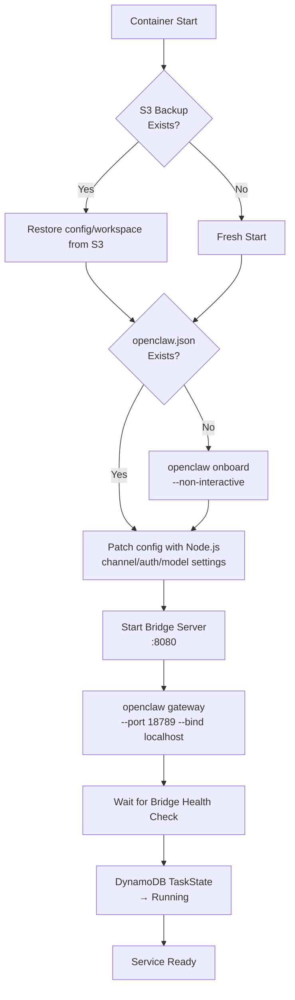
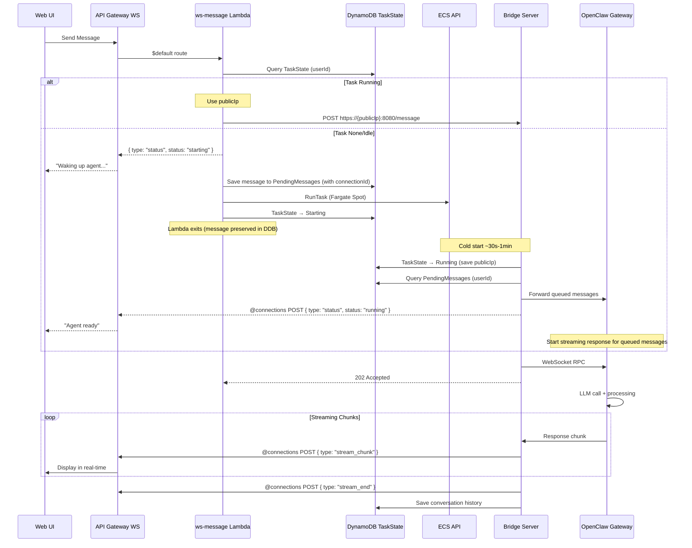
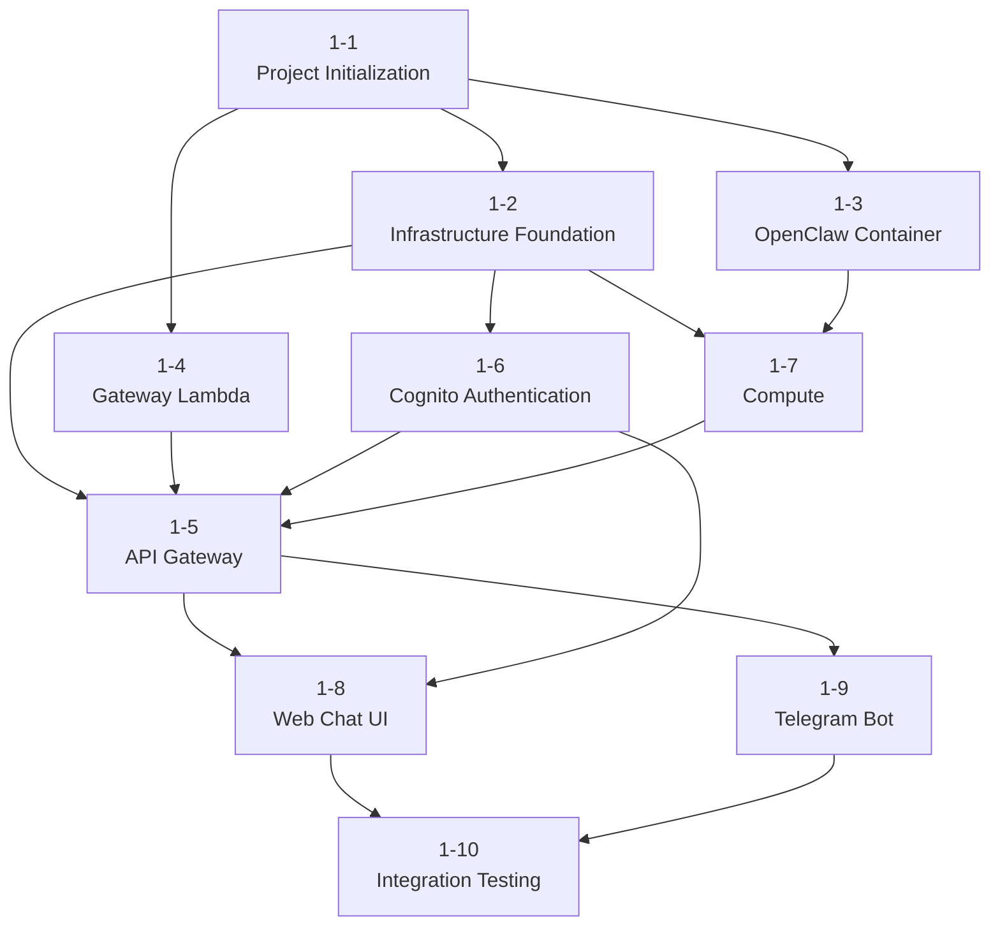

# Detailed Design and Implementation Plan

Detailed implementation-level design and step-by-step implementation plan based on MoltWorker reference analysis.

---

## Part 1: MoltWorker Reference Analysis and Design Decisions

### 1.1 MoltWorker Architecture Summary

MoltWorker is a project that runs OpenClaw on Cloudflare Worker + Sandbox, with the following structure:

```
Browser → CF Worker (Hono) → CF Sandbox Container → OpenClaw Gateway (:18789)
```

| Component | Role |
|-----------|------|
| CF Worker (`src/index.ts`) | Proxy, authentication, container lifecycle management |
| Sandbox Container | OpenClaw runtime (Docker) |
| `start-openclaw.sh` | Container startup script: R2 restore → onboard → config patch → gateway start |
| Admin UI (`src/client/`) | React SPA for device management, storage status, gateway restart |
| R2 Storage | Data persistence via rsync backup/restore every 5 minutes |

### 1.2 Key Patterns to Reference from MoltWorker

| Pattern | MoltWorker Implementation | Our Project Adaptation |
|---------|---------------------------|------------------------|
| **Container startup script** | `start-openclaw.sh`: backup restore → onboard → config patch → gateway start | S3 restore → onboard → config patch → Bridge + Gateway start |
| **Direct OpenClaw Gateway usage** | Worker proxies HTTP/WS to Gateway(:18789) | Bridge server connects to Gateway via local WebSocket |
| **Config patching** | Node.js inline script dynamically modifies `openclaw.json` | Same pattern (channel, auth, model settings) |
| **Cold start UX** | Returns loading HTML page immediately + background start | WebSocket sends "Waking up agent..." status message |
| **Data persistence** | R2 rsync every 5 minutes | S3 backup + DynamoDB real-time storage |
| **Lifecycle management** | `ensureMoltbotGateway()`: process discovery → port wait → kill/restart on failure | Lambda watchdog + DynamoDB TaskState |

### 1.3 Key Design Decisions

#### Decision 1: Need for a Bridge Server

MoltWorker can directly proxy WebSocket from CF Worker, so a separate Bridge is unnecessary. However, AWS Lambda is ephemeral (max 30 seconds) and cannot maintain persistent WebSocket connections.

**Decision**: Implement a Bridge server inside the container to perform protocol translation between Lambda (HTTP) and OpenClaw Gateway (WebSocket).

```
Lambda --HTTP POST--> Bridge(:8080) --local WS--> OpenClaw Gateway(:18789)
                                     <--streaming--
Bridge --@connections POST--> API Gateway WS --> Client
```

#### Decision 2: Lambda VPC Placement and Network Design

NAT Gateway costs ~$33/month even in a minimal single-AZ configuration ($4.5 fixed + data processing costs), which exceeds the total cost target ($1/month) by over 30x.

**Decision**: Remove NAT Gateway and adopt the following architecture.

| Component | Placement | Reason |
|-----------|-----------|--------|
| Fargate | Public subnet + Public IP assigned | Direct internet access (LLM API, Telegram, etc.). No NAT Gateway needed |
| Lambda | Outside VPC | Uses public AWS endpoints such as ECS API, API Gateway Management API. No VPC placement needed |
| VPC Gateway Endpoints | DynamoDB, S3 (free) | Keeps Fargate's AWS service traffic on the AWS internal network |

- Lambda → Fargate communication: Obtain public IP via `DescribeTasks` → HTTP request to Bridge server (`:8080`)
- Bridge server authentication: Shared secret token to block unauthorized access (Security Group alone cannot identify Lambda's variable IPs)
- No private subnets needed → Simplified VPC structure

#### Decision 3: Telegram Integration Strategy

| Approach | Pros | Cons |
|----------|------|------|
| **A. Webhook-only (via Lambda)** | Always responsive, single path | Requires message forwarding logic to Bridge |
| **B. OpenClaw native (long polling)** | Simple, leverages built-in features | Messages lost when container is down |
| ~~C. Hybrid~~ | ~~Always responsive + native~~ | **Not possible due to Telegram API restriction** |

**Decision**: **Approach A (Webhook-only)**

> **Why Approach C is not possible**: Telegram Bot API rejects `getUpdates` (long polling) calls when a webhook is set. The two approaches are mutually exclusive and cannot be used simultaneously.

- Telegram webhook → Lambda: Lambda receives **all messages**
- When container is not running: "Waking up..." response + start container + queue message in DynamoDB
- When container is running: Lambda → forwards message to Bridge (HTTP POST)
- Disable Telegram channel in OpenClaw config (to prevent long polling):
  ```typescript
  // Remove Telegram channel in patch-config.ts
  delete config.channels?.telegram;
  ```
- Advantages: Single message path for easier debugging, messages can be received even when container is down

#### Decision 4: Data Persistence Strategy

MoltWorker uses only R2 rsync backup every 5 minutes. We use a dual DynamoDB + S3 structure:

| Data | Storage | Reason |
|------|---------|--------|
| Conversation history | DynamoDB | Real-time queries needed (conversation list, search) |
| User settings | DynamoDB | Frequent reads/writes |
| Task state | DynamoDB | Real-time updates from both Lambda and Bridge |
| OpenClaw config files | S3 | Restored on container startup |
| OpenClaw workspace | S3 | Agent state such as IDENTITY.md, MEMORY.md |
| Skills | S3 | Custom skill files |

---

## Part 2: Detailed Design

### 2.1 Container Startup Flow

References MoltWorker's `start-openclaw.sh` pattern, adapted for the AWS environment:



**Startup script (`start-openclaw.sh`) design:**

```bash
#!/bin/bash
set -e

CONFIG_DIR="/home/openclaw/.openclaw"
CONFIG_FILE="$CONFIG_DIR/openclaw.json"
WORKSPACE_DIR="/home/openclaw/clawd"
S3_BUCKET="${S3_DATA_BUCKET}"

# ============================================================
# Step 1: Restore backup from S3
# ============================================================
if [ -n "$S3_BUCKET" ]; then
    echo "Checking S3 backup..."
    aws s3 sync "s3://$S3_BUCKET/config/" "$CONFIG_DIR/" --quiet 2>/dev/null || true
    aws s3 sync "s3://$S3_BUCKET/workspace/" "$WORKSPACE_DIR/" --quiet 2>/dev/null || true
    aws s3 sync "s3://$S3_BUCKET/skills/" "$WORKSPACE_DIR/skills/" --quiet 2>/dev/null || true
fi

# ============================================================
# Step 2: Onboard (only when config does not exist)
# ============================================================
if [ ! -f "$CONFIG_FILE" ]; then
    echo "Running openclaw onboard..."
    # --auth-choice env: Reference API key from environment variables, not written to config
    # (No secrets on disk principle — see architecture.md 7.9)
    openclaw onboard --non-interactive --accept-risk \
        --mode local \
        --auth-choice env \
        --gateway-port 18789 \
        --gateway-bind localhost \
        --skip-channels \
        --skip-skills \
        --skip-health
fi

# ============================================================
# Step 3: Config patching (references MoltWorker pattern)
# ============================================================
node /app/patch-config.js

# ============================================================
# Step 4: Start Bridge server + Gateway
# ============================================================
echo "Starting Bridge server..."
node /app/bridge.js &
BRIDGE_PID=$!

echo "Starting OpenClaw Gateway..."
exec openclaw gateway --port 18789 --verbose --allow-unconfigured --bind localhost
```

### 2.2 Bridge Server Detailed Design

```
packages/container/src/
├── bridge.ts           # Express server entry point
├── openclaw-client.ts  # OpenClaw Gateway WebSocket client
├── callback.ts         # API Gateway @connections callback
├── lifecycle.ts        # Lifecycle management (health check, shutdown, S3 backup)
├── patch-config.ts     # openclaw.json patching script
└── types.ts            # Type definitions
```

#### Bridge Server Core Logic

```typescript
// bridge.ts pseudocode
import express from "express";
import { OpenClawClient } from "./openclaw-client";
import { CallbackSender } from "./callback";
import { LifecycleManager } from "./lifecycle";

// TLS: Run HTTPS server with self-signed certificate (prevent Bearer token sniffing)
import https from "https";
import { readFileSync } from "fs";

const app = express();
const ocClient = new OpenClawClient("ws://localhost:18789");
const callback = new CallbackSender(process.env.WEBSOCKET_CALLBACK_URL);
const lifecycle = new LifecycleManager();

// ── Security: Bearer token authentication middleware ──
// Bridge is exposed via Public IP, so all requests require authentication
const BRIDGE_SECRET = process.env.BRIDGE_AUTH_TOKEN;
app.use((req, res, next) => {
  // /health is exempt from auth for ECS health checks
  if (req.path === "/health") return next();
  const token = req.headers.authorization?.replace("Bearer ", "");
  if (!BRIDGE_SECRET || token !== BRIDGE_SECRET) {
    return res.status(401).json({ error: "Unauthorized" });
  }
  next();
});

// POST /message - Receive messages from Lambda
// IDOR prevention: userId is only the value validated by Lambda from JWT/connectionId.
// Bridge uses this value as-is and never directly trusts client input.
app.post("/message", async (req, res) => {
  const { userId, message, channel, connectionId, callbackUrl } = req.body;

  // 1. Forward message to OpenClaw Gateway
  const stream = await ocClient.sendMessage(userId, message);

  // 2. Immediately return 202 Accepted (prevent Lambda timeout)
  res.status(202).json({ status: "processing" });

  // 3. Forward streaming response via @connections
  for await (const chunk of stream) {
    await callback.send(connectionId, {
      type: "stream_chunk",
      content: chunk,
    });
  }
  await callback.send(connectionId, { type: "stream_end" });

  // 4. Save conversation history to DynamoDB
  await lifecycle.saveConversation(userId, message, stream.fullResponse);
  lifecycle.updateLastActivity();
});

// GET /health - Health check (auth exempt, minimal response — prevent internal state exposure)
app.get("/health", (req, res) => {
  res.json({ status: "ok" });
});

// POST /shutdown - Graceful shutdown
app.post("/shutdown", async (req, res) => {
  res.json({ status: "shutting_down" });
  await lifecycle.gracefulShutdown();
});
```

#### OpenClaw Gateway WebSocket Protocol

OpenClaw Gateway is a WebSocket server based on **JSON-RPC 2.0 / MCP (Model Context Protocol)**. MoltWorker does not interpret this protocol and simply proxies WebSocket messages between browser and Gateway as-is. Our Bridge must implement this protocol directly.

**Connection and Authentication:**
```
ws://localhost:18789?token={MOLTBOT_GATEWAY_TOKEN}
```
- Pass the Gateway token via the `?token=` query parameter (see MoltWorker `index.ts:296`)
- Connection is rejected if the token is missing or mismatched

**Message format (JSON-RPC 2.0):**
```json
// Client → Gateway: Send message
{"jsonrpc": "2.0", "method": "sendMessage", "params": {"message": "Hello"}, "id": 1}

// Gateway → Client: Streaming response (notification, no id)
{"jsonrpc": "2.0", "method": "streamChunk", "params": {"content": "Response text..."}}

// Gateway → Client: Stream end
{"jsonrpc": "2.0", "method": "streamEnd", "params": {"fullResponse": "Complete response"}}

// Gateway → Client: Error (see MoltWorker index.ts:364)
{"error": {"message": "Error message"}}
```

> **Note**: The message formats above are inferred from MoltWorker proxy code and the MCP specification. The exact method names and params structure may differ depending on the OpenClaw version, so **you must capture and verify actual Gateway WebSocket traffic during implementation**.

**Bridge's Protocol Adapter Role:**
```
Lambda (HTTP POST) → Bridge → Convert to JSON-RPC 2.0 → Gateway (WebSocket)
                              ← Receive streaming chunks ←
Bridge → API Gateway @connections (HTTP POST) → Client (WebSocket)
```

#### OpenClaw Gateway WebSocket Client

```typescript
// openclaw-client.ts pseudocode
import WebSocket from "ws";

export class OpenClawClient {
  private ws: WebSocket;
  private pending: Map<number, { resolve: Function; chunks: string[] }> = new Map();
  private nextId = 1;

  constructor(private gatewayUrl: string) {
    this.connect();
  }

  private connect() {
    // Pass Gateway token as query parameter
    const token = process.env.OPENCLAW_GATEWAY_TOKEN;
    const url = token ? `${this.gatewayUrl}?token=${token}` : this.gatewayUrl;
    this.ws = new WebSocket(url);
    this.ws.on("open", () => console.log("Connected to OpenClaw Gateway"));
    this.ws.on("message", (raw) => this.handleMessage(raw));
    this.ws.on("close", () => setTimeout(() => this.connect(), 1000));
  }

  private handleMessage(raw: WebSocket.Data) {
    const data = JSON.parse(raw.toString());

    // Streaming chunk (notification — no id)
    if (data.method === "streamChunk" && data.params?.requestId) {
      const pending = this.pending.get(data.params.requestId);
      if (pending) pending.chunks.push(data.params.content);
      return;
    }

    // Stream end
    if (data.method === "streamEnd" && data.params?.requestId) {
      const pending = this.pending.get(data.params.requestId);
      if (pending) {
        pending.resolve(pending.chunks);
        this.pending.delete(data.params.requestId);
      }
      return;
    }

    // JSON-RPC response (result or error)
    if (data.id && this.pending.has(data.id)) {
      const pending = this.pending.get(data.id)!;
      if (data.error) pending.resolve({ error: data.error });
      // result is handled in streamEnd
    }
  }

  async *sendMessage(userId: string, message: string): AsyncGenerator<string> {
    const id = this.nextId++;
    const chunks: string[] = [];
    let done = false;

    this.pending.set(id, {
      resolve: () => { done = true; },
      chunks,
    });

    // Send message in JSON-RPC 2.0 format
    this.ws.send(JSON.stringify({
      jsonrpc: "2.0",
      method: "sendMessage",
      params: { message, userId },
      id,
    }));

    // Yield chunks as they accumulate, break on completion
    let lastIndex = 0;
    while (!done) {
      await new Promise((r) => setTimeout(r, 50));
      while (lastIndex < chunks.length) {
        yield chunks[lastIndex++];
      }
    }
    // Yield all remaining chunks
    while (lastIndex < chunks.length) {
      yield chunks[lastIndex++];
    }
  }
}
```

#### API Gateway @connections Callback

```typescript
// callback.ts pseudocode
import {
  ApiGatewayManagementApiClient,
  PostToConnectionCommand,
} from "@aws-sdk/client-api-gateway-management-api";

export class CallbackSender {
  private client: ApiGatewayManagementApiClient;

  constructor(endpoint: string) {
    this.client = new ApiGatewayManagementApiClient({ endpoint });
  }

  async send(connectionId: string, data: object): Promise<void> {
    await this.client.send(
      new PostToConnectionCommand({
        ConnectionId: connectionId,
        Data: Buffer.from(JSON.stringify(data)),
      })
    );
  }
}
```

### 2.3 Lambda-Fargate Communication Pattern



#### Obtaining Fargate Task IP from Lambda

```typescript
// packages/gateway/src/services/container.ts
import {
  ECSClient,
  DescribeTasksCommand,
  RunTaskCommand,
} from "@aws-sdk/client-ecs";

const ecs = new ECSClient({});

export async function getTaskPublicIP(
  cluster: string,
  taskArn: string
): Promise<string | null> {
  const response = await ecs.send(
    new DescribeTasksCommand({ cluster, tasks: [taskArn] })
  );
  const task = response.tasks?.[0];
  if (!task?.attachments?.[0]?.details) return null;

  // For Fargate tasks with Public IP assigned, query Public IP via ENI ID
  const eniDetail = task.attachments[0].details.find(
    (d) => d.name === "networkInterfaceId"
  );
  if (!eniDetail?.value) return null;

  // Obtain Public IP via EC2 DescribeNetworkInterfaces
  const { EC2Client, DescribeNetworkInterfacesCommand } = await import("@aws-sdk/client-ec2");
  const ec2 = new EC2Client({});
  const eniResp = await ec2.send(
    new DescribeNetworkInterfacesCommand({
      NetworkInterfaceIds: [eniDetail.value],
    })
  );
  return eniResp.NetworkInterfaces?.[0]?.Association?.PublicIp || null;
}

export async function startTask(params: {
  cluster: string;
  taskDefinition: string;
  subnets: string[];
  securityGroups: string[];
}): Promise<string> {
  const response = await ecs.send(
    new RunTaskCommand({
      cluster: params.cluster,
      taskDefinition: params.taskDefinition,
      // launchType and capacityProviderStrategy cannot be specified together — remove launchType
      capacityProviderStrategy: [
        { capacityProvider: "FARGATE_SPOT", weight: 1 },
      ],
      networkConfiguration: {
        awsvpcConfiguration: {
          subnets: params.subnets,
          securityGroups: params.securityGroups,
          assignPublicIp: "ENABLED",
        },
      },
      platformVersion: "LATEST",
    })
  );

  const taskArn = response.tasks?.[0]?.taskArn;
  if (!taskArn) throw new Error("Failed to start task");
  return taskArn;
}
```

### 2.4 Graceful Shutdown (Spot Interruption Handling)

MoltWorker manages container termination externally, but we must handle Fargate Spot's SIGTERM directly:

```typescript
// packages/container/src/lifecycle.ts
import { DynamoDBClient, UpdateItemCommand } from "@aws-sdk/client-dynamodb";
import { S3Client, PutObjectCommand } from "@aws-sdk/client-s3";

export class LifecycleManager {
  private lastActivity: Date = new Date();
  private shutdownInProgress = false;

  constructor(
    private dynamodb: DynamoDBClient,
    private s3: S3Client,
    private config: {
      userId: string;
      taskArn: string;
      tableName: string;
      s3Bucket: string;
    }
  ) {
    // SIGTERM handler (received 2 minutes before Spot interruption)
    process.on("SIGTERM", () => this.gracefulShutdown());
  }

  async gracefulShutdown(): Promise<void> {
    if (this.shutdownInProgress) return;
    this.shutdownInProgress = true;

    console.log("[Lifecycle] SIGTERM received, starting graceful shutdown...");

    // 1. TaskState → Stopping
    await this.updateTaskState("Stopping");

    // 2. Backup OpenClaw config/workspace to S3
    await this.backupToS3();

    // 3. Notify active WebSocket connections of shutdown
    await this.notifyClients("Agent is shutting down. It will restart shortly.");

    // 4. TaskState → Idle
    await this.updateTaskState("Idle");

    console.log("[Lifecycle] Graceful shutdown complete");
    process.exit(0);
  }

  async backupToS3(): Promise<void> {
    // Sync OpenClaw config, workspace, skills to S3
    const configDir = "/home/openclaw/.openclaw";
    const workspaceDir = "/home/openclaw/clawd";
    // Execute aws s3 sync or upload files via SDK
  }

  // Periodic S3 backup every 5 minutes (references MoltWorker's R2 sync pattern)
  startPeriodicBackup(intervalMs: number = 300000): void {
    setInterval(async () => {
      try {
        await this.backupToS3();
        console.log("[Lifecycle] Periodic backup completed");
      } catch (err) {
        console.error("[Lifecycle] Periodic backup failed:", err);
      }
    }, intervalMs);
  }
}
```

### 2.5 Config Patching Script

Directly references MoltWorker's inline Node.js patching pattern:

```typescript
// packages/container/src/patch-config.ts
import fs from "fs";

const CONFIG_PATH = "/home/openclaw/.openclaw/openclaw.json";

let config: Record<string, any> = {};
try {
  config = JSON.parse(fs.readFileSync(CONFIG_PATH, "utf8"));
} catch {
  console.log("Starting with empty config");
}

// Gateway settings
config.gateway = config.gateway || {};
config.gateway.port = 18789;
config.gateway.mode = "local";

// Authentication: environment variable reference method (no tokens written to disk)
// OpenClaw Gateway reads the OPENCLAW_GATEWAY_TOKEN environment variable directly
config.gateway.auth = { method: "env" };
delete config.gateway?.auth?.token; // Remove token if it exists in existing config

// LLM provider: environment variable reference (ANTHROPIC_API_KEY not written to config)
config.auth = { method: "env" };
delete config.auth?.apiKey; // Remove API key if it exists

// Disable Telegram channel (webhook-only approach — Lambda handles all messages)
// OpenClaw's built-in long polling is not used, so remove channel config
delete config.channels?.telegram;

// Model override
if (process.env.LLM_MODEL) {
  config.agents = config.agents || {};
  config.agents.defaults = config.agents.defaults || {};
  config.agents.defaults.model = { primary: process.env.LLM_MODEL };
}

fs.writeFileSync(CONFIG_PATH, JSON.stringify(config, null, 2));
console.log("Configuration patched successfully");
```

### 2.6 Watchdog Lambda Design

```typescript
// packages/gateway/src/handlers/watchdog.ts
import {
  ECSClient,
  StopTaskCommand,
  DescribeTasksCommand,
} from "@aws-sdk/client-ecs";
import { DynamoDBClient, ScanCommand, UpdateItemCommand } from "@aws-sdk/client-dynamodb";

const INACTIVITY_TIMEOUT_MINUTES = parseInt(
  process.env.INACTIVITY_TIMEOUT_MINUTES || "15"
);
const MIN_UPTIME_MINUTES = 5; // Cold start protection

export async function handler(): Promise<void> {
  const dynamodb = new DynamoDBClient({});
  const ecs = new ECSClient({});

  // Scan for tasks in Running state
  const result = await dynamodb.send(
    new ScanCommand({
      TableName: process.env.TASK_STATE_TABLE,
      FilterExpression: "#s = :running",
      ExpressionAttributeNames: { "#s": "status" },
      ExpressionAttributeValues: { ":running": { S: "Running" } },
    })
  );

  const now = Date.now();

  for (const item of result.Items || []) {
    const lastActivity = new Date(item.lastActivity.S!).getTime();
    const startedAt = new Date(item.startedAt.S!).getTime();
    const idleMinutes = (now - lastActivity) / 60000;
    const uptimeMinutes = (now - startedAt) / 60000;

    // Cold start protection: do not terminate within 5 minutes of start
    if (uptimeMinutes < MIN_UPTIME_MINUTES) continue;

    // Inactivity timeout exceeded
    if (idleMinutes > INACTIVITY_TIMEOUT_MINUTES) {
      console.log(`Stopping idle task: ${item.taskArn.S}, idle: ${idleMinutes}min`);

      await ecs.send(
        new StopTaskCommand({
          cluster: process.env.ECS_CLUSTER_ARN,
          task: item.taskArn.S!,
          reason: "Inactivity timeout",
        })
      );

      await dynamodb.send(
        new UpdateItemCommand({
          TableName: process.env.TASK_STATE_TABLE,
          Key: { PK: item.PK },
          UpdateExpression: "SET #s = :idle",
          ExpressionAttributeNames: { "#s": "status" },
          ExpressionAttributeValues: { ":idle": { S: "Idle" } },
        })
      );
    }
  }
}
```

### 2.7 Docker Image Design

References MoltWorker's Dockerfile with AWS/ARM64 optimization applied:

```dockerfile
# Dockerfile
FROM node:20-slim AS base

# ARM64 (Graviton) optimization - higher Spot availability + 20% cheaper
# Build with: docker buildx build --platform linux/arm64

# Install OpenClaw (references MoltWorker pattern)
RUN npm install -g openclaw@latest

# Install AWS CLI (for S3 backup)
RUN apt-get update && apt-get install -y \
    curl unzip \
    && curl "https://awscli.amazonaws.com/awscli-exe-linux-aarch64.zip" -o "awscliv2.zip" \
    && unzip awscliv2.zip && ./aws/install \
    && rm -rf awscliv2.zip aws \
    && apt-get clean && rm -rf /var/lib/apt/lists/*

# Build Bridge server
WORKDIR /app
COPY packages/container/package*.json ./
RUN npm ci --production
COPY packages/container/dist/ ./

# Create non-root user (prevent privilege escalation on container escape)
RUN groupadd -r openclaw && useradd -r -g openclaw -m -d /home/openclaw openclaw

# Create OpenClaw directories
RUN mkdir -p /home/openclaw/.openclaw \
    && mkdir -p /home/openclaw/clawd \
    && mkdir -p /home/openclaw/clawd/skills \
    && chown -R openclaw:openclaw /home/openclaw

# Copy startup script
COPY packages/container/start-openclaw.sh /usr/local/bin/
RUN chmod +x /usr/local/bin/start-openclaw.sh

USER openclaw
WORKDIR /home/openclaw/clawd

# Only expose 8080 (Gateway 18789 binds to localhost so EXPOSE is unnecessary)
EXPOSE 8080

HEALTHCHECK --interval=30s --timeout=5s --retries=3 \
    CMD curl -f http://localhost:8080/health || exit 1

CMD ["/usr/local/bin/start-openclaw.sh"]
```

### 2.8 CDK Stack Core Implementation

#### WebSocket API Gateway + Lambda

```typescript
// packages/cdk/lib/stacks/api-stack.ts core structure
import * as apigatewayv2 from "@aws-cdk/aws-apigatewayv2-alpha";
import * as integrations from "@aws-cdk/aws-apigatewayv2-integrations-alpha";

// WebSocket API
const wsApi = new apigatewayv2.WebSocketApi(this, "WebSocketApi", {
  connectRouteOptions: {
    integration: new integrations.WebSocketLambdaIntegration(
      "ConnectIntegration",
      wsConnectFn
    ),
  },
  disconnectRouteOptions: {
    integration: new integrations.WebSocketLambdaIntegration(
      "DisconnectIntegration",
      wsDisconnectFn
    ),
  },
  defaultRouteOptions: {
    integration: new integrations.WebSocketLambdaIntegration(
      "DefaultIntegration",
      wsMessageFn
    ),
  },
});

const wsStage = new apigatewayv2.WebSocketStage(this, "ProdStage", {
  webSocketApi: wsApi,
  stageName: "prod",
  autoDeploy: true,
});

// Grant @connections permission to Fargate task
taskRole.addToPolicy(
  new iam.PolicyStatement({
    actions: ["execute-api:ManageConnections"],
    resources: [
      `arn:aws:execute-api:${this.region}:${this.account}:${wsApi.apiId}/prod/POST/@connections/*`,
    ],
  })
);
```

#### Fargate Task Definition

```typescript
// packages/cdk/lib/stacks/compute-stack.ts core structure
const taskDefinition = new ecs.FargateTaskDefinition(this, "OpenClawTask", {
  memoryLimitMiB: 512,
  cpu: 256,
  runtimePlatform: {
    cpuArchitecture: ecs.CpuArchitecture.ARM64,
    operatingSystemFamily: ecs.OperatingSystemFamily.LINUX,
  },
  taskRole: openclawTaskRole,
  executionRole: openclawExecRole,
});

taskDefinition.addContainer("openclaw", {
  image: ecs.ContainerImage.fromEcrRepository(ecrRepo, "latest"),
  portMappings: [
    { containerPort: 8080 },  // Bridge
    { containerPort: 18789 }, // OpenClaw Gateway
  ],
  logging: ecs.LogDrivers.awsLogs({
    streamPrefix: "openclaw",
    logGroup: new logs.LogGroup(this, "FargateLogGroup", {
      logGroupName: "/serverless-openclaw/fargate/openclaw",
      retention: logs.RetentionDays.TWO_WEEKS,
    }),
  }),
  secrets: {
    ANTHROPIC_API_KEY: ecs.Secret.fromSecretsManager(llmSecret, "anthropic_api_key"),
    TELEGRAM_BOT_TOKEN: ecs.Secret.fromSecretsManager(telegramSecret, "bot_token"),
  },
  environment: {
    DYNAMODB_TABLE_PREFIX: "serverless-openclaw",
    S3_DATA_BUCKET: dataBucket.bucketName,
    WEBSOCKET_CALLBACK_URL: wsCallbackUrl,
    INACTIVITY_TIMEOUT_MINUTES: "15",
  },
  healthCheck: {
    command: ["CMD-SHELL", "curl -f http://localhost:8080/health || exit 1"],
    interval: cdk.Duration.seconds(30),
    timeout: cdk.Duration.seconds(5),
    retries: 3,
    startPeriod: cdk.Duration.seconds(60),
  },
});
```

---

## Part 3: Implementation Plan

### Phase 1 MVP Implementation Steps

Consists of 10 steps total, where each step depends on the outputs of previous steps.

### Step 1-1: Project Initialization

**Goal**: Set up monorepo structure, shared configuration, CDK bootstrap

**Files to create:**

```
serverless-openclaw/
├── package.json                   # npm workspaces root
├── tsconfig.json                  # Shared TypeScript configuration
├── tsconfig.base.json             # Base compiler options
├── .eslintrc.js                   # Shared ESLint configuration
├── .prettierrc                    # Prettier configuration
├── packages/
│   ├── cdk/
│   │   ├── package.json
│   │   ├── tsconfig.json
│   │   ├── cdk.json
│   │   └── bin/app.ts             # CDK app entry point
│   ├── gateway/
│   │   ├── package.json
│   │   └── tsconfig.json
│   ├── container/
│   │   ├── package.json
│   │   └── tsconfig.json
│   ├── web/
│   │   ├── package.json
│   │   └── tsconfig.json
│   └── shared/
│       ├── package.json
│       ├── tsconfig.json
│       └── src/
│           ├── types.ts           # Shared types (message protocol, etc.)
│           └── constants.ts       # Shared constants
```

**Key tasks:**
- Set up npm workspaces (`"workspaces": ["packages/*"]`)
- Configure TypeScript project references
- Create CDK app skeleton (`cdk init app --language typescript`)
- Define shared types (message protocol, state enums)

**Validation**: `npm install` + `npx tsc --build` succeeds

---

### Step 1-2: Infrastructure Foundation (Network + Storage)

**Goal**: Deploy VPC, DynamoDB tables, S3 buckets, ECR repository

**Files to create:**

```
packages/cdk/lib/stacks/
├── network-stack.ts               # VPC, public subnets, VPC Gateway Endpoints
└── storage-stack.ts               # DynamoDB x 4, S3 x 2, ECR
```

**NetworkStack Resources:**
- VPC (10.0.0.0/16)
- 2 public subnets (for Fargate tasks, Public IP assignment)
- VPC Gateway Endpoints: DynamoDB, S3 (free)
- No NAT Gateway (direct internet access via Fargate Public IP)

**StorageStack Resources:**
- DynamoDB: Conversations, Settings, TaskState, Connections, PendingMessages (PAY_PER_REQUEST)
- S3: `serverless-openclaw-data` (OpenClaw backup), `serverless-openclaw-web` (React SPA)
- ECR: `serverless-openclaw` repository

**Validation**: `cdk deploy NetworkStack StorageStack` succeeds

---

### Step 1-3: OpenClaw Container

**Goal**: Build Docker image, implement Bridge server, push to ECR

**Files to create:**

```
packages/container/
├── Dockerfile
├── start-openclaw.sh
├── src/
│   ├── bridge.ts                  # Express server
│   ├── openclaw-client.ts         # OpenClaw Gateway WS client
│   ├── callback.ts                # API Gateway @connections callback
│   ├── lifecycle.ts               # Lifecycle (SIGTERM, S3 backup, DDB updates)
│   ├── patch-config.ts            # openclaw.json patching
│   └── types.ts
├── package.json
└── tsconfig.json
```

**Key tasks:**
1. Write Dockerfile (ARM64, Node 20 slim, OpenClaw installation)
2. Write start-openclaw.sh (S3 restore → onboard → patch → start)
3. Implement Bridge server (`/message`, `/health`, `/shutdown`, `/status`)
4. Implement OpenClaw Gateway WebSocket client
5. Implement @connections callback sender
6. Implement Lifecycle Manager (SIGTERM, periodic S3 backup)
7. Local Docker build + test

**Validation**: Local `docker build` + `docker run` + `/health` response confirmed

---

### Step 1-4: Gateway Lambda

**Goal**: Implement 6 Lambda functions

**Files to create:**

```
packages/gateway/src/
├── handlers/
│   ├── ws-connect.ts              # WebSocket $connect
│   ├── ws-message.ts              # WebSocket $default
│   ├── ws-disconnect.ts           # WebSocket $disconnect
│   ├── telegram-webhook.ts        # Telegram webhook
│   ├── api-handler.ts             # REST API
│   └── watchdog.ts                # EventBridge trigger
├── services/
│   ├── container.ts               # ECS task management (start, stop, getIP)
│   ├── message.ts                 # Message routing (Bridge HTTP calls)
│   ├── auth.ts                    # JWT verification helper
│   ├── connections.ts             # WebSocket connection management (DynamoDB)
│   └── conversations.ts           # Conversation history management (DynamoDB)
├── index.ts
└── types.ts
```

**Implementation order:**
1. `services/container.ts` — ECS RunTask, StopTask, DescribeTasks, getTaskIP
2. `services/connections.ts` — connectionId CRUD (DynamoDB)
3. `services/message.ts` — Bridge HTTP calls (`POST https://{publicIp}:8080/message`)
4. `handlers/ws-connect.ts` — JWT verification + save connectionId
5. `handlers/ws-message.ts` — Query TaskState → start container/forward message
6. `handlers/ws-disconnect.ts` — Delete connectionId
7. `handlers/watchdog.ts` — Detect/terminate zombie tasks
8. `handlers/telegram-webhook.ts` — Secret verification + message routing
9. `handlers/api-handler.ts` — Conversation history, settings, status API

**Validation**: Unit tests (vitest) pass

---

### Step 1-5: API Gateway

**Goal**: Define WebSocket API + REST API + Cognito Authorizer in CDK

**Files to create:**

```
packages/cdk/lib/stacks/
├── api-stack.ts                   # API Gateway + Lambda deployment
└── constructs/
    ├── websocket-api.ts           # WebSocket API construct
    └── rest-api.ts                # REST API construct
```

**Key tasks:**
1. WebSocket API ($connect, $default, $disconnect routes)
2. REST API (Telegram webhook, 8 management API endpoints)
3. Connect Cognito Authorizer
4. Deploy 6 Lambda functions (esbuild bundling)
5. Place Lambda outside VPC (uses public AWS endpoints)
6. Attach IAM roles/policies
7. EventBridge Rule (watchdog every 5 minutes)

**Validation**: `cdk deploy ApiStack` + WebSocket connection test

---

### Step 1-6: Cognito Authentication

**Goal**: Set up User Pool, App Client, hosted UI

**Files to create:**

```
packages/cdk/lib/stacks/
└── auth-stack.ts                  # Cognito User Pool + App Client
```

**Key tasks:**
1. Cognito User Pool (email login, password policy)
2. App Client (for SPA: PKCE flow)
3. Domain configuration (Cognito hosted domain)
4. Self-service sign-up + email verification

**Validation**: Create test user in Cognito console + confirm JWT issuance

---

### Step 1-7: Compute (ECS + Fargate)

**Goal**: Deploy ECS cluster, Fargate task definition, Docker image

**Files to create:**

```
packages/cdk/lib/stacks/
└── compute-stack.ts               # ECS cluster + Fargate task definition
```

**Key tasks:**
1. Create ECS cluster
2. Fargate task definition (ARM64, 0.25 vCPU, 512MB, FARGATE_SPOT)
3. ECR image build + push (CDK DockerImageAsset)
4. IAM roles (task role, execution role)
5. Secrets Manager → container environment variables
6. CloudWatch Logs group
7. Security group (inbound: 8080 from 0.0.0.0/0 + Bridge token auth, outbound: allow all)

**Validation**: `cdk deploy ComputeStack` + manual RunTask + /health response

---

### Step 1-8: Web Chat UI

**Goal**: Develop React SPA, WebSocket communication, S3/CloudFront deployment

**Files to create:**

```
packages/web/
├── src/
│   ├── components/
│   │   ├── Chat/
│   │   │   ├── ChatContainer.tsx
│   │   │   ├── MessageList.tsx
│   │   │   ├── MessageBubble.tsx
│   │   │   ├── MessageInput.tsx
│   │   │   └── StreamingMessage.tsx
│   │   ├── Auth/
│   │   │   ├── LoginForm.tsx
│   │   │   └── AuthProvider.tsx
│   │   └── Status/
│   │       ├── AgentStatus.tsx
│   │       └── ColdStartBanner.tsx
│   ├── hooks/
│   │   ├── useWebSocket.ts
│   │   └── useAuth.ts
│   ├── services/
│   │   ├── websocket.ts
│   │   └── api.ts
│   ├── App.tsx
│   └── main.tsx
├── vite.config.ts
├── index.html
└── package.json

packages/cdk/lib/stacks/
└── web-stack.ts                   # S3 + CloudFront
```

**Key tasks:**
1. Vite + React + TypeScript project setup
2. Cognito authentication integration (`amazon-cognito-identity-js`)
3. WebSocket client (auto-reconnect, exponential backoff)
4. Chat UI (message list, input, streaming display)
5. Cold start status display ("Waking up agent...")
6. S3 static hosting + CloudFront CDK deployment
7. Inject environment variables at build time (WS URL, API URL, Cognito settings)

**Validation**: Local `npm run dev` + WebSocket connection + message send/receive

---

### Step 1-9: Telegram Bot Integration

**Goal**: Set up Telegram webhook, pairing flow, message routing

**Key tasks:**
1. Create Telegram Bot (BotFather)
2. Register webhook URL (`POST /telegram` REST API endpoint)
3. Implement secret token verification
4. Implement pairing flow (generate code in web UI → `/pair {code}` in Telegram)
5. Message routing (Lambda → Bridge → OpenClaw)
6. "Waking up..." response when container is not running + start container

**Validation**: Send message in Telegram → receive response

---

### Step 1-10: Integration Testing and Deployment Documentation

**Goal**: E2E testing, deployment guide, final validation

**Files to create:**

```
docs/
├── deployment.md                  # Deployment guide
└── development.md                 # Development guide

packages/cdk/bin/
└── app.ts                         # Define full stack deployment order
```

**Key tasks:**
1. `cdk deploy --all` integration test
2. E2E scenario tests:
   - Web UI login → chat → automatic container start → receive response
   - Telegram message → receive response
   - 15 minutes of inactivity → automatic container shutdown
   - Reconnect → container restart → conversation history preserved
3. Document deployment guide (prerequisites, step-by-step commands, troubleshooting)
4. Document development guide (local development environment, testing, contribution guide)

**Validation**: `cdk deploy --all` succeeds on a clean AWS account

---

### Step Dependency Graph



**Parallelizable work:**
- 1-3 (Container) + 1-4 (Lambda) + 1-6 (Cognito) can be developed in parallel
- 1-8 (Web UI) and 1-9 (Telegram) can be parallelized after API Gateway is complete

---

## References

### MoltWorker Reference

- [MoltWorker Repository](https://github.com/cloudflare/moltworker) — Cloned in `references/moltworker/`
- `src/index.ts` — Worker proxy + WebSocket relay pattern
- `src/gateway/process.ts` — Container lifecycle management (`ensureMoltbotGateway`)
- `start-openclaw.sh` — Container startup script (R2 restore → onboard → config patch)
- `src/gateway/sync.ts` — R2 backup synchronization pattern

### AWS Official Documentation

- [Fargate Task Networking](https://docs.aws.amazon.com/AmazonECS/latest/developerguide/fargate-task-networking.html) — Obtaining task private IP
- [Fargate Capacity Providers](https://docs.aws.amazon.com/AmazonECS/latest/developerguide/fargate-capacity-providers.html) — Spot interruption handling
- [Graceful Shutdowns with ECS](https://aws.amazon.com/blogs/containers/graceful-shutdowns-with-ecs/) — SIGTERM handling
- [API Gateway WebSocket](https://docs.aws.amazon.com/apigateway/latest/developerguide/apigateway-websocket-api.html) — @connections API
- [Fargate Graviton Spot](https://towardsaws.com/aws-fargate-graviton-spot-76-cheaper-d27f8c570a19) — ARM64 cost optimization

### OpenClaw Reference

- [OpenClaw Architecture](https://vertu.com/ai-tools/openclaw-clawdbot-architecture-engineering-reliable-and-controllable-ai-agents/) — Gateway architecture, Lane Queue, Agent Runner
- [OpenClaw Setup Guide](https://www.jitendrazaa.com/blog/ai/clawdbot-complete-guide-open-source-ai-assistant-2026/) — onboard, config structure, gateway settings
- [OpenClaw Docs](https://docs.openclaw.ai/) — Official documentation
