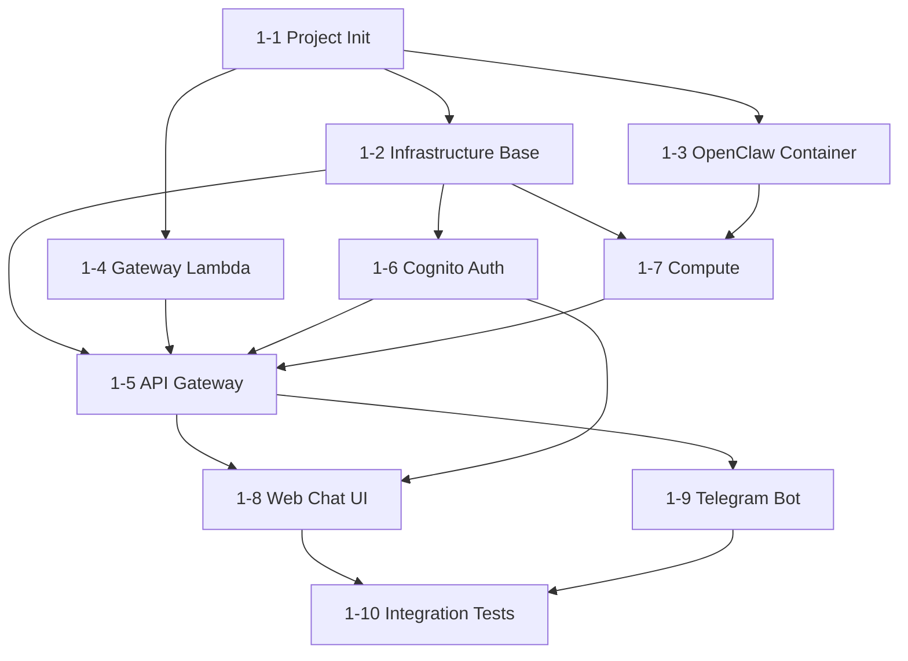

# Project Progress Plan

A document tracking the overall progress and future plans for the Serverless OpenClaw project.

---

## Progress Summary

| Phase | Description | Status |
|-------|-------------|--------|
| **Phase 0** | Documentation & Design | **Complete** |
| **Phase 1** | MVP Implementation (10 steps) | **Complete** (10/10) |
| Phase 2 | Browser Automation + Custom Skills | Not started |
| Phase 3 | Advanced Features (Monitoring, Scheduling, Multi-channel) | Not started |

---

## Phase 0: Documentation & Design (Complete)

### 0-1. Initial Documentation (Complete)

| Document | Description | Commit |
|----------|-------------|--------|
| [PRD.md](PRD.md) | Product requirements definition | `80d6f20` |
| [README.md](../README.md) | Project overview | `a04562f` |
| [cost-optimization.md](cost-optimization.md) | Cost optimization analysis | `d08acd1` |
| [architecture.md](architecture.md) | Detailed architecture design | `6d27541` |
| [implementation-plan.md](implementation-plan.md) | Detailed design + implementation plan based on MoltWorker reference | `3deecd2` |

### 0-2. Design Review & Improvements (Complete, uncommitted)

All P0/P1 issues and security items discovered after performing `/review` have been addressed.

#### P0 (Blocker) — 3 issues resolved

| ID | Issue | Resolution | Modified Files |
|----|-------|------------|----------------|
| P0-1 | NAT Gateway cost ($32/month) | Fargate Public IP + Lambda outside VPC + VPC Gateway Endpoints (DynamoDB, S3) | architecture, implementation-plan, cost-optimization, README |
| P0-2 | OpenClaw WS protocol unspecified | Documented JSON-RPC 2.0 / MCP over WebSocket with `?token=` auth. Complete rewrite of OpenClawClient code | implementation-plan |
| P0-3 | RunTask API parameter conflict | `launchType` and `capacityProviderStrategy` cannot be specified simultaneously — using `capacityProviderStrategy` only | implementation-plan |

#### P1 (Critical) — 3 issues resolved

| ID | Issue | Resolution | Modified Files |
|----|-------|------------|----------------|
| P1-1 | Telegram webhook + long polling conflict | Telegram API rejects getUpdates when webhook is set — switched to webhook-only approach | implementation-plan |
| P1-2 | Lambda VPC placement contradiction | Unified Lambda placement outside VPC (using public AWS endpoints) | architecture, implementation-plan |
| P1-3 | Cold start message loss | Added PendingMessages DynamoDB table (5-min TTL). Lambda stores messages, Bridge consumes them after startup | architecture, implementation-plan, PRD |

#### Security — 5 items resolved

| Item | Resolution | Modified Files |
|------|------------|----------------|
| Bridge 6-layer defense | SG → Bearer token → TLS (self-signed, Phase 1) → localhost binding → non-root → Secrets Manager | architecture |
| /health minimal info exposure | Return only `{"status":"ok"}`, removed version/system info | implementation-plan |
| IDOR prevention | 4-layer userId verification (Lambda JWT, Bridge Lambda-only trust, REST jwt.sub, Telegram pairing verification) | architecture (7.8) |
| No secrets written to disk | API keys/tokens not stored in `openclaw.json`. Use `--auth-choice env` for environment variables only | architecture (7.9), implementation-plan |
| CLI token exposure prevention | Removed gateway token from config patch, removed Telegram channel settings | implementation-plan |

#### Other consistency fixes

- README: "private subnet" → "public subnet + multi-layer defense"
- All `http://{publicIp}` → `https://{publicIp}`
- PRD DynamoDB tables: 3 → 5 (added Connections, PendingMessages)
- TaskState PK: `taskId` → `userId`

---

## Phase 1: MVP Implementation (Complete)

Consists of 10 steps. Each step depends on the results of the previous steps.

### Dependency Graph

### Step-by-Step Details

| Step | Goal | Key Deliverables | Verification Criteria | Status |
|------|------|-----------------|----------------------|--------|
| **1-1** | Project initialization | npm workspaces monorepo, TypeScript project references, CDK skeleton, shared types | `npm install` + `npx tsc --build` succeeds | **Complete** |
| **1-2** | Infrastructure base | NetworkStack (VPC, public subnets, VPC GW Endpoints), StorageStack (5 DDB tables, 2 S3 buckets, ECR) | `cdk deploy NetworkStack StorageStack` succeeds | **Complete** |
| **1-3** | OpenClaw container | Dockerfile, start-openclaw.sh, Bridge server, OpenClawClient (JSON-RPC 2.0), Lifecycle Manager | Local `docker build` + `docker run` + `/health` response | **Complete** |
| **1-4** | Gateway Lambda | 6 Lambda functions (ws-connect, ws-message, ws-disconnect, telegram-webhook, api-handler, watchdog), 5 service modules | Unit tests (vitest) pass | **Complete** |
| **1-5** | API Gateway | WebSocket API + REST API CDK, Cognito Authorizer, Lambda deployment, EventBridge Rule | `cdk deploy ApiStack` + WebSocket connection test | **Complete** |
| **1-6** | Cognito auth | AuthStack (User Pool, App Client, PKCE flow, hosted domain) | Cognito test user + JWT issuance verified | **Complete** |
| **1-7** | Compute | ComputeStack (ECS cluster, Fargate task definition, ARM64, FARGATE_SPOT, Secrets Manager) | `cdk deploy ComputeStack` + manual RunTask + `/health` response | **Complete** |
| **1-8** | Web chat UI | React SPA (Vite), Cognito auth, WebSocket client, chat UI, cold start status, WebStack CDK | Local `npm run dev` + WebSocket + message send/receive | **Complete** |
| **1-9** | Telegram bot | Webhook registration, secret token verification, message routing, cold start response, Bot API sendMessage | Telegram message → response received | **Complete** |
| **1-10** | Integration tests/docs | E2E tests, deployment.md, development.md | `cdk deploy --all` succeeds on a clean AWS account | **Complete** |

### Post-Phase 1 Enhancements

| Enhancement | Description | Status |
|-------------|-------------|--------|
| **Cold Start Optimization** | Docker 이미지 2.22GB→1.27GB (43% 감소), AWS CLI 제거, chown 최적화, SOCI lazy loading | **Complete** |
| **CloudWatch Monitoring** | 8 커스텀 메트릭, MonitoringStack 대시보드 5행 | **Complete** |
| **Telegram-Web Identity Linking** | OTP 기반 계정 연동 (Settings 테이블), resolveUserId, REST API 3개, Web UI 설정 페이지, CORS 설정 | **Complete** |

### Parallel Implementation Groups

Work groups that can be maximally parallelized based on dependencies:

| Order | Parallelizable Steps | Prerequisites |
|-------|---------------------|---------------|
| 1 | **1-1** Project initialization | None |
| 2 | **1-2** Infrastructure, **1-3** Container, **1-4** Gateway Lambda | 1-1 complete |
| 3 | **1-5** API Gateway, **1-6** Cognito, **1-7** Compute | 1-2, 1-3, 1-4 complete |
| 4 | **1-8** Web UI, **1-9** Telegram | 1-5, 1-6 complete |
| 5 | **1-10** Integration tests | 1-8, 1-9 complete |

### 1-4 Gateway Lambda Details (Complete)

| Category | File | Description |
|----------|------|-------------|
| **Service** | `task-state.ts` | DDB TaskState query/save, returns null for Idle state |
| | `connections.ts` | DDB Connections CRUD, 24-hour TTL |
| | `conversations.ts` | DDB Conversations query (reverse order, default 50 items), save |
| | `container.ts` | ECS RunTask (`capacityProviderStrategy` only), getPublicIp (ENI chain), StopTask |
| | `message.ts` | Routing logic: Running → Bridge HTTP, Starting → PendingMsg only, null → PendingMsg + RunTask |
| **Handler** | `ws-connect.ts` | Extract userId from JWT sub, save connectionId |
| | `ws-disconnect.ts` | Delete connectionId |
| | `ws-message.ts` | sendMessage → routeMessage, getStatus → return TaskState |
| | `telegram-webhook.ts` | `X-Telegram-Bot-Api-Secret-Token` verification, userId=`telegram:{fromId}` |
| | `api-handler.ts` | GET /conversations, GET /status |
| | `watchdog.ts` | Terminate tasks inactive for over 15 minutes, protect tasks under 5 minutes |
| **index.ts** | `src/index.ts` | Re-export of all 6 handlers |

Verification results:
- Unit tests: 49 total (28 services + 21 handlers), all passing
- TypeScript build: passing
- ESLint: passing

Design patterns:
- DI pattern: `send` function injection (same as container package)
- AWS SDK send binding: `ddb.send.bind(ddb) as (cmd: any) => Promise<any>`
- Server-side userId only: JWT sub (web) / `telegram:{fromId}` (Telegram)
- IDOR prevention: never trust client-provided userId

### 1-8 Web Chat UI Details (Complete)

| Category | File | Description |
|----------|------|-------------|
| **Project Setup** | `index.html` | Vite entry point |
| | `vite.config.ts` | `@vitejs/plugin-react`, `VITE_` prefix |
| | `vite-env.d.ts` | Environment variable type declarations (WS_URL, API_URL, COGNITO_*) |
| **Auth** | `services/auth.ts` | Cognito SRP auth wrapper (signIn/signUp/confirmSignUp/signOut/getSession) |
| | `hooks/useAuth.ts` | Auth state hook (session recovery, error handling) |
| | `components/Auth/AuthProvider.tsx` | React Context global auth provider |
| | `components/Auth/LoginForm.tsx` | Login/signup/verification code form |
| **WebSocket** | `services/websocket.ts` | WebSocketClient class (auto-reconnect, exponential backoff, heartbeat) |
| | `hooks/useWebSocket.ts` | WS connection hook (message/streaming/state management) |
| **REST API** | `services/api.ts` | fetchConversations, fetchStatus |
| **Chat UI** | `components/Chat/ChatContainer.tsx` | Main layout (AgentStatus + MessageList + MessageInput) |
| | `components/Chat/MessageList.tsx` | Message list (auto-scroll, streaming cursor) |
| | `components/Chat/MessageInput.tsx` | Input (Enter to send, Shift+Enter for newline, auto-height) |
| | `components/Status/AgentStatus.tsx` | Agent status display (Idle/Starting/Running/Stopping) |
| **CDK** | `web-stack.ts` | S3 bucket + CloudFront (OAC, SPA routing, BucketDeployment) |

Verification results:
- TypeScript build: passing
- Vite build: passing (dist/ generated)
- CDK synth: passing (6 stacks including WebStack)
- ESLint: passing
- Unit tests: 92 total, all passing (no existing tests broken)

Design decisions:
- S3 webBucket created inside WebStack (avoids StorageStack → WebStack circular dependency)
- `amazon-cognito-identity-js` SRP auth (no Hosted UI needed)
- Direct import of `@serverless-openclaw/shared` (Vite bundler module resolution)
- WebSocket `?token={idToken}` query auth (API GW does not support Authorization header on $connect)
- Plain CSS + CSS variables (automatic dark/light mode detection)

### 1-9 Telegram Bot Details (Complete)

| Category | File | Description |
|----------|------|-------------|
| **Service** | `services/telegram.ts` | Telegram Bot API sendMessage wrapper (fire-and-forget) |
| **Handler** | `handlers/telegram-webhook.ts` | Cold start detection → immediate "Waking up..." response added |
| **CDK** | `api-stack.ts` | `TELEGRAM_BOT_TOKEN` environment variable injection |
| **Script** | `scripts/setup-telegram-webhook.sh` | Webhook URL + secret token registration |

Verification results:
- Unit tests: 99 total, all passing (4 telegram service + 7 webhook handler tests new/modified)
- TypeScript build: passing
- CDK synth: passing
- ESLint: passing

Design decisions:
- Cold start detection: immediate Telegram response when `getTaskState` result is null or Starting
- sendTelegramMessage is fire-and-forget (does not throw on failure — to avoid affecting message routing)
- `TELEGRAM_BOT_TOKEN` and `TELEGRAM_SECRET_TOKEN` separated (same Secrets Manager secret but different purposes)

### 1-10 Integration Tests/Documentation Details (Complete)

| Category | File | Description |
|----------|------|-------------|
| **Deployment Guide** | `docs/deployment.md` | Prerequisites, secret setup, build, deployment, verification, troubleshooting |
| **Development Guide** | `docs/development.md` | Local environment, build, per-package development, TDD, Git Hooks, coding conventions |
| **E2E Tests** | `packages/cdk/__tests__/stacks.e2e.test.ts` | 6 CDK stack synth + key resource verification (24 tests) |
| **Config** | `vitest.config.ts` | Exclude `*.e2e.test.ts` from unit tests |

Verification results:
- Unit tests: 99 total, all passing (no existing tests broken)
- E2E tests: 24 total, all passing (CDK synth for 6 stacks)
- TypeScript build: passing
- ESLint: passing

E2E test coverage:
- NetworkStack: VPC, no NAT Gateway, 2 public subnets, VPC Gateway Endpoints, Security Group
- StorageStack: 5 DynamoDB tables (PAY_PER_REQUEST), GSI, S3, ECR
- AuthStack: Cognito User Pool, SRP auth, User Pool Domain
- ComputeStack: ECS cluster, Fargate Task Definition (ARM64), CloudWatch Log Group
- ApiStack: 6 Lambda functions (ARM64), WebSocket API, HTTP API, EventBridge watchdog
- WebStack: S3, CloudFront, OAC, SPA error responses

---

## Phase 2: Browser Automation + Custom Skills (Not started)

| Step | Task |
|------|------|
| 2-1 | Build Docker image with Chromium |
| 2-2 | Browser automation skill integration |
| 2-3 | Custom skill upload/management API |
| 2-4 | Settings management UI (LLM provider selection, skill management) |

## Phase 3: Advanced Features (Not started)

| Step | Task |
|------|------|
| 3-1 | CloudWatch alerts + cost dashboard |
| 3-2 | EventBridge-based scheduled task scheduling |
| 3-3 | Additional messenger support (Discord, Slack) |

---

## Key Architecture Decision Records

Recording the major decisions made during Phase 0 and their rationale for future reference.

| Decision | Choice | Rationale |
|----------|--------|-----------|
| Compute | Fargate Spot (Lambda containers not viable) | OpenClaw requires long-running sessions >15 min + WebSocket |
| Network | Public subnet + Public IP | Eliminates NAT Gateway $32/month, compensated by multi-layer defense |
| Telegram | Webhook-only | API rejects getUpdates when webhook is set |
| Cold start messages | PendingMessages DDB (5-min TTL) | Lambda stores to DDB, Bridge consumes after startup |
| Gateway protocol | JSON-RPC 2.0 / MCP over WebSocket | Confirmed via MoltWorker analysis + Perplexity research |
| Secret management | Secrets Manager → environment variables only | Never written to disk/config files |
| Bridge security | 6-layer defense | SG, Bearer token, TLS, localhost, non-root, Secrets Manager |
| Development methodology | TDD (except UI) | Write tests first then implement, using vitest |
| Git Hooks | pre-commit: UT + lint, pre-push: E2E | Managed with husky |
| E2E deployment | Local (.env) + GitHub Actions (OIDC) | AWS profiles via .env, CI uses OIDC auth integration |
