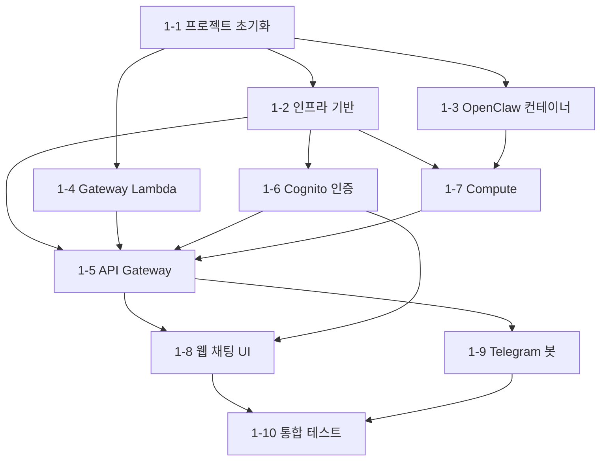

# 프로젝트 진행 계획

Serverless OpenClaw 프로젝트의 전체 진행 상황과 앞으로의 계획을 추적하는 문서.

---

## 진행 현황 요약

| Phase | 설명 | 상태 |
|-------|------|------|
| **Phase 0** | 문서화 및 설계 | **완료** |
| **Phase 1** | MVP 구현 (10단계) | **진행 중** (2/10) |
| Phase 2 | 브라우저 자동화 + 커스텀 Skills | 미착수 |
| Phase 3 | 고급 기능 (모니터링, 스케줄링, 멀티채널) | 미착수 |

---

## Phase 0: 문서화 및 설계 (완료)

### 0-1. 초기 문서 작성 (완료)

| 문서 | 설명 | 커밋 |
|------|------|------|
| [PRD.md](PRD.md) | 프로젝트 요구사항 정의 | `80d6f20` |
| [README.md](../README.md) | 프로젝트 개요 | `a04562f` |
| [cost-optimization.md](cost-optimization.md) | 비용 최적화 분석 | `d08acd1` |
| [architecture.md](architecture.md) | 상세 아키텍처 설계 | `6d27541` |
| [implementation-plan.md](implementation-plan.md) | MoltWorker 참조 기반 세부 설계 + 구현 계획 | `3deecd2` |

### 0-2. 설계 리뷰 및 보완 (완료, 미커밋)

`/review` 수행 후 발견된 P0/P1 이슈 및 보안 항목을 모두 반영.

#### P0 (Blocker) — 3건 해결

| ID | 이슈 | 해결 내용 | 수정 파일 |
|----|------|----------|----------|
| P0-1 | NAT Gateway 비용 ($32/월) | Fargate Public IP + Lambda VPC 외부 + VPC Gateway Endpoints (DynamoDB, S3) | architecture, implementation-plan, cost-optimization, README |
| P0-2 | OpenClaw WS 프로토콜 미명세 | JSON-RPC 2.0 / MCP over WebSocket, `?token=` 인증 문서화. OpenClawClient 코드 전면 재작성 | implementation-plan |
| P0-3 | RunTask API 파라미터 충돌 | `launchType`과 `capacityProviderStrategy` 동시 지정 불가 — `capacityProviderStrategy`만 사용 | implementation-plan |

#### P1 (Critical) — 3건 해결

| ID | 이슈 | 해결 내용 | 수정 파일 |
|----|------|----------|----------|
| P1-1 | Telegram webhook + long polling 충돌 | Telegram API는 webhook 설정 시 getUpdates 거부 — Webhook-only 방식으로 변경 | implementation-plan |
| P1-2 | Lambda VPC 배치 모순 | Lambda는 VPC 외부 배치 (공개 AWS endpoint 사용)로 통일 | architecture, implementation-plan |
| P1-3 | Cold start 메시지 유실 | PendingMessages DynamoDB 테이블 추가 (5분 TTL). Lambda가 저장 → Bridge가 기동 후 소비 | architecture, implementation-plan, PRD |

#### 보안 — 5건 해결

| 항목 | 해결 내용 | 수정 파일 |
|------|----------|----------|
| Bridge 6계층 방어 | SG → Bearer 토큰 → TLS (self-signed, Phase 1) → localhost 바인딩 → non-root → Secrets Manager | architecture |
| /health 최소 정보 노출 | `{"status":"ok"}` 만 반환, 버전/시스템 정보 제거 | implementation-plan |
| IDOR 방지 | 4계층 userId 검증 (Lambda JWT, Bridge Lambda-only 신뢰, REST jwt.sub, Telegram 페어링 검증) | architecture (7.8) |
| 시크릿 디스크 미기록 | `openclaw.json`에 API 키/토큰 미기록. `--auth-choice env`로 환경변수만 사용 | architecture (7.9), implementation-plan |
| CLI 토큰 노출 방지 | config 파치에서 gateway 토큰 삭제, Telegram 채널 설정 삭제 | implementation-plan |

#### 기타 정합성 수정

- README: "프라이빗 서브넷" → "퍼블릭 서브넷 + 다층 방어"
- 모든 `http://{publicIp}` → `https://{publicIp}`
- PRD DynamoDB 테이블: 3개 → 5개 (Connections, PendingMessages 추가)
- TaskState PK: `taskId` → `userId`

---

## Phase 1: MVP 구현 (진행 중)

10단계로 구성. 각 단계는 이전 단계의 결과물에 의존한다.

### 의존 관계

### 단계별 상세

| 단계 | 목표 | 주요 산출물 | 검증 기준 | 상태 |
|------|------|------------|----------|------|
| **1-1** | 프로젝트 초기화 | npm workspaces 모노레포, TypeScript 프로젝트 참조, CDK 스켈레톤, 공유 타입 | `npm install` + `npx tsc --build` 성공 | **완료** |
| **1-2** | 인프라 기반 | NetworkStack (VPC, 퍼블릭 서브넷, VPC GW Endpoints), StorageStack (DDB 5개, S3 2개, ECR) | `cdk deploy NetworkStack StorageStack` 성공 | **완료** |
| **1-3** | OpenClaw 컨테이너 | Dockerfile, start-openclaw.sh, Bridge 서버, OpenClawClient (JSON-RPC 2.0), Lifecycle Manager | 로컬 `docker build` + `docker run` + `/health` 응답 | 미착수 |
| **1-4** | Gateway Lambda | Lambda 6개 (ws-connect, ws-message, ws-disconnect, telegram-webhook, api-handler, watchdog), 서비스 모듈 5개 | 단위 테스트 (vitest) 통과 | 미착수 |
| **1-5** | API Gateway | WebSocket API + REST API CDK, Cognito Authorizer, Lambda 배포, EventBridge Rule | `cdk deploy ApiStack` + WebSocket 연결 테스트 | 미착수 |
| **1-6** | Cognito 인증 | AuthStack (User Pool, App Client, PKCE flow, 호스팅 도메인) | Cognito 테스트 사용자 + JWT 발급 확인 | 미착수 |
| **1-7** | Compute | ComputeStack (ECS 클러스터, Fargate 태스크 정의, ARM64, FARGATE_SPOT, Secrets Manager) | `cdk deploy ComputeStack` + 수동 RunTask + `/health` 응답 | 미착수 |
| **1-8** | 웹 채팅 UI | React SPA (Vite), Cognito 인증, WebSocket 클라이언트, 채팅 UI, Cold start 상태, WebStack CDK | 로컬 `npm run dev` + WebSocket + 메시지 송수신 | 미착수 |
| **1-9** | Telegram 봇 | Webhook 등록, secret token 검증, 페어링 흐름, 메시지 라우팅, cold start 응답 | Telegram 메시지 → 응답 수신 | 미착수 |
| **1-10** | 통합 테스트/문서화 | E2E 테스트, deployment.md, development.md | 클린 AWS 계정에서 `cdk deploy --all` 성공 | 미착수 |

### 병렬 구현 가능 그룹

의존 관계 기반으로 최대 병렬화할 수 있는 작업 그룹:

| 순서 | 병렬 실행 가능 단계 | 선행 조건 |
|------|-------------------|----------|
| 1 | **1-1** 프로젝트 초기화 | 없음 |
| 2 | **1-2** 인프라, **1-3** 컨테이너, **1-4** Gateway Lambda | 1-1 완료 |
| 3 | **1-5** API Gateway, **1-6** Cognito, **1-7** Compute | 1-2, 1-3, 1-4 완료 |
| 4 | **1-8** 웹 UI, **1-9** Telegram | 1-5, 1-6 완료 |
| 5 | **1-10** 통합 테스트 | 1-8, 1-9 완료 |

---

## Phase 2: 브라우저 자동화 + 커스텀 Skills (미착수)

| 단계 | 작업 |
|------|------|
| 2-1 | Chromium 포함 Docker 이미지 빌드 |
| 2-2 | 브라우저 자동화 skill 연동 |
| 2-3 | 커스텀 skill 업로드/관리 API |
| 2-4 | 설정 관리 UI (LLM 프로바이더 선택, skill 관리) |

## Phase 3: 고급 기능 (미착수)

| 단계 | 작업 |
|------|------|
| 3-1 | CloudWatch 알림 + 비용 대시보드 |
| 3-2 | EventBridge 기반 정기 태스크 스케줄링 |
| 3-3 | 추가 메신저 (Discord, Slack) 지원 |

---

## 핵심 아키텍처 결정 기록

향후 참고를 위해 Phase 0에서 내린 주요 결정과 그 근거를 기록한다.

| 결정 | 선택 | 근거 |
|------|------|------|
| 컴퓨팅 | Fargate Spot (Lambda 컨테이너 불가) | OpenClaw는 15분 초과 장기 실행 + WebSocket 필요 |
| 네트워크 | 퍼블릭 서브넷 + Public IP | NAT Gateway $32/월 제거, 다층 방어로 보안 보완 |
| Telegram | Webhook-only | API가 webhook 설정 시 getUpdates 거부 |
| Cold start 메시지 | PendingMessages DDB (5분 TTL) | Lambda → DDB 저장, Bridge 기동 후 소비 |
| Gateway 프로토콜 | JSON-RPC 2.0 / MCP over WebSocket | MoltWorker 분석 + Perplexity 조사 결과 확인 |
| 시크릿 관리 | Secrets Manager → 환경변수 only | 디스크/config 파일에 절대 미기록 |
| Bridge 보안 | 6계층 방어 | SG, Bearer 토큰, TLS, localhost, non-root, Secrets Manager |
